# AXIS 프로젝트 의존성 분석


## 목차

- [1. 의존성 요약](#1-의존성-요약)
  - [링크 타임 의존성 (Link-Time, .lib)](#링크-타임-의존성-link-time-lib)
    - [내부 DLL (.lib 정적 링크)](#내부-dll-lib-정적-링크)
    - [Windows SDK (.lib)](#windows-sdk-lib)
    - [타사 SDK/라이브러리 (.lib)](#타사-sdk라이브러리-lib)
  - [런타임 의존성 (Runtime, .dll)](#런타임-의존성-runtime-dll)
    - [내부 DLL (d:\src\IBKS\src\dll 계층)](#내부-dll-dsrcibkssrcdll-계층)
    - [타사 SDK DLL (런타임 로드)](#타사-sdk-dll-런타임-로드)
    - [INCA 소프트웨어 (증권사 API)](#inca-소프트웨어-증권사-api)
    - [Windows 시스템 DLL (OS 기본)](#windows-시스템-dll-os-기본)
  - [헤더 인클루드 의존성 (Header, #include)](#헤더-인클루드-의존성-header-include)
    - [MFC (Microsoft Foundation Classes)](#mfc-microsoft-foundation-classes)
    - [내부 헤더 (프로젝트 내)](#내부-헤더-프로젝트-내)
    - [ATL (Active Template Library)](#atl-active-template-library)
    - [STL (Standard Template Library)](#stl-standard-template-library)
    - [Windows SDK](#windows-sdk)
    - [Ahnlab SafeTx SDK](#ahnlab-safetx-sdk)
    - [INCA Software](#inca-software)
    - [cpprestsdk (NuGet)](#cpprestsdk-nuget)
- [2. 의존성 그래프 (Mermaid)](#2-의존성-그래프-mermaid)
  - [전체 의존성 맵](#전체-의존성-맵)
  - [DLL 체인 (디렉토리 구조)](#dll-체인-디렉토리-구조)
- [3. 링크 타임 의존성 (Link-Time Dependencies)](#3-링크-타임-의존성-link-time-dependencies)
  - [Release 구성 (D:\IBKS_TEST\ibks_2019\)](#release-구성-dibks_testibks_2019)
  - [Debug 구성 (D:\IBK_VC_DEV\HTS\exe\)](#debug-구성-dibk_vc_devhtsexe)
  - [중요: 조건부 링크 제외](#중요-조건부-링크-제외)
- [4. 런타임 의존성 (Runtime Dependencies)](#4-런타임-의존성-runtime-dependencies)
  - [DLL 로드 순서 (추론)](#dll-로드-순서-추론)
  - [암묵적 DLL 의존성](#암묵적-dll-의존성)
- [5. 헤더 인클루드 의존성 (Header Dependencies)](#5-헤더-인클루드-의존성-header-dependencies)
  - [순환 인클루드 가능성 분석](#순환-인클루드-가능성-분석)
    - [그룹 1: 메인 프레임 (MainFrm.h)](#그룹-1-메인-프레임-mainfrmh)
    - [그룹 2: 축 애플리케이션 (axis.h)](#그룹-2-축-애플리케이션-axish)
    - [그룹 3: 예외 처리 (ExceptionHandler.h)](#그룹-3-예외-처리-exceptionhandlerh)
    - [그룹 4: 동기화 (CriticalSection.h)](#그룹-4-동기화-criticalsectionh)
  - [순환 의존성 위험 요약](#순환-의존성-위험-요약)
- [6. 내부 모듈 간 의존성 (Module-to-Module Dependencies)](#6-내부-모듈-간-의존성-module-to-module-dependencies)
  - [의존성 계층 (추정)](#의존성-계층-추정)
  - [순환 의존성 위험 (DLL 간)](#순환-의존성-위험-dll-간)
- [7. 외부 SDK/라이브러리 통합 포인트](#7-외부-sdk라이브러리-통합-포인트)
  - [1. Ahnlab SafeTx (ASTx)](#1-ahnlab-safetx-astx)
  - [2. INCA Software (증권사 API)](#2-inca-software-증권사-api)
  - [3. cpprestsdk (NuGet)](#3-cpprestsdk-nuget)
  - [4. 구 AOSS SDK (Deprecated)](#4-구-aoss-sdk-deprecated)
- [8. Windows API 사용 패턴](#8-windows-api-사용-패턴)
  - [Winsock2 (TCP/UDP)](#winsock2-tcpudp)
  - [WinInet (HTTP/FTP)](#wininet-httpftp)
  - [IME (입력기)](#ime-입력기)
  - [GDI+ (그래픽)](#gdi-그래픽)
  - [네트워크/시스템](#네트워크시스템)
  - [암호화/보안](#암호화보안)
  - [프로세스/시스템 정보](#프로세스시스템-정보)
- [9. COM/ActiveX 의존성](#9-comactivex-의존성)
  - [MFC ActiveX 컨테이너](#mfc-activex-컨테이너)
  - [초기화/종료](#초기화종료)
  - [타사 OCX 컨트롤 (추정)](#타사-ocx-컨트롤-추정)
- [10. 버전/호환성 제약사항](#10-버전호환성-제약사항)
  - [Visual Studio 버전](#visual-studio-버전)
  - [MFC 버전](#mfc-버전)
  - [런타임 라이브러리](#런타임-라이브러리)
  - [Windows API 최소 요구사항](#windows-api-최소-요구사항)
  - [써드파티 SDK 버전](#써드파티-sdk-버전)
- [11. 로드 순서/의존성 체인](#11-로드-순서의존성-체인)
  - [정적 링크 단계 (Build Time)](#정적-링크-단계-build-time)
  - [런타임 로드 단계 (Runtime)](#런타임-로드-단계-runtime)
- [12. 배포/설치 체크리스트](#12-배포설치-체크리스트)
  - [필수 배포 항목](#필수-배포-항목)
  - [선택적 배포 항목](#선택적-배포-항목)
  - [설치 위치](#설치-위치)
  - [설치 전제조건](#설치-전제조건)
- [13. 알려진 문제/제약사항](#13-알려진-문제제약사항)
  - [1. 절대 경로 하드코딩](#1-절대-경로-하드코딩)
  - [2. VC6 레거시 코드](#2-vc6-레거시-코드)
  - [3. AOSS SDK Deprecated](#3-aoss-sdk-deprecated)
  - [4. MFC Dynamic 링크 (runtime only)](#4-mfc-dynamic-링크-runtime-only)
  - [5. 순환 인클루드 잠재성](#5-순환-인클루드-잠재성)
- [14. 의존성 업데이트 가능성](#14-의존성-업데이트-가능성)
  - [NuGet 패키지 업그레이드](#nuget-패키지-업그레이드)
  - [SDK 업그레이드](#sdk-업그레이드)
  - [Windows SDK](#windows-sdk-1)
- [참고](#참고)

---

**분석 일시**: 2026-07-14  
**프로젝트**: AXIS (IBK HTS 메인 GUI)  
**출력 파일**: axis.exe (Win32 x86)

---

## 1. 의존성 요약

### 링크 타임 의존성 (Link-Time, .lib)

#### 내부 DLL (.lib 정적 링크)
- `../dll/axiscm/Release(Debug)/axiscm.lib` - 증권사 통신 모듈
- `../dll/sm/Release(Debug)/axissm.lib` - 서버 관리 모듈
- `../dll/axiscp/Release(Debug)/axiscp.lib` - 컨트롤 팩 모듈

#### Windows SDK (.lib)
- `Imm32.lib` - IME (입력기) 제어
- `msimg32.lib` - AlphaBlend() 알파 합성 이미지 함수
- `wininet.lib` - WinInet API (HTTP/FTP 다운로드)
- `Netapi32.lib` - 네트워크 API (NetXXX 함수)
- `Winmm.lib` - 멀티미디어 (타이머, 사운드)
- `iphlpapi.lib` - IP Helper API (네트워크 설정)
- `winsock2.lib` - Winsock2 (TCP/UDP 소켓, 포함됨) [추론]
- `wincrypt.lib` - Windows Cryptography API [추론, 인증서/암호화]
- `Netapi32.lib`, `Winmm.lib` - 상동

#### 타사 SDK/라이브러리 (.lib)
- `ASTx/StSdkEx.lib` - Ahnlab SafeTx SDK (프로세스 보호, 메모리 보호)

### 런타임 의존성 (Runtime, .dll)

#### 내부 DLL (d:\src\IBKS\src\dll 계층)
- `axiscm.dll` - 증권사 통신
- `axissm.dll` - 서버 관리
- `axiscp.dll` - 컨트롤 팩

#### 타사 SDK DLL (런타임 로드)
- `cpprestsdk` (NuGet 패키지, Win32/Release 버전 사용)
  - cpprestsdk.v141.dll (또는 정적 링크 가능)
- `ASTx` (Ahnlab SafeTx)
  - astx_setup.exe (설정/설치 프로그램)
  - 관련 DLL (symstore 저장소에 기호 저장)

#### INCA 소프트웨어 (증권사 API)
- INCA SDK (npenkAppInstall5WIN.h 래퍼)
  - 런타임: INCA 클라이언트 설치 필수 (별도 배포)

#### Windows 시스템 DLL (OS 기본)
- `kernel32.dll`, `user32.dll`, `gdi32.dll` (기본)
- `imm32.dll` (IME)
- `msimg32.dll` (GDI+)
- `wininet.dll` (WinInet)
- `netapi32.dll` (네트워크)
- `winmm.dll` (멀티미디어)
- `iphlpapi.dll` (IP Helper)
- `winsock2.dll` (소켓)
- `crypt32.dll` (암호화)
- `advapi32.dll` (보안, 레지스트리)
- `oleaut32.dll`, `ole32.dll` (COM/OLE)
- `rpcrt4.dll` (RPC)
- `shell32.dll` (쉘)

### 헤더 인클루드 의존성 (Header, #include)

#### MFC (Microsoft Foundation Classes)
```cpp
#include <afxwin.h>      // MFC 기본
#include <afxext.h>      // MFC 확장 (스플리터 등)
#include <afxdtl.h>      // MFC 디테일
#include <afxdlgs.h>     // MFC 다이얼로그
#include <afxdlgs.h>     // MFC 공통 다이얼로그
#include <afxmt.h>       // MFC 스레드/동기화
#include <afxocc.h>      // MFC ActiveX 컨테이너
#include <afxdisp.h>     // MFC IDispatch
```

#### 내부 헤더 (프로젝트 내)
```cpp
#include "MainFrm.h"
#include "ChildFrm.h"
#include "axisDoc.h"
#include "axisView.h"
#include "../h/jmcode.h"      // 공통 코드 정의
#include "../h/axisfire.h"    // AXIS 특화 정의
#include "CriticalSection.h"  // 동기화 래퍼
#include "ExceptionHandler.h"  // 예외 처리
#include "whdump.h"           // MiniDump
```

#### ATL (Active Template Library)
```cpp
#include <atlbase.h>     // ATL 기본
// CComPtr 등 스마트 포인터 사용 (COM)
```

#### STL (Standard Template Library)
```cpp
#include <vector>
#include <algorithm>
#include <unordered_set>
#include <shared_mutex>   // C++17 읽기-쓰기 뮤텍스
```

#### Windows SDK
```cpp
#include <windows.h>      // 기본 Windows API
#include <winsock2.h>     // Winsock2 (소켓)
#include <wininet.h>      // WinInet (HTTP/FTP)
#include <TlHelp32.h>     // Tool Help (프로세스 모니터링)
#include <shellapi.h>     // Shell API (시스템 트레이 등)
#include <shlobj.h>       // Shell Objects
#include <psapi.h>        // Process Status API
#include <crypt.h>        // 암호화
```

#### Ahnlab SafeTx SDK
```cpp
#include "ASTx/StSdkExCfg.h"
#include "ASTx/StSdkExCom.h"
#include "ASTx/StSdkExDef.h"
#include "ASTx/StSdkExErr.h"
#pragma comment(lib, "ASTx/StSdkEx.lib")
```

#### INCA Software
```cpp
#include "inca/npenkAppInstall5WIN.h"  // INCA 설치 프로그램 래퍼
#include "inca/NpnxMgr.h"              // PC Firewall (비활성화)
```

#### cpprestsdk (NuGet)
```cpp
#include "cpprest/http_client.h"
#include "cpprest/json.h"
#include "pplx/pplxtasks.h"  // PPL 테스크
```

---

## 2. 의존성 그래프 (Mermaid)

### 전체 의존성 맵

```mermaid
graph TD
    A["AXIS.exe<br/>(Win32 x86)"]
    
    A -->|링크| B["axiscm.lib<br/>(증권사 통신)"]
    A -->|링크| C["axissm.lib<br/>(서버 관리)"]
    A -->|링크| D["axiscp.lib<br/>(컨트롤 팩)"]
    
    A -->|링크| E["Imm32.lib<br/>(IME)"]
    A -->|링크| F["msimg32.lib<br/>(AlphaBlend)"]
    A -->|링크| G["wininet.lib<br/>(HTTP/FTP)"]
    A -->|링크| H["Netapi32.lib<br/>(네트워크)"]
    A -->|링크| I["Winmm.lib<br/>(멀티미디어)"]
    A -->|링크| J["iphlpapi.lib<br/>(IP Helper)"]
    
    A -->|링크| K["StSdkEx.lib<br/>(Ahnlab SafeTx)"]
    
    A -->|런타임| B_DLL["axiscm.dll"]
    A -->|런타임| C_DLL["axissm.dll"]
    A -->|런타임| D_DLL["axiscp.dll"]
    
    A -->|런타임| K_DLL["astx_setup.exe<br/>(SafeTx)"]
    A -->|런타임| INCA_DLL["INCA SDK<br/>(별도 설치)"]
    
    A -->|포함| MFC["MFC<br/>(afxwin.h 등)"]
    A -->|포함| ATL["ATL<br/>(atlbase.h)"]
    A -->|포함| STL["STL<br/>(vector, shared_mutex)"]
    A -->|포함| CPPREST["cpprestsdk<br/>(NuGet)"]
    
    A -->|헤더| LOCAL["내부 헤더<br/>(../h/)"]
    
    MFC -->|시스템| S1["kernel32.dll"]
    MFC -->|시스템| S2["user32.dll"]
    MFC -->|시스템| S3["gdi32.dll"]
    MFC -->|시스템| S4["ole32.dll"]
    MFC -->|시스템| S5["oleaut32.dll"]
    
    STL -.->|스택 기반| SHARED_MUTEX["std::shared_mutex"]
    
    A -->|동기화| CRIT["CCriticalSection"]
    
    style A fill:#4CAF50,color:#fff
    style B fill:#2196F3,color:#fff
    style C fill:#2196F3,color:#fff
    style D fill:#2196F3,color:#fff
    style K fill:#FF9800,color:#fff
    style MFC fill:#9C27B0,color:#fff
    style STL fill:#9C27B0,color:#fff
```



### DLL 체인 (디렉토리 구조)

```
d:\src\IBKS\src\
  ├── AXIS/
  │   └── axis.vcxproj
  │       ├── Links: axiscm.lib (../dll/axiscm/Release)
  │       ├── Links: axissm.lib (../dll/sm/Release)
  │       ├── Links: axiscp.lib (../dll/axiscp/Release)
  │       └── Produces: axis.exe
  │           └── (런타임)
  │               ├── axiscm.dll
  │               ├── axissm.dll
  │               ├── axiscp.dll
  │               └── External SDK DLLs
  │
  ├── dll/
  │   ├── axiscm/ (증권사 통신)
  │   │   └── axiscm.lib/dll
  │   │       └── Depends: ?
  │   ├── sm/ (서버 관리)
  │   │   └── axissm.lib/dll
  │   │       └── Depends: ?
  │   └── axiscp/ (컨트롤 팩)
  │       └── axiscp.lib/dll
  │           └── Depends: ?
  │
  ├── h/
  │   ├── jmcode.h
  │   └── axisfire.h
  │
  └── ... (기타 프로젝트)
```

---

## 3. 링크 타임 의존성 (Link-Time Dependencies)

### Release 구성 (D:\IBKS_TEST\ibks_2019\)

```
Output: C:\IBKS\IBK투자증권 HTS\exe\axis.exe

AdditionalDependencies:
  ../dll/axiscm/Release/axiscm.lib
  ../dll/sm/Release/axissm.lib
  Imm32.lib
  ../dll/axiscp/Release/axiscp.lib
  msimg32.lib
  wininet.lib
  (기타 암묵적 링크: kernel32.lib, user32.lib 등)

Post-Build Event:
  "C:\Program Files (x86)\Windows Kits\8.1\Debuggers\x86\symstore.exe"
    add /f "D:\symbol\axis.pdb"
    /s "D:\symstore"
    /t "IBKS"
  (PDB 기호 저장)
```

### Debug 구성 (D:\IBK_VC_DEV\HTS\exe\)

```
Output: D:\IBK_VC_DEV\HTS\exe\axis.exe

AdditionalDependencies:
  ../dll/axiscm/Debug/axiscm.lib
  ../dll/sm/Debug/axissm.lib
  Imm32.lib
  ../dll/axiscp/Debug/axiscp.lib
  Msimg32.lib
  wininet.lib
  (기타 암묵적 링크: kernel32.lib, user32.lib 등)

StackReserveSize: 2097152 (2MB, 디버그 전용)
```

### 중요: 조건부 링크 제외

```
IgnoreSpecificDefaultLibraries (Release):
  libc.lib
  libci.lib
```

이는 LIBCMT.lib (멀티스레드 정적 라이브러리) 대신 MSVCRT.dll (멀티스레드 DLL) 사용을 강제합니다.

---

## 4. 런타임 의존성 (Runtime Dependencies)

### DLL 로드 순서 (추론)

```
1. Windows 커널 로더
   ├─ kernel32.dll, ntdll.dll
   ├─ user32.dll (윈도우 관리)
   └─ gdi32.dll (그래픽)

2. MFC/CRT
   ├─ MSVCRT.dll (C 런타임)
   ├─ MFCXXX.dll (MFC 런타임, Dynamic MFC)
   └─ ole32.dll, oleaut32.dll (COM)

3. AXIS 내부 DLL
   ├─ axiscm.dll (증권사 통신)
   ├─ axissm.dll (서버 관리)
   └─ axiscp.dll (컨트롤 팩)

4. 타사 SDK
   ├─ cpprestsdk (NuGet, 정적 링크 또는 동적)
   └─ astx_setup.exe (Ahnlab SafeTx)

5. INCA/외부
   └─ INCA SDK (별도 설치, 런타임 로드)
```

### 암묵적 DLL 의존성

```
Windows 시스템 DLL (OS 제공):
  imm32.dll          ← Imm32.lib
  msimg32.dll        ← msimg32.lib
  wininet.dll        ← wininet.lib
  netapi32.dll       ← Netapi32.lib
  winmm.dll          ← Winmm.lib
  iphlpapi.dll       ← iphlpapi.lib
  winsock2.dll       ← Winsock (암묵적)
  crypt32.dll        ← 암호화 (암묵적)
  advapi32.dll       ← 레지스트리/보안
  shell32.dll        ← 쉘 (시스템 트레이 등)
  rpcrt4.dll         ← RPC (COM)
  version.dll        ← 버전 정보
```

---

## 5. 헤더 인클루드 의존성 (Header Dependencies)

### 순환 인클루드 가능성 분석

#### 그룹 1: 메인 프레임 (MainFrm.h)

```
MainFrm.h
  ├─ #include <afxmt.h> (MFC 멀티스레딩)
  ├─ #include <atlbase.h> (ATL COM)
  ├─ #include "cpuUse.h"
  ├─ #include "PhonePad.h"
  ├─ #include "../h/jmcode.h"
  ├─ #include "../h/axisfire.h"
  ├─ #include "childFrm.h"
  │   └─ #include "MainFrm.h" ⚠️ 순환 인클루드 가능
  ├─ #include "SChild.h"
  ├─ #include "inca/npenkAppInstall5WIN.h"
  ├─ #include <vector>
  ├─ #include <algorithm>
  ├─ #include <unordered_set>
  └─ #include <shared_mutex>

상태: 보호 (include guard 또는 #pragma once 추정)
위험: 낮음 (헤더 가드 사용 필수)
```

#### 그룹 2: 축 애플리케이션 (axis.h)

```
axis.h
  └─ #include "MainFrm.h"
     (다양한 대화상자 및 뷰 포함)

상태: axis.cpp는 axis.h 포함, stdafx.h 사용
위험: 낮음 (pch 구조)
```

#### 그룹 3: 예외 처리 (ExceptionHandler.h)

```
ExceptionHandler.h
  └─ IExceptionHandler 인터페이스 정의
  └─ CExceptionHandler 정적 싱글톤

상태: 독립적 헤더, 다중 포함 안전
위험: 낮음
```

#### 그룹 4: 동기화 (CriticalSection.h)

```
CriticalSection.h
  ├─ CCriticalSection (래퍼)
  └─ CUseCriticalSection (RAII)

상태: 독립적 헤더, 순환 의존성 없음
위험: 낮음
```

### 순환 의존성 위험 요약

**⚠️ 잠재적 순환 인클루드**:
- ChildFrm.h ↔ MainFrm.h (전방 선언 필요)
- 다양한 다이얼로그 ↔ MainFrm.h (메시지 핸들러 콜백)

**현재 상태**: 대부분 헤더 가드 또는 전방 선언으로 보호된 것으로 추정

---

## 6. 내부 모듈 간 의존성 (Module-to-Module Dependencies)

### 의존성 계층 (추정)

```
┌─────────────────────────┐
│  AXIS.exe               │
│  (UI 프레임워크)         │
└─────────────────────────┘
          ↓
┌─────────────────────────┐
│  axiscm.lib/dll         │
│  (증권사 통신)           │
└─────────────────────────┘
          ↓
┌─────────────────────────┐
│  axissm.lib/dll         │
│  (서버 관리)             │
└─────────────────────────┘
          ↓
┌─────────────────────────┐
│  axiscp.lib/dll         │
│  (컨트롤 팩)             │
└─────────────────────────┘
          ↓
┌─────────────────────────┐
│  Windows API/SDK        │
│  (Winsock, HTTP 등)      │
└─────────────────────────┘
```

### 순환 의존성 위험 (DLL 간)

**현재 정보**: 불명확

다음 확인 필요:
- axiscm.lib가 axissm.lib를 참조하는가?
- axissm.lib가 axiscm.lib를 역참조하는가?
- axiscp.lib의 위치는?

---

## 7. 외부 SDK/라이브러리 통합 포인트

### 1. Ahnlab SafeTx (ASTx)

**위치**: `AXIS\ASTx\` 디렉토리

**헤더**:
```cpp
#include "ASTx/StSdkExCfg.h"   // 설정
#include "ASTx/StSdkExCom.h"   // 통신/프로토콜
#include "ASTx/StSdkExDef.h"   // 정의
#include "ASTx/StSdkExErr.h"   // 에러 코드
#pragma comment(lib, "ASTx/StSdkEx.lib")
```

**콜백**:
```cpp
int __stdcall STSDKEX_EventCallback(long lCode, void* pParam, long lParamSize);
// MainFrm.cpp에서 구현

// 이벤트 코드:
// STSDKEX_PB_CALLBACK_START
// STSDKEX_PB_CALLBACK_STOP
// STSDKEX_PB_CALLBACK_ABNORMAL_MEMORY_ACCESS
// STSDKEX_PB_CALLBACK_REMOTE_DETECT
// STSDKEX_PB_CALLBACK_REMOTE_BLOCKD
// STSDKEX_PB_CALLBACK_EXCEPTION_PROCESS
```

**URL 설정** (MainFrm.h):
```cpp
STSDKEX_MASTER_URL: "https://safetx.ahnlab.com/master/win/default"
STSDKEX_CUSTOM_POLICY_URL: "http://webclinic.ahnlab.com/astx/policy/customer_stsdk_default.html"
```

**버전**: v141 (Visual Studio 2017/2019 호환)

**성격**: 런타임 보안 SDK (프로세스 보호, 메모리 감시)

### 2. INCA Software (증권사 API)

**위치**: `AXIS\inca\` 디렉토리

**헤더**:
```cpp
#include "inca/npenkAppInstall5WIN.h"   // 설치 프로그램 래퍼
#include "inca/NpnxMgr.h"               // PC 방화벽 (비활성화)
```

**특징**:
- 증권사 클라이언트 설치 시스템 연동
- ActiveX/OCX 컨트롤 로드 가능
- 원본 파일: `npenkAppInstall5VC6.cpp` (VC6 유산)

**우려**: 
- 구 INCA SDK (npenkAppInstall5WIN)
- 최신 버전 마이그레이션 필요 여부 불명

### 3. cpprestsdk (NuGet)

**위치**: `AXIS\packages\cpprestsdk.v141.2.10.12.1\`

**주요 헤더**:
```cpp
#include "cpprest/http_client.h"
#include "cpprest/json.h"
#include "cpprest/uri.h"
#include "cpprest/uri_builder.h"
#include "cpprest/http_headers.h"
#include "cpprest/http_compression.h"
#include "pplx/pplxtasks.h"
#include "pplx/pplxcancellation_token.h"
```

**기능**:
- REST API 클라이언트 (HTTP 통신)
- JSON 처리
- PPL 작업 (병렬 프로그래밍)

**버전**: 2.10.12 (v141, VS2017/2019 호환)

**링크 방식**: 
- 추정상 정적 링크 (또는 조건부 동적)
- NuGet 패키지이므로 빌드 시 자동 복사

### 4. 구 AOSS SDK (Deprecated)

**위치**: `AXIS\aossdk\` 디렉토리

**상태**: 대부분 코드에서 비활성화됨 (주석처리)

```cpp
// #include "aossdk/aossdkdef.h"
// #pragma comment(lib, "aossdk/aossdk.lib")
// int __stdcall SBSDK_Callback(...);
```

**대체**: Ahnlab SafeTx (ASTx)로 이전 (현재 활성화)

**정리**: 향후 제거 후보

---

## 8. Windows API 사용 패턴

### Winsock2 (TCP/UDP)

```cpp
#include <winsock2.h>
#pragma comment(lib, "Ws2_32.lib")  // 암묵적

// 기능: TCP/UDP 소켓, IPC, 네트워크 통신
// 사용 처: 증권사 서버 연결 (axiscm.lib에서 주로 사용)
```

### WinInet (HTTP/FTP)

```cpp
#pragma comment(lib, "wininet.lib")

// 기능: HTTP GET/POST, FTP 다운로드, 프록시 설정
// 사용 처: 업데이트 다운로드, 뉴스 피드 등
```

### IME (입력기)

```cpp
#pragma comment(lib, "Imm32.lib")

// 기능: 한글/중국어/일본어 입력 처리
// 사용 처: 주문 입력 필드, 검색창
```

### GDI+ (그래픽)

```cpp
#pragma comment(lib, "msimg32.lib")

// 기능: AlphaBlend 투명 합성, PNG/JPEG 처리
// 사용 처: 커스텀 컨트롤 드로잉, 버튼 이미지
```

### 네트워크/시스템

```cpp
#pragma comment(lib, "Netapi32.lib")    // 네트워크 정보 조회
#pragma comment(lib, "iphlpapi.lib")    // IP 설정 조회
#pragma comment(lib, "Winmm.lib")       // 멀티미디어 타이머
```

### 암호화/보안

```cpp
#include <wincrypt.h>
// (암묵적 링크: crypt32.lib)

// 기능: 인증서 검증, 해시, 서명 검증
// 사용 처: 공인인증서 로그인 (CertLogin.cpp)
```

### 프로세스/시스템 정보

```cpp
#include <TlHelp32.h>
#include <psapi.h>

// 기능: 프로세스 스냅샷, CPU 사용률, 메모리 정보
// 사용 처: 중복 실행 방지, 시스템 모니터링
```

---

## 9. COM/ActiveX 의존성

### MFC ActiveX 컨테이너

```cpp
#include <afxocc.h>  // VC2019 권장 (occimpl.h 대신)

// 기능: OCX 컨트롤 호스팅, IUnknown/IDispatch 관리
// 사용 처: 차트, 시세 그리드, 매매 패널 (추정)
```

### 초기화/종료

```cpp
// InitInstance()
AfxOleInit();       // OLE/ActiveX 초기화
CoInitialize(NULL); // COM 초기화

// ExitInstance()
// (CoUninitialize() 명시적 호출 미확인)
```

### 타사 OCX 컨트롤 (추정)

- INCA 클라이언트: ActiveX 컨트롤 제공
- 기타: 차트, 그리드 공급업체의 OCX (별도 라이선스)

---

## 10. 버전/호환성 제약사항

### Visual Studio 버전

```
Required: Visual Studio 2019 (v142 toolset)
Target:   Windows Vista SP2 이상 (WindowsTargetPlatformVersion=10.0)
C++ 표준: C++17
```

### MFC 버전

```
Use of MFC: Dynamic (MFC DLL)
  → mfc142d.dll (Debug)
  → mfc142.dll (Release)
```

### 런타임 라이브러리

```
Release: /MD (MSVCRT.dll)
Debug:   /MDd (MSVCRTD.dll)

제외: libc.lib, libci.lib (VC6 레거시)
```

### Windows API 최소 요구사항

```
Imm32.lib:  Windows 95 이상
WinInet:    Windows 95 이상
Winsock2:   Windows 95 이상 (WS2_32.dll)
ASTx SDK:   Windows XP 이상 (추정)
```

### 써드파티 SDK 버전

```
cpprestsdk:  2.10.12 (v141)
ASTx:        v141 호환 (최신 버전)
INCA:        5.x (VC6 이상 호환, 버전 불명)
```

---

## 11. 로드 순서/의존성 체인

### 정적 링크 단계 (Build Time)

```
axis.obj + ...
  ↓
linker.exe
  ├─ axiscm.lib
  │   └─ (Export: axiscm.dll 대기)
  ├─ axissm.lib
  │   └─ (Export: axissm.dll 대기)
  ├─ axiscp.lib
  │   └─ (Export: axiscp.dll 대기)
  ├─ Imm32.lib, msimg32.lib, wininet.lib 등
  │   └─ (Import: Windows 시스템 DLL 참조)
  ├─ StSdkEx.lib
  │   └─ (Export: astx_setup.exe 대기)
  └─ (기타 암묵적 CRT, MFC)
  ↓
axis.exe (Import Directory 생성)
  └─ Export Address Table 참조
```

### 런타임 로드 단계 (Runtime)

```
WinMain → kernel32.exe
  ↓
LoadLibrary (또는 암묵적 DLL 로드)
  ├─ MSVCRT.dll (C 런타임)
  ├─ mfc142.dll (MFC 프레임워크)
  ├─ ole32.dll, oleaut32.dll (COM)
  ├─ axiscm.dll (증권사 통신)
  │   └─ (내부 의존성 로드)
  ├─ axissm.dll (서버 관리)
  │   └─ (내부 의존성 로드)
  ├─ axiscp.dll (컨트롤 팩)
  │   └─ (내부 의존성 로드)
  ├─ cpprestsdk (HTTP 클라이언트)
  ├─ (기타 Windows 시스템 DLL)
  └─ INCA SDK (별도 설치 필수)
```

---

## 12. 배포/설치 체크리스트

### 필수 배포 항목

- [x] axis.exe (메인 실행 파일)
- [x] axiscm.dll (증권사 통신)
- [x] axissm.dll (서버 관리)
- [x] axiscp.dll (컨트롤 팩)
- [ ] cpprestsdk DLL (정적 링크 시 불필요, 동적 링크 시 필요)
- [ ] ASTx DLL (astx_setup.exe 포함 또는 별도 설치)
- [ ] INCA SDK (별도 설치 프로그램)

### 선택적 배포 항목

- [ ] axis.pdb (PDB 기호, 디버깅용)
- [ ] README, 라이선스 파일
- [ ] 리소스 파일 (DLL 내 포함)

### 설치 위치

```
C:\IBKS\IBK투자증권 HTS\exe\
  ├── axis.exe
  ├── axiscm.dll
  ├── axissm.dll
  ├── axiscp.dll
  └── (기타 런타임)
```

### 설치 전제조건

1. **Windows 런타임**: Visual C++ 2019 재배포 가능 패키지
2. **INCA Software**: 증권사 클라이언트 설치
3. **Ahnlab SafeTx**: (옵션) 보안 관련 기능 필요 시
4. **인터넷 연결**: 초기 설정 및 업데이트 다운로드

---

## 13. 알려진 문제/제약사항

### 1. 절대 경로 하드코딩

```cpp
// axis.vcxproj (Release)
OutputFile: C:\IBKS\IBK투자증권 HTS\exe\axis.exe
ProgramDatabaseFile: D:\symbol\axis.pdb

// MainFrm.h
STSDKEX_MASTER_URL: https://safetx.ahnlab.com/master/win/default
```

**문제**: 빌드 머신 환경 종속성 (C:, D: 드라이브 가정)  
**해결**: 상대 경로 또는 환경 변수 사용

### 2. VC6 레거시 코드

```cpp
// axis.vcxproj
<Import Project="$(VCTargetsPath)Microsoft.Cpp.UpgradeFromVC60.props" />
```

**문제**: 구 코드 스타일 (ClassWizard, 구식 패턴)  
**해결**: 모던 C++로 점진적 마이그레이션

### 3. AOSS SDK Deprecated

```cpp
// aossdk/ 디렉토리 전체 비활성화
// #include "aossdk/aossdkdef.h"  // 주석처리
```

**문제**: 불필요한 의존성 (정리 필요)  
**해결**: 정리 및 제거

### 4. MFC Dynamic 링크 (runtime only)

```cpp
UseOfMfc: Dynamic
// → mfc142.dll 필수 (배포)
```

**문제**: 배포 시 MFC DLL 포함 필수  
**장점**: 코드 크기 감소  
**단점**: 런타임 의존성 증가

### 5. 순환 인클루드 잠재성

```cpp
MainFrm.h ↔ ChildFrm.h
```

**현재 상태**: 헤더 가드로 보호된 것으로 추정  
**권장**: 전방 선언 (forward declaration) 사용 확대

---

## 14. 의존성 업데이트 가능성

### NuGet 패키지 업그레이드

- cpprestsdk: 최신 버전 (2.10.12.1 → ?)
- 위험: API 변경 가능성 (마이너 버전)

### SDK 업그레이드

- Ahnlab SafeTx: 최신 버전 확인
- INCA SDK: 증권사와 협의 필요

### Windows SDK

- WindowsTargetPlatformVersion: 10.0 (유지)
- 최신 기능 사용 가능성: 높음 (현재 설정이 최신 지원)

---

## 참고

- **Architecture.md**: 전체 구조 및 계층 분석
- **ArchitectureReview.md**: 구조적 문제 및 리팩터링 후보
- **SourceIndex.md**: 파일별 역할 및 클래스 색인
- **KnowledgeBase.md**: 설계 패턴, 트러블슈팅 지식

