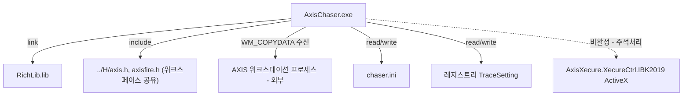

# Dependency

## 목차

- [개요](#개요)
  - [정적 라이브러리 — RichLib](#정적-라이브러리-richlib)
  - [워크스페이스 공유 헤더 (`../H/`)](#워크스페이스-공유-헤더-h)
  - [MFC / Windows API](#mfc-windows-api)
  - [COM / ActiveX (비활성 상태)](#com-activex-비활성-상태)
  - [외부 설정 파일](#외부-설정-파일)
- [의존 관계 다이어그램](#의존-관계-다이어그램)

---

- 생성일: 2026-07-10
- 목적: 외부 라이브러리, COM 컨트롤, 모듈 간 의존 관계를 기록한다.

## 개요

AxisChaser(`Application`, `AxisChaser.vcxproj`)는 다음을 의존한다.

### 정적 라이브러리 — RichLib

- `AxisChaser.vcxproj`의 `AdditionalDependencies`에 `Debug/RichLib.lib` /
  `Release/RichLib.lib`가 링크됨.
- RichLib은 `RichLib/RichLib.vcxproj`로 별도 빌드되는 서브 프로젝트(`.dsp`/`.sln`도
  남아있어 VC6 시절부터 이어진 구조로 추정). `AxisChaser`가 프로젝트 참조
  (`ProjectReference`)가 아니라 산출물 `.lib` 경로를 직접 지정하는 방식이라, **RichLib을
  AxisChaser보다 먼저 빌드해야** `Debug/RichLib.lib` 또는 `Release/RichLib.lib`가
  존재한다.
- 제공 클래스: `CRichEditCtrlEx`(RichEdit 확장), `CRTFBuilder`(RTF 스트림 빌더 —
  `<<`/`>>` 연산자 오버로딩으로 폰트/색상/굵게/기울임 등을 체이닝 방식으로 구성).

### 워크스페이스 공유 헤더 (`../H/`)

- `ChildView.cpp`가 `#include "../H/axis.h"`, `#include "../H/axisfire.h"`로
  `d:\src\IBKS\src\H\` 디렉토리를 상대 경로로 참조.
- 사용되는 정의: `struct _axisH`, `L_axisH`(헤더 크기), `statENC`(암호화 플래그) 등 —
  AXIS 통신 프로토콜의 공용 상수/구조체.
- 이 헤더들은 AxisChaser 소유가 아니라 워크스페이스 전역 공유 자원이므로, 변경 시
  다른 서브프로젝트(AXIS 본체 등)에 영향을 줄 수 있음 — 수정 전 영향 범위 확인 필요.

### MFC / Windows API

- `afxwin.h`, `afxcmn.h`(공통 컨트롤), `afxtempl.h`(`CArray` 등 템플릿 컬렉션),
  `afxmt.h`(`CCriticalSection`), `afxcoll.h`(`CObArray`, `CMapStringToString`,
  `CStringArray`)
- `CFrameWnd`, `CWnd`, `CDialog`, `CToolBar`, `CRichEditCtrl`, `CFindReplaceDialog`,
  `CColorDialog`, `CFileDialog` 등 표준 MFC UI 클래스
- WinAPI: `CreateMutex`/`OpenMutex`(단일 인스턴스 체크), `GetModuleFileName`,
  `GetPrivateProfileInt/String`(INI 설정 `chaser.ini`), `RegisterWindowMessage`
  (`FINDMSGSTRING`)

### COM / ActiveX (비활성 상태)

- `AfxOleInit()` 호출은 살아있으나, 그 이후 `AxisXecure.XecureCtrl.IBK2019` ActiveX
  컨트롤을 `CreateControl`로 생성하고 `DllRegisterServer`를 호출하는 코드 전체가
  `CChildView::OnCreate`(`ChildView.cpp:204-261`)에서 **주석 처리되어 비활성화**됨.
  `CChildView::Xecure()`(암복호화 헬퍼 호출)도 항상 `false` 반환 — 현재 빌드에서는
  COM 의존성이 사실상 사용되지 않음(코드는 남아있어 재활성화 가능성 있는 상태).

### 외부 설정 파일

- `chaser.ini` — `COptions`/`CChildView::loadOptions()`가 읽는 표시 옵션(send/receive/
  header/data/rts) 및 `[code]` 섹션의 표시 대상 코드 목록.
- 레지스트리(`HKCU\...\AXIS\[AXIS Chaser] <TargetKey>`, `TRACESETTING` 섹션) — 폰트/색상/
  창 위치 등 사용자 설정 영속화(`CWinApp::GetProfileInt/WriteProfileInt`).

## 의존 관계 다이어그램

