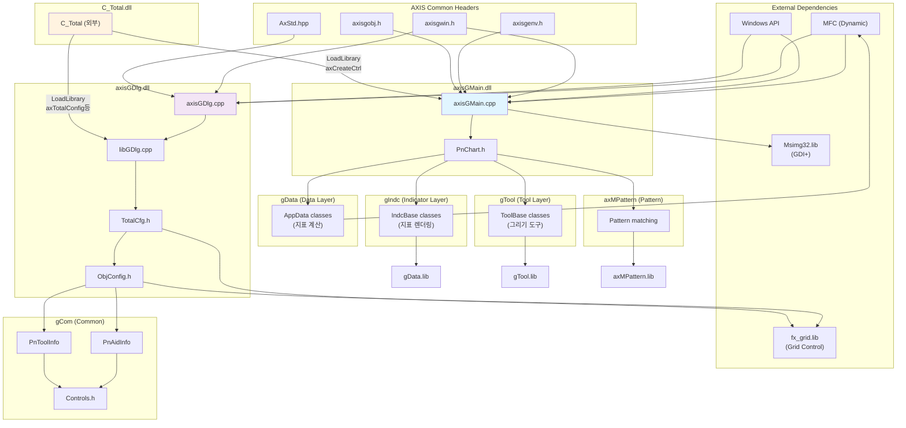

# axisGMain.dll & axisGDlg.dll 의존성 분석

## 목차

- [개요](#개요)
- [axisGMain.dll 의존성](#axisgmaindll-의존성)
  - [정적 링크 의존성](#정적-링크-의존성-1)
  - [Include 관계](#include-관계-1)
  - [Export 함수](#export-함수-1)
  - [런타임 동작](#런타임-동작-1)
- [axisGDlg.dll 의존성](#axisgdlgdll-의존성)
  - [정적 링크 의존성](#정적-링크-의존성-2)
  - [Include 관계](#include-관계-2)
  - [Export 함수](#export-함수-2)
  - [런타임 동작](#런타임-동작-2)
- [C_Total과의 관계](#c_total과의-관계)
- [의존성 그래프](#의존성-그래프)
- [Build 구조](#build-구조)

---

## 개요

**axisGMain.dll**과 **axisGDlg.dll**은 C_Total(차트 컨트롤) 내부에서 로드되는 보조 DLL입니다.

- **axisGMain.dll**: 차트 렌더링 엔진 (실제 그리기)
- **axisGDlg.dll**: 차트 설정 다이얼로그 라이브러리

두 DLL 모두 **C_Total.dll**에 의해 런타임에 `LoadLibrary`로 동적 로드되며, 정적 링크 의존성은 상호 간에 없습니다.

---

## axisGMain.dll 의존성

### 정적 링크 의존성

```
axisGMain.dll (Release)
├─ ../gData/Release/axisGData.lib          [차트 데이터 처리]
├─ ../gIndc/Release/axisGIndc.lib          [지표 렌더링]
├─ ../gTool/Release/axisGTool.lib          [그리기 도구]
├─ ../axMPattern/Release/axMPattern.lib    [패턴 매칭]
└─ Msimg32.lib                             [Windows GDI+ (AlphaBlend 등)]
```

### Include 관계

**Header hierarchy** (StdAfx.h 및 axisGMain.h):

```
axisGMain.h
├─ #include "resource.h"                      (로컬 리소스)
├─ #include "afxtempl.h"                      (MFC 템플릿)
├─ #include "../../h/axisgwin.h"              (차트 윈도우 인터페이스)
├─ #include "../../h/axisgenv.h"              (환경 설정 구조체)
└─ #include "../../h/axisgobj.h"              (차트 객체 정의)

StdAfx.h (gMain)
├─ #include <afxwin.h>                        (MFC 코어)
├─ #include <afxext.h>                        (MFC 확장)
├─ #include <afxole.h>                        (OLE)
├─ #include <afxdisp.h>                       (자동화)
├─ #include <afxdb.h>                         (ODBC - 선택)
├─ #include <afxdao.h>                        (DAO - 선택)
├─ #include <afxdtctl.h>                      (IE4 공통 컨트롤)
├─ #include <afxcmn.h>                        (Windows 공통 컨트롤)
└─ #include "../mxtrace.h"                    (공통 로깅)

libGMain.cpp
├─ #include "PnChart.h"                       (차트 렌더링 패널)
└─ Export: axCreateCtrl (메인 팩토리 함수)
```

**공통 헤더 의존성**:
- `../../h/axisgwin.h` - 차트 윈도우 인터페이스
- `../../h/axisgenv.h` - 환경 설정 구조체
- `../../h/axisgobj.h` - 차트 객체 정의

### Export 함수

| 함수명 | 호출처 | 용도 |
|--------|--------|------|
| `axCreateCtrl(int iCtrlKind, CWnd*, CWnd*, char*, CFont*)` | C_Total::MainWnd::CreatePn() | 차트 렌더링 컨트롤 생성 (GEV_CHART 타입) |

**호출 흐름**:
```cpp
// C_Total/MainWnd.cpp ~1298줄
CWnd* (APIENTRY *axCreateCtrl)(int, CWnd*, CWnd*, char*, CFont*);
axCreateCtrl = (CWnd* (APIENTRY *)(int, CWnd*, CWnd*, char*, CFont*))
    GetProcAddress(m_hGMainLib, "axCreateCtrl");
pWnd = axCreateCtrl(GEV_CHART, m_pwndView, this, (char*)m_pEnvInfo, m_pFont);
```

### 런타임 동작

**동적 로딩 없음** - axisGMain.dll 자체에서 `LoadLibrary` 호출 없음

**내부 라이브러리 의존성**:
- gData: 차트 데이터 점 계산, 지표값 산출 — OHLC(시고저종) 구성 방식은
  [AxisGData_CandleConstruction.md](AxisGData_CandleConstruction.md) 참고
- gIndc: 주가 봉(캔들), 보조지표 렌더링
- gTool: 선, 화살표, 패턴 도구 그리기
- axMPattern: 차트 패턴(헤드앤숄더, 더블탑 등) 인식

---

## axisGDlg.dll 의존성

### 정적 링크 의존성

```
axisGDlg.dll (Release)
├─ ../../../fx_grid/Release/fx_grid.lib     [그리드 컨트롤 라이브러리]
├─ ../gCom/PnAidInfo.cpp                    [보조지표 정보 패널]
└─ ../gCom/PnToolInfo.cpp                   [도구 정보 패널]
```

**참고**: gCom의 일부 .cpp 파일만 포함되며, gCom 자체가 독립 라이브러리는 아닙니다.

### Include 관계

**Header hierarchy** (StdAfx.h 및 axisGDlg.h):

```
axisGDlg.h
└─ #include "resource.h"                      (로컬 리소스)

StdAfx.h (gDlg)
├─ #include <afxwin.h>                        (MFC 코어)
├─ #include <afxext.h>                        (MFC 확장)
├─ #include <afxole.h>                        (OLE)
├─ #include <afxodlgs.h>                      (OLE 다이얼로그)
├─ #include <afxdisp.h>                       (자동화)
├─ #include <afxdb.h>                         (ODBC - 선택)
├─ #include <afxdao.h>                        (DAO - 선택)
├─ #include <afxdtctl.h>                      (IE4 공통 컨트롤)
├─ #include <afxcmn.h>                        (Windows 공통 컨트롤)
├─ #include "../../h/axisgwin.h"              (차트 윈도우 인터페이스)
├─ #include "libcommon.h"                     (로컬 공통 함수)
├─ #include "Controls.h"                      (커스텀 컨트롤)
├─ #include "ControlEx.h"                     (확장 컨트롤)
├─ #include "../MxTrace.h"                    (공통 로깅)
└─ #include <AxStd.hpp>                       (AXIS 표준 템플릿 - D:\src\IBKS\src\h\)

libGDlg.cpp (Export 함수들)
├─ #include "TotalCfg.h"                      (전체 환경설정 다이얼로그)
├─ #include "ObjConfig.h"                     (지표 설정 다이얼로그)
├─ #include "SaveFrameDlg.h"                  (프레임 저장/로드 다이얼로그)
├─ #include "ScreenCfg.h"                     (화면 설정 다이얼로그)
├─ #include "ToolCfg.h"                       (도구 설정 다이얼로그)
├─ #include "SetDrawtoolDlg.h"                (그리기 도구 설정)
├─ #include "SetAidDlg.h"                     (보조지표 설정)
├─ #include "SetYAxisDlg.h"                   (Y축 설정)
└─ #include "SetYShowDlg.h"                   (Y축 표시 설정)
```

**공통 헤더 의존성**:
- `../../h/axisgwin.h` - 차트 윈도우 인터페이스
- `../../h/AxStd.hpp` - AXIS 표준 템플릿

### Export 함수

| 함수명 | C_Total 호출 위치 | 용도 |
|--------|------------------|------|
| `axTotalConfig(CWnd* pMain, DWORD, char*, char*, char*)` | Config() | 전체 환경설정 |
| `axIndcConfig(CWnd* pMain, DWORD, char*, char*, char*)` | (이차 다이얼로그) | 지표 설정 |
| `axSaveFrame(CWnd* pMain, char*, char*, char*)` | (프레임 저장) | 프레임 저장/로드 |
| `axScreenConfig(CWnd* pMain, DWORD, char*, char*, char*)` | (화면 설정) | 화면 설정 (현재 미사용) |
| `axToolConfig(CWnd* pMain, void*)` | (도구 설정) | 도구 설정 다이얼로그 |
| `axPnToolConfig(CWnd* pwndGView, CWnd* pwndView, char*)` | (차트 도구 설정) | 차트상 도구 설정 |
| `axPnAidConfig(CWnd* pwndGView, CWnd* pwndView, char*)` | (차트 보조지표 설정) | 차트상 지표 설정 |
| `axYAxisConfig(CWnd* pwndGView, CWnd* pwndView, char*, char*, char*)` | (Y축 설정) | Y축 범위 설정 |
| `axYShowConfigByMove()` | (마우스 드래그) | Y축 범위 실시간 조정 |

**호출 패턴** (C_Total/MainWnd.cpp ~1916줄):
```cpp
// 지연 로딩 (Lazy Loading)
if (!m_pApp->m_hGDlgLib)
    m_pApp->m_hGDlgLib = LoadLibrary("axisGDlg.dll");

if (m_pApp->m_hGDlgLib)
{
    axTotalConfig = (char* (APIENTRY *)(CWnd*, DWORD, char*, char*, char*))
        GetProcAddress(m_hGDlgLib, "axTotalConfig");
    // ... 사용
}
```

### 런타임 동작

**동적 로딩 없음** - axisGDlg.dll 자체에서 `LoadLibrary` 호출 없음

**부모-자식 의존성**:
- C_Total에서 필요시에만 `LoadLibrary`로 로드 (다이얼로그 호출 시점)
- 로드 실패해도 다이얼로그만 표시 안됨 (컨트롤은 계속 동작) — axisGMain.dll보다 낮은 심각도

---

## C_Total과의 관계

### 로드 시점 및 전략

| DLL | 로드 시점 | 로드 전략 | 실패 처리 |
|-----|----------|---------|----------|
| axisGMain.dll | OnCreate() | 필수 (절대경로 → 상대경로 → LOAD_WITH_ALTERED_SEARCH_PATH) | MessageBox 후 컨트롤 생성 실패 |
| axisGDlg.dll | 지연 로딩 (설정 다이얼로그 호출 시) | 선택 (상대경로만) | MessageBox, 해당 다이얼로그만 무산 |

### 상호 의존성

```
C_Total.dll
├─ LoadLibrary("axisGMain.dll")  [OnCreate]
│  ├─ gData.lib
│  ├─ gIndc.lib
│  ├─ gTool.lib
│  ├─ axMPattern.lib
│  └─ Msimg32.lib
│
├─ LoadLibrary("axisGDlg.dll")    [지연 로딩]
│  ├─ fx_grid.lib
│  └─ gCom 부분 파일들
│
└─ Include: axisgwin.h, axisvar.h, axisfire.h
```

**axisGMain.dll과 axisGDlg.dll 간 직접 의존성**: **없음** ✓
- 두 DLL은 C_Total을 통해서만 간접 연결
- 서로 다른 목적 (렌더링 vs 다이얼로그)

---

## 의존성 그래프



---

## Build 구조

### Directory Layout

```
D:\src\IBKS\src\CONTROL\ibk_chart_dll_20220831\chart_dll\
├─ gMain\
│  ├─ axisGMain.vcxproj        → axisGMain.dll
│  ├─ axisGMain.h, axisGMain.cpp
│  ├─ libGMain.cpp             (Export: axCreateCtrl)
│  ├─ PnChart.h, PnChart.cpp    (차트 렌더링)
│  ├─ CrossLine.h, DaedeungDlg.h, Excel.h (도형/분석 도구)
│  └─ Release/ Debug/           (빌드 산출물)
│
├─ gDlg\
│  ├─ axisGDlg.vcxproj         → axisGDlg.dll
│  ├─ axisGDlg.h, axisGDlg.cpp
│  ├─ libGDlg.cpp              (Export: axTotalConfig등)
│  ├─ TotalCfg.h, ObjConfig.h, ScreenCfg.h, ToolCfg.h
│  ├─ MainPreview.h, PreviewWnd.h
│  └─ Release/ Debug/           (빌드 산출물)
│
├─ gData\
│  ├─ axisGData.vcxproj         → axisGData.lib
│  ├─ DataMgr.h, OrgData.h
│  └─ App*.h (AppMA, AppRSI, AppMACD, ... 지표 클래스들)
│
├─ gIndc\
│  ├─ axisGIndc.vcxproj         → axisGIndc.lib
│  ├─ GraphMgr.h, IndcBase.h
│  └─ B*.h, L*.h (주가 봉, 선형/비선형 지표 렌더링)
│
├─ gTool\
│  ├─ axisGTool.vcxproj         → axisGTool.lib
│  ├─ ToolMgr.h, ToolBase.h
│  └─ *.h (선, 화살표, 피보나치, 갠, 기간 도구 등)
│
├─ axMPattern\
│  ├─ AxMPattern.vcxproj        → AxMPattern.lib
│  └─ 패턴 매칭 관련 클래스들
│
└─ gCom\
   ├─ axisGCom.vcxproj          (라이브러리 아님, 소스 공유)
   ├─ PnAidInfo.h, PnToolInfo.h
   ├─ Controls.h, ControlEx.h
   └─ Pn*.h (Panel 기반 UI 컴포넌트들)

D:\src\IBKS\src\CONTROL\fx_grid\
├─ fx_grid.vcxproj              → fx_grid.lib (그리드 컨트롤)
└─ (GridCtrl 관련 클래스들)
```

### Build Dependencies (vcxproj)

**axisGMain.vcxproj**:
```xml
<AdditionalDependencies>
  ../gData/Release/axisGData.lib;
  ../gIndc/Release/axisGIndc.lib;
  ../gTool/Release/axisGTool.lib;
  ../axMPattern/Release/axMPattern.lib;
  Msimg32.lib;
  %(AdditionalDependencies)
</AdditionalDependencies>
```

**axisGDlg.vcxproj**:
```xml
<AdditionalDependencies>
  ../../../fx_grid/Release/fx_grid.lib;
  %(AdditionalDependencies)
</AdditionalDependencies>
<AdditionalIncludeDirectories>
  ../../h
</AdditionalIncludeDirectories>
```

### Output Paths

| 빌드 | axisGMain.dll | axisGDlg.dll | axisGData.lib | gIndc.lib | gTool.lib | axMPattern.lib | fx_grid.lib |
|------|---|---|---|---|---|---|---|
| Release | `../../../../../release/AXISGMAIN.DLL` | `../../../../exe/AXISGDLG.DLL` | `Release/` | `Release/` | `Release/` | `Release/` | `Release/` |
| Debug | `../../../../../exe/AXISGMAIN.DLL` | `../../../../../exe/AXISGDLG.DLL` | `debug/` | `debug/` | `debug/` | `debug/` | `debug/` |

---

## 변경 영향도

### axisgwin.h 수정 시

| 영향 범위 | 심각도 |
|----------|--------|
| axisGMain.dll (재컴파일) | **높음** |
| axisGDlg.dll (재컴파일) | **높음** |
| C_Total.dll (재컴파일) | **높음** |

→ 공통 헤더이므로 전체 프로젝트 재구성 필요

### gData.lib/gIndc.lib/gTool.lib 수정 시

| 항목 | 영향 |
|------|------|
| axisGMain.dll 재링크 필수 | O |
| axisGDlg.dll 영향 | X (직접 의존성 없음) |
| C_Total.dll 영향 | X (간접 의존성만) |

### fx_grid.lib 수정 시

| 항목 | 영향 |
|------|------|
| axisGDlg.dll 재링크 필수 | O |
| axisGMain.dll 영향 | X |
| C_Total.dll 영향 | X |

---

## 히스토리

- **초기 작성**: 2026-08-27
- **분석 대상**: axisGMain.dll, axisGDlg.dll
- **소스 위치**: D:\src\IBKS\src\CONTROL\ibk_chart_dll_20220831\chart_dll\
