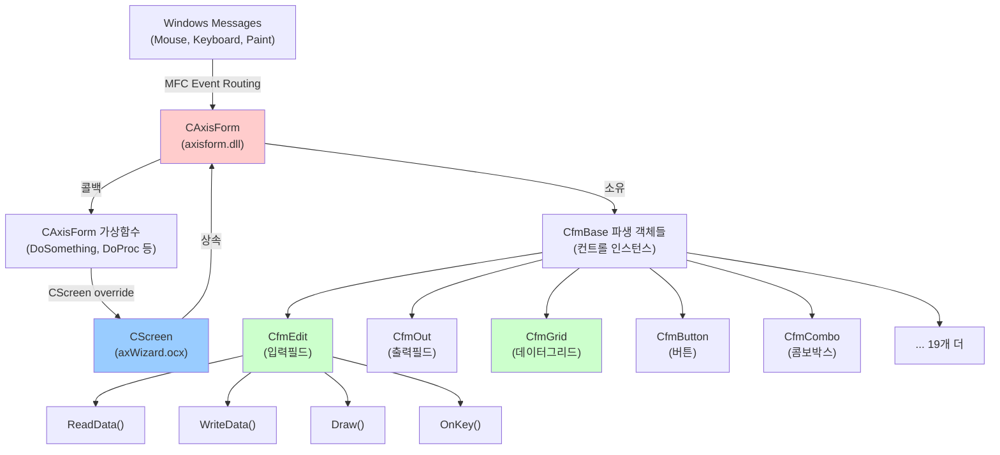
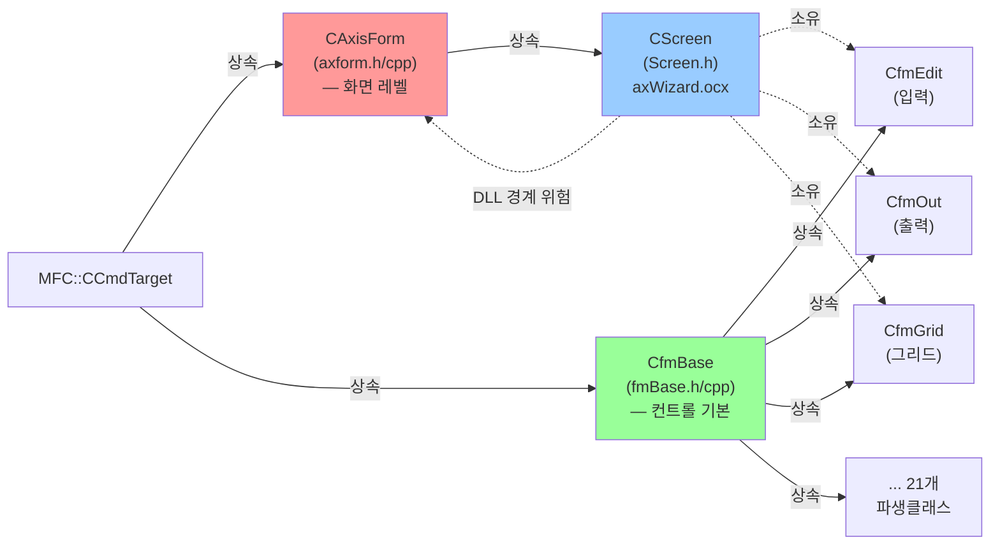

# axisform.dll (dll/form/) 아키텍처 분석

## 문서 목적

AXIS HTS의 **폼/컨트롤 렌더링 레이어**(axisform.dll, `dll/form/`)의 전체 구조, 클래스 계층, 데이터 흐름을 분석합니다.
이 서브시스템은 화면(맵) 위의 모든 시각적 컨트롤(입력박스, 버튼, 그리드 등)의 생명주기를 관리하는 핵심 인프라이며,
**그동안 전혀 문서화된 적 없는 사각지대**였습니다.

관련 고수준 문서: `@docs/WizardArchitecture.md`(Wizard 계층), `@docs/Architecture.md`(전체 3계층)

---

## 1. 클래스 계층 구조

### 전체 의존성 다이어그램



### 클래스 관계도



---

## 2. CAxisForm — 화면(폼) 레벨 기본 클래스

### 역할

- 맵 바이너리 로드 및 폼 구조 파싱
- 폼에 포함된 모든 컨트롤(CfmBase 파생 객체)의 컬렉션 관리
- 그리기, 크기 조정, 포커스 관리
- Wizard의 CScreen이 override하는 가상함수 제공 (DoSomething, DoProc, GetHistory 등)

### 주요 멤버 (구조 요약)

```cpp
class CAxisForm : public CCmdTarget {
    // 컬렉션
    CObArray m_fmObs;              // 모든 폼 객체 배열
    CMapStringToOb m_n2Obs;        // 이름 → 폼 매핑 (빠른 조회)

    // 맵 바이너리
    char* m_mapB;                  // 맵 바이너리 포인터
    DWORD m_mapL;                  // 크기

    // 구조체 포인터 (파싱된 맵 정의)
    struct _mapH* m_mapH;          // 맵 헤더
    struct _formR* m_formR;        // 폼 정의 배열
    struct _cellR* m_cellR;        // 셀 정의 (그리드용)
    struct _pageR* m_pageR;        // 페이지 정의
    DWORD* m_valueR;               // 초기값 배열
    char* m_scriptR;               // 스크립트 섹션

    // 렌더링
    class CAxisDraw* m_draw;       // 그리기 엔진
    class CAxisPalette* m_palette; // 색상 팔레트
    CWnd* m_view;                  // 부모 윈도우

    // 스케일
    float m_hRatio;                // 수평 확대율
    float m_vRatio;                // 수직 확대율
};
```

### 핵심 공개 인터페이스

**로드/파싱:**
```cpp
bool LoadMAP(CString mapN);                    // 맵 파일 로드
void LoadForm(CRect mRect, bool drawOnly);     // 폼 파싱 및 생성
```

**폼 조회:**
```cpp
CfmBase* GetAtForm(int key);                    // 인덱스로 폼 조회
bool FindForm(CString symbol, CfmBase*& form);  // 이름으로 폼 조회
```

**렌더링/UI:**
```cpp
void DrawForm(CDC* dc);                        // 모든 폼 그리기
void ResizeForm(float hRatio, float vRatio);   // 폼 크기 조정
void ClearForm(int type = CLR_ALL);            // 입력/출력 필드 초기화
```

**라디오/탭:**
```cpp
void SetRadioGroup(CString symbol, bool checked);
void SetTabPage(int index, CfmBase* tab);
```

### 가상함수 (CScreen이 override)

```cpp
virtual long DoSomething(int type, CfmBase* form, ...);
    // 유형: doPUSH(데이터 저장), doPOP(복구), doRELOAD, doBLINK,
    //       doSEND(서버 전송), doCLEAR, doFOCUS, doCOMBO, doOBJECT 등

virtual int DoComboBox(CfmBase* form);
    // 콤보박스 작업 처리

virtual void DoProc(CString procs, CfmBase* form, ...);
    // 스크립트 프로시저 실행

virtual bool GetHistory(CString name, CString& codes, bool up);
    // 편집 히스토리 조회

virtual BOOL IsResizable();
virtual int GetHeight();
virtual int GetWidth();
    // 크기 조회

#ifdef DF_RTM_INDEX
virtual void UpdateFlashCode(WORD key, CString text);
    // RTM 코드 필드 변경 훅 (2026-07-23 추가, 반드시 맨 뒤 — 8절 참고)
#endif
```

---

## 3. CfmBase — 컨트롤 기본 클래스

### 역할

모든 컨트롤 타입(edit, button, grid 등)의 공통 인터페이스 정의.

### 주요 멤버 (구조 요약)

```cpp
class CfmBase : public CCmdTarget {
    // 소유권
    struct _formR* m_form;         // 이 폼의 정의 구조체 (attr/kind/iorder/size 등)
    CAxisForm* m_axform;           // 부모 폼 (콜백용, 실제로는 CScreen 인스턴스)
    int m_iform;                   // 폼 배열 내 인덱스

    // 그리기
    CRect m_rect;                  // 컨트롤의 논리 위치/크기
    CRect m_pRc;                   // 실제 화면 그리기 좌표 (스케일 적용)
    COLORREF m_pRGB, m_tRGB, m_bRGB; // 배경/텍스트/보더 색

    // 상태
    bool m_focus;                  // 포커스 여부
    bool m_mousedown;              // 마우스 버튼 누름 여부
    int m_rts;                     // 컨트롤 번호 (내부 식별자)
};
```

### 핵심 가상함수

**데이터 입출력:**
```cpp
virtual void ReadData(CString& data, bool edit, int col, int row);
    // 컨트롤 값을 문자열로 읽음

virtual void WriteData(CString data, bool redraw, int col, int row);
    // 문자열 값을 컨트롤에 쓰기 (화면 갱신)

virtual bool IsChanged(bool reset);
    // 데이터 변경 여부 확인 및 플래그 리셋
```

**렌더링:**
```cpp
virtual void Draw(CDC* dc);
    // 컨트롤을 DC에 그리기
```

**사용자 입력:**
```cpp
virtual int OnKey(int key, int& result);
virtual void OnLButton(bool down, CPoint pt, int& result);
virtual void OnDblClick(CPoint pt, int& result);
virtual void UpdateData(int key, bool moving, int& result);
    // 사용자 입력 후 데이터 모델 갱신 (키 입력 커밋)
virtual void InsertData(int key, bool moving, int& result);
    // 데이터 삽입 (그리드 행 추가 등)
```

**상태 제어:**
```cpp
virtual void SetFocus(bool focus);
virtual void SetVisible(bool visible, int col, int row);
virtual void SetEnable(bool enable);
virtual void SetFgColor(int rgb, int col, int row);
virtual void SetBkColor(int rgb, int col, int row);
```

**중요:** `WriteData`/`ReadData`/`Draw` 등은 각 파생 클래스가 `CfmBase`의 기본 구현을 호출하지 않고 **완전히 자체 구현**하는 경우가 많다(예: `CfmEdit::WriteData`, `CfmOut::WriteData`). 즉 `CfmBase`에 공통 로직을 추가해도 대부분의 실제 컨트롤에는 반영되지 않는다 — 오늘(2026-07-23) RTM 코드필드 훅을 추가할 때도 `CfmBase::WriteData`가 아니라 `CfmEdit::WriteData`/`CfmOut::WriteData` 양쪽에 개별적으로 훅을 넣어야 했다.

---

## 4. 주요 파생 클래스 상세

### 4.1 CfmEdit — 입력 필드

**파일:** `fmEdit.h/cpp` (약 2000줄)

**역할:** 텍스트 입력, 숫자 스핀, 코드 조회, 날짜 선택기 포함.

**특화 멤버:** `m_changed`(변경 플래그), `m_strR`/`m_data`(표시 텍스트), `m_caretPos`(커서 위치), `m_spinRc`/`m_codeRc`(스핀·코드조회 버튼 영역), `m_codes`(코드 히스토리/목록).

**전문화:**
- 스핀 버튼으로 수치 조정, 코드조회(▼) 버튼으로 코드 목록 팝업
- 날짜 필드는 달력 팝업(`CmonthWnd`) 지원
- 자동 포맷팅(천단위, 소수점 등)
- 키 입력은 `UpdateData(int key, ...)`가 처리(`m_strR` 버퍼 직접 조작) — 이 함수는 early-return 분기가 많아 값이 커밋되는 지점이 여러 군데로 흩어져 있다(RTM 조사 때 확인, `docs/RealtimeCodeIndex_Investigation.md` 참고). 반면 값이 실제로 "확정"되는 시점은 `SetFocus(false)`(포커스 이탈)로 비교적 깔끔하게 잡을 수 있다.

### 4.2 CfmOut — 출력 필드

**파일:** `fmOut.h/cpp` (약 500줄)

**역할:** 읽기 전용 데이터 표시 (RTM 시세 갱신 시 주로 사용).

**전문화:**
- `WriteData` 호출로만 값 변경(사용자 직접 입력 불가)
- RTM 데이터 수신 시 이 컨트롤의 `WriteData`가 자주 호출됨
- 실시간 종목코드 매칭용 "키 필드"가 `FM_EDIT`이 아니라 `FM_OUT`인 경우가 실제로 있다(실측 사례: `IB999987`의 `1021` 필드, `docs/RealtimeCodeIndex_Investigation.md` 참고) — 조회는 `FM_EDIT`로, 실시간 매칭 키는 `FM_OUT`으로 분리된 설계.

### 4.3 CfmGrid — 데이터 그리드

**파일:** `fmGrid.h/cpp` (약 4000줄, 이 서브시스템에서 가장 복잡한 컨트롤)

**핵심 구조:** 열 단위로 `Ccolumn` 객체를 배열로 관리하며, 각 `Ccolumn`이 행별 표시값/실데이터/속성을 별도 배열로 들고 있다(`m_display`, `m_data`, `m_attrs`).

**전문화:**
- 다중 행/열 스크롤, 셀 레벨 편집(edit/combo/check/button 모드)
- 정렬, 필터링, 드래그앤드롭, Excel 내보내기/가져오기
- RTM 갱신 시 `CScreen::OnAlert`에서 일반 필드와 다른 경로(`FlashGrid`)로 처리됨 — 단일 코드 필드가 아니라 여러 종목을 동시에 표시하는 구조라 `m_codeIndex` 역인덱스 설계에서 의도적으로 제외됨(`docs/RealtimeCodeIndex_Investigation.md` 참고)

---

## 5. 모든 파생 클래스 목록 (24개)

| 클래스 | 파일 | 역할 |
|--------|------|------|
| CfmEdit | fmEdit.h/cpp | 텍스트 입력, 스핀, 코드 조회 |
| CfmOut | fmOut.h/cpp | 출력전용 필드 (RTM 시세) |
| CfmGrid | fmGrid.h/cpp | 데이터 그리드, 정렬, 편집 |
| CfmButton | fmButton.h/cpp | 클릭 버튼 |
| CfmLabel | fmLabel.h/cpp | 텍스트 레이블 (읽기전용) |
| CfmCombo | fmCombo.h/cpp | 드롭다운 콤보박스 |
| CfmCheck | fmCheck.h/cpp | 체크박스 |
| CfmRadio | fmRadio.h/cpp | 라디오 버튼 그룹 |
| CfmMemo | fmMemo.h/cpp | 멀티라인 텍스트 |
| CfmObject | fmObject.h/cpp | 임베디드 화면(서브화면) |
| CfmPanel | fmPanel.h/cpp | 패널/그룹 박스 |
| CfmTab | fmTab.h/cpp | 탭 컨트롤 |
| CfmTable | fmTable.h/cpp | 테이블 (그리드 유사) |
| CfmTreeView | fmTreeView.h/cpp | 트리 뷰 |
| CfmBrowser | fmBrowser.h/cpp | 웹 브라우저 (IE/Edge) |
| CfmEditEx | fmEditEx.h/cpp | 확장 편집(단축키 등) |
| CfmGroup | fmGroup.h/cpp | 그룹박스 경계선 |
| CfmSheet | fmSheet.h/cpp | 스프레드시트 스타일 |
| CfmSysm | fmSysm.h/cpp | 시스템 정보(시간, 잔고 등) |
| CfmUserTab | fmUserTab.h/cpp | 사용자 정의 탭 |
| CfmAvi | fmAvi.h/cpp | AVI 동영상 재생 |
| CfmBox | fmBox.h/cpp | 박스/테두리 |
| CfmCtrl | fmCtrl.h/cpp | 사용자 정의 컨트롤 |

**합계: CfmBase(기본) + 24개 파생 = 25개 컨트롤 클래스**

> 정확한 라인 수 등 세부 수치는 이번 1차 분석에서 파일별로 실측하지 않았다 — 필요하면 다음 분석 때 `wc -l`로 보강할 것.

---

## 6. 컨트롤 생명주기

### 생성 단계

```
1. LoadMAP(mapN)          — 맵 파일 로드(바이너리), m_mapH/m_formR/m_cellR 등 파싱
2. LoadForm(rect)          — m_formR[] 순회, kind별로 동적 생성
                             (FM_EDIT→CfmEdit, FM_OUT→CfmOut, FM_GRID→CfmGrid, ...)
                             m_fmObs 배열 등록, m_n2Obs 이름 매핑
3. 각 파생 클래스 생성자   — 멤버 초기화, 이미지/폰트 로드
```

### 사용 단계 (개념도)

```
RTM 데이터 도착 → CScreen::OnAlert → form->WriteData(value) → invalidateRect
WM_PAINT        → CAxisForm::DrawForm → form->Draw(dc)
사용자 입력      → OnLButton()/OnKey() → UpdateData() → IsChanged() → 스크립트 콜백
```

### 소멸 단계

```
~CAxisForm() → m_fmObs[] 순회 → 각 CfmBase 파생 객체 delete
```

---

## 7. 데이터 흐름

### RTM(실시간 시세) 갱신 흐름 — 상세는 `docs/KnowledgeBase.md` 11절, `docs/RealtimeCodeIndex_Investigation.md` 참고

```
소켓 수신(틱) → CGuard::DoRTM → CClient::OnAlert(code)
  → CScreen::OnAlert(code)
      1. m_flashObs[] 순회 (FA_FLASH 속성이 붙은 폼들)
      2. FM_GRID/FM_TABLE/FM_CONTROL → FlashGrid/FlashSemi로 별도 처리
      3. 그 외(default) → form->ReadData(text); text.Compare(code)
      4. 일치하면 UpdateRTM(key+1, ...) 호출
          → key 이후 필드 순회, 필드명을 실시간 데이터셋에서 조회
          → form->WriteData(value)  (CfmEdit/CfmOut::WriteData)
              → 내부 버퍼 갱신 + invalidateRect()
WM_PAINT → CAxisForm::DrawForm → form->Draw(dc) → 화면 반영
```

### 사용자 입력 흐름 (CfmEdit 기준)

```
WM_KEYDOWN/WM_CHAR → CfmEdit::OnKey → CfmEdit::UpdateData(key, ...)
  → m_strR 버퍼 갱신, m_changed = true
포커스 이탈 → CfmEdit::SetFocus(false)  ← 값이 "확정"되는 안정적 지점
변경 확인 → CfmBase::IsChanged() → Script.cpp의 CScript::On*() → m_vbe->DoProcedure(...)
```

---

## 8. DLL 경계의 위험성 (2026-07-23 실제 크래시 사례)

### 상황: axisform.dll ↔ axWizard.ocx는 서로 다른 두 개의 바이너리

- **axisform.dll** (`dll/form/`, `axisform.vcxproj`) — `CAxisForm`(기반), `CfmBase`와 24개 파생 컨트롤 클래스 전부
- **axWizard.ocx** (`Wizard/`) — `CScreen : public CAxisForm`, `CScript`, `CClient`, `CGuard` 등

`CScreen`이 `CAxisForm`을 상속하는 구조라, **기반 클래스와 파생 클래스가 서로 다른 DLL에 나뉘어 컴파일**된다.

### 실제 발생한 크래시

RTM 역인덱스 작업 중 `CAxisForm`에 새 가상함수 `UpdateFlashCode`를 **기존 목록 중간**(`DoComboBox`와 `DoProc` 사이)에 삽입했다가, 그 뒤에 선언된 `DoProc`/`GetHistory`/`IsResizable`/`GetHeight`/`GetWidth`의 vtable 슬롯이 전부 하나씩 밀렸다. axisform.dll과 axWizard.ocx의 빌드가 완전히 동기화되지 않으면서(부분빌드 등) vtable 불일치가 발생, `CAxisForm::LoadForm`이 `CScreen::GetHistory`를 가상호출하는 지점에서 크래시가 났다(NULL_POINTER_READ, `mfc140!ATL::CStringData::Release`, cdb `!analyze -v`로 확정. 덤프: `C:\IBKS\IBK투자증권 HTS\user\1172747575\Crashlog\`).

RTM 기능과 전혀 무관한 "화면 로딩 초기 단계"에서 크래시가 발생했다는 점이 이 문제의 위험성을 잘 보여준다 — 원인과 증상의 거리가 매우 멀다.

### 해결 원칙: 새 가상함수는 반드시 목록 맨 끝에 추가

```cpp
// axform.h — 실제 수정된 형태
virtual int  GetWidth() { return 0; }
#ifdef DF_RTM_INDEX
	virtual	void UpdateFlashCode(WORD key, CString text) {}
	// 반드시 마지막에 추가 (기존 가상함수 vtable 슬롯을 밀면 안 됨)
#endif
// Overrides 섹션 시작...
```

맨 끝에 추가하면 기존 슬롯 번호가 전혀 바뀌지 않으므로, 설령 두 DLL 중 하나가 완전히 동시에 재빌드되지 않아도(스테일 상태) 블라스트 반경이 "새 함수 호출 하나"로 국한된다.

### 재컴파일 시 유의사항

| 변경 케이스 | 위험도 | 설명 |
|-----------|--------|------|
| 기존 가상함수 순서 변경/중간 삽입 | 매우 높음 | vtable 전체 어긋남, 무관한 곳에서 크래시 가능 |
| 맨 끝에 가상함수만 추가 | 낮음 | 새 슬롯만 추가, 기존 호출 안전 |
| 비가상 멤버 추가 | 낮음~중간 | 클래스 크기 변경, sizeof 의존 코드 있으면 주의 |

**공통 결론:** `CAxisForm`/`CfmBase`처럼 여러 DLL에서 상속해 쓰는 기반 클래스를 수정한 뒤에는 axisform.vcxproj와 Wizard.vcxproj를 **부분빌드하지 말고 항상 함께 Clean+Rebuild**하고, 두 DLL을 같이 재배포해야 한다.

---

## 9. Wizard와의 인터페이싱 (연동 지점)

| 함수 | 위치 | 역할 |
|------|------|------|
| `CScreen::Parse()` | Wizard/Screen.cpp:198~454 | `LoadMAP`/`LoadForm` 호출로 폼 생성, 컨트롤별 특수 초기화, 스크립트 엔진 로드 |
| `CScreen::OnAlert()` | Wizard/Screen.cpp:755~804 | `m_flashObs` 순회하며 RTM 코드 필드 매칭 |
| `CScreen::UpdateRTM()` | Wizard/Screen.cpp:806~ | 매칭된 코드 이후 필드들에 실시간 값 `WriteData` |
| `CScript::On*()` | Wizard/Script.cpp | `IsChanged()`/이벤트 감지 후 `m_vbe->DoProcedure()`로 스크립트 실행 |
| `CAxisForm` 가상함수 콜백 | axform.h ↔ Screen.h/cpp | `DoSomething`/`DoProc`/`GetHistory` 등 axisform→Wizard 역방향 호출 |

상세 흐름/코드는 `docs/WizardArchitecture.md`, `docs/KnowledgeBase.md` 11~12절, `docs/RealtimeCodeIndex_Investigation.md` 참고.

---

## 10. 핵심 헬퍼 클래스 (dll/form/ 내)

| 클래스/파일 | 역할 |
|------|------|
| `axArray.h/cpp` | 배열 유틸 (CAxStringArray, CAxDWordArray 등) |
| `browser.h/cpp`, `browserX.h/cpp` | 웹 브라우저 컨트롤 기반/확장 |
| `cbList.h/cpp` (CcbList) | 콤보박스 드롭다운 목록 관리 |
| `image.h/cpp` (Cimage) | 이미지 로드/캐싱/렌더링 |
| `memo.h/cpp` (Cmemo) | 멀티라인 텍스트 유틸 |
| `month.h/cpp`, `monthWnd.h/cpp` (Cmonth, CmonthWnd) | 날짜 선택기(달력) 데이터/팝업 |
| `gif.h` | GIF 이미지 처리 |
| `grid.h` | 그리드 보조 유틸 |

---

## 11. 파일 구성 요약

```
dll/form/
  axform.h/cpp          — CAxisForm (화면 레벨 기반)
  fmBase.h/cpp           — CfmBase (컨트롤 기반)
  fmEdit/fmOut/fmGrid/fmButton/fmLabel/fmCombo/fmCheck/fmRadio/fmMemo/
  fmObject/fmPanel/fmTab/fmTable/fmTreeView/fmBrowser/fmEditEx/fmGroup/
  fmSheet/fmSysm/fmUserTab/fmAvi/fmBox/fmCtrl  .h/cpp  (24개 파생 클래스)
  axArray / browser / browserX / cbList / image / memo / month / monthWnd / gif / grid
  axisform.vcxproj / axisform.def / axisform.odl / axisform.rc / Resource.h / StdAfx.h/cpp
```

---

## 12. 설계 패턴 관찰

- **Template Method** — `CfmBase`가 `ReadData`/`WriteData`/`Draw`/`OnKey` 등 공통 가상함수 셋을 정의하고, 24개 파생 클래스가 각자 방식으로 구현. 호출부(Wizard)는 `CfmBase*` 인터페이스만 알면 됨.
- **Strategy(콜백 위임)** — `CAxisForm`이 `DoSomething`/`DoProc`/`GetHistory` 같은 가상함수로 실제 처리를 `CScreen`(Wizard)에 위임 → axisform.dll이 Wizard의 구체 로직을 몰라도 됨.
- **MVC 유사 분리** — 데이터(m_data/버퍼) / 렌더링(Draw) / 입력처리(OnKey, UpdateData)가 각 컨트롤 클래스 내에서 역할별로 나뉨.
- **Composite** — `CfmObject`(임베디드 서브화면), `CfmPanel`/`CfmGroup`은 다른 폼을 포함할 수 있는 컨테이너 성격.

---

## 13. 향후 분석 후보 (미착수)

- `CfmGrid`(약 4000줄, 가장 복잡) 심화 분석 — 셀 편집/정렬/스크롤 내부 구조
- `CAxisDraw`(그리기 엔진) 자체 분석 — 현재는 존재만 확인, 내부 미분석
- 각 파생 클래스 정확한 라인 수/복잡도 실측 (`wc -l` 등)
- Dispatch(IDispatch) 인터페이스 목록 — 스크립트에서 각 컨트롤에 어떤 메서드/프로퍼티로 접근 가능한지 전수 정리

---

## 14. 관련 문서

- `@docs/Architecture.md` — 3계층 개요 (Wizard ↔ axisform 통합 관점)
- `@docs/WizardArchitecture.md` — Wizard(CScreen 등) 클래스 계층/이벤트 흐름 상세
- `@docs/KnowledgeBase.md` — RTM 흐름, DLL 경계 이슈, 트러블슈팅 이력
- `@docs/RealtimeCodeIndex_Investigation.md` — FA_FLASH 필드, vtable 크래시 실사례 상세 기록
- `@docs/CallGraph.md` — 함수 호출 흐름도
- `@docs/SourceIndex.md` — 소스 파일 색인

---

**최종 수정:** 2026-07-24
**작성 방식:** 정적 분석(파일/클래스 전수 확인) + 오늘 작업(RTM 역인덱스, vtable 크래시)에서 실측된 사실 반영
**상태:** 1차 완료 — 세부 심화는 13절 "향후 분석 후보" 참고
