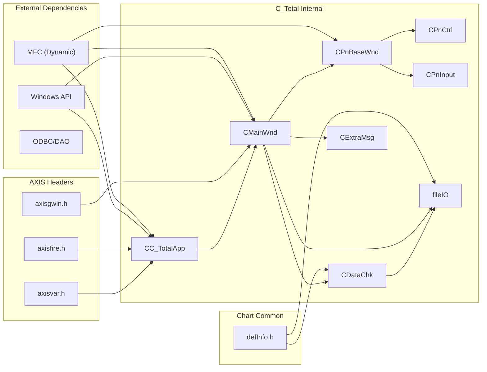

# C_Total 의존성 분석

## 목차

- [의존성 개요](#의존성-개요)
- [내부 의존성](#내부-의존성)
- [외부 의존성](#외부-의존성)
- [DLL/LIB 링크](#dllllib-링크)
- [런타임 동적 로딩 (LoadLibrary)](#런타임-동적-로딩-loadlibrary)
- [포함 경로](#포함-경로)
- [COM/OLE 인터페이스](#comole-인터페이스)
- [순환 의존성](#순환-의존성)

---

## 의존성 개요

C_Total은 MFC 기반 OLE 컨트롤이므로 MFC 동적 라이브러리, Windows API, 그리고 AXIS 프로젝트의
공통 헤더에 의존합니다.

### 의존성 요약

| 카테고리 | 항목 | 의존도 |
|---------|------|--------|
| **MFC** | MFC Dynamic Library | 필수 |
| **COM/OLE** | afxole.h, afxdisp.h | 필수 |
| **Windows API** | Windows.h, wingdi.h, winuser.h | 필수 |
| **AXIS 라이브러리** | axisgwin.h, axisvar.h, axisfire.h | 필수 |
| **프로젝트 내부** | CONTROL/Common, chart_dll | 필수 |
| **ODBC/DAO** | afxdb.h, afxdao.h | 선택 |

---

## 내부 의존성

### 모듈별 Include 관계

```
C_Total.h
├─> resource.h
├─> ../../h/axisfire.h        <- AXIS 헤더
├─> ../../h/axisvar.h         <- AXIS 헤더
├─> ../../h/axisgwin.h        <- AXIS 헤더
└─> ../../chart_dll/gCom/defInfo.h <- Chart Common

MainWnd.h
├─> afxtempl.h                <- MFC 템플릿
├─> C_Total.h
├─> DataChk.h
├─> ExtraMsg.h
├─> fileIO.h
├─> PnCtrl.h
├─> PnInput.h
├─> PnWndCombo.h
└─> PnBaseWnd.h

PnBaseWnd.h
├─> afxtempl.h
└─> (struct _comp 정의)

PnCtrl.h
└─> PnBaseWnd.h

PnInput.h
└─> PnBaseWnd.h

PnWndCombo.h
└─> PnBaseWnd.h

DataChk.h
└─> (자체 헤더)

fileIO.h
└─> (자체 헤더)

ExtraMsg.h
└─> (자체 헤더)
```

### 순환 Include 검사

| From | To | 상태 |
|------|-----|------|
| C_Total.h ↔ MainWnd.h | MainWnd 미포함 | ✓ 안전 |
| MainWnd.h ↔ PnBaseWnd.h | 직접 참조 없음 | ✓ 안전 |
| PnCtrl.h → PnBaseWnd.h | 단방향 | ✓ 안전 |

**결론**: 순환 의존성 없음

---

## 외부 의존성

### 1. MFC (Microsoft Foundation Classes)

**설정**:
```xml
<UseOfMfc>Dynamic</UseOfMfc>
<RuntimeLibrary>MultiThreadedDLL</RuntimeLibrary>
```

**포함 헤더**:
```cpp
#include <afxwin.h>          // MFC core
#include <afxext.h>          // MFC extensions
#include <afxole.h>          // OLE classes
#include <afxodlgs.h>        // OLE dialog classes
#include <afxdisp.h>         // Automation classes
#include <afxtempl.h>        // Template classes (CArray, CMap)
#include <afxdb.h>           // ODBC database classes (선택)
#include <afxdao.h>          // DAO database classes (선택)
#include <afxdtctl.h>        // Internet Explorer 4 Common Controls
#include <afxcmn.h>          // Windows Common Controls
```

**클래스 사용**:
- `CWinApp` - 애플리케이션 클래스
- `CWnd` - 윈도우 클래스
- `CDC` - 디바이스 컨텍스트
- `CFont`, `CPen`, `CBrush` - GDI 리소스
- `CImageList` - 이미지 관리
- `CArray<T>`, `CMap<K,V>` - 컨테이너
- `CString` - 문자열

---

### 2. COM/OLE (Component Object Model)

**OLE 서버 등록**:
```cpp
COleObjectFactory::RegisterAll();  // C_Total.cpp
```

**IDL 파일**:
```
C_Total.odl
├─ library C_Total (uuid FEE6CBC0-69E4-48C2-BA45-98FA1BFCB53D)
└─ dispinterface IMainWnd
   └─ coclass MainWnd
```

**Dispatch Interface**:
```cpp
[id(1)] boolean visible;
[id(2)] BSTR GetProperties();
[id(3)] void SetProperties(BSTR str);
[id(4)] boolean RequestTR(BSTR str);
[id(5)] boolean Config();
[id(6)] long GetTotalDay();
[id(7)] long GetDisplayDay();
[id(8)] BSTR GetSelectTime();
[id(9)] void SetSelectTime(BSTR DateTime);
[id(10)] BSTR GetSelectPrice();
[id(11)] void SetTimeLine(BSTR time);
[id(12)] void RemoveTimeLine();
[id(13)] void SetOrderMode();
[id(14)] boolean RequestTR2(BSTR str);
[id(15)] propput void sMarket(BSTR newVal);
```

---

### 3. AXIS 프로젝트 헤더 (../../h/)

#### axisgwin.h
- 그래프 윈도우 인터페이스
- 차트 관련 구조체/매크로

#### axisvar.h
- AXIS 공통 변수/상수 정의

#### axisfire.h
- AXIS 이벤트 및 콜백 메커니즘

**영향도**: CMainWnd, CC_TotalApp, Panel 클래스에서 광범위하게 사용

**변경 시 재빌드**: C_Total 전체 재컴파일 필요

---

### 4. Chart Common Library (../../chart_dll/gCom/)

#### defInfo.h
- 차트 정보 구조체
- 데이터 형식 정의

**영향도**: CDataChk, MainWnd, fileIO 에서 사용

---

### 5. CONTROL/Common 모듈

#### SavedHead.cpp
- 공통 유틸리티 함수
- 파일 경로 처리 등

#### MxTrace.cpp
- 트레이싱/로깅 유틸리티

**컴파일 타입**: 소스 파일 직접 포함 (링크 의존성 없음)

---

## DLL/LIB 링크

### Release 빌드

```xml
<OutputFile>D:\IBK_HOT_TRADING\dev\C_TOTAL.DLL</OutputFile>
<ImportLibrary>.\Release\C_TOTAL.lib</ImportLibrary>
<ModuleDefinitionFile>.\C_Total.def</ModuleDefinitionFile>
```

### Debug 빌드

```xml
<OutputFile>../../../../../dev/C_TOTAL.DLL</OutputFile>
<ImportLibrary>.\Debug\C_TOTAL.lib</ImportLibrary>
<ModuleDefinitionFile>.\C_Total.def</ModuleDefinitionFile>
```

### C_Total.def (모듈 정의)

Export 함수 목록:
- DLL_CreateEx (메인 팩토리 함수)
- DLL_Delete
- DLL_SetProperties
- GetProperties
- SetProperties
- RequestTR
- RequestTR2
- Config
- ... (OLE 인터페이스 관련 함수)

**참고**: 실제 .def 파일 내용 확인 필요

---

## 런타임 동적 로딩 (LoadLibrary)

`C_Total.def`/링크 단계 의존성과 별개로, **런타임에 `LoadLibrary`로 동적 로딩되는 DLL이 2개**
있습니다. 정적 분석(Include 관계, 링크 라이브러리)만으로는 드러나지 않는 의존성이라 별도 기록합니다.

### 1. axisGMain.dll

**로딩 위치**: `MainWnd.cpp` `CMainWnd::OnCreate()` (약 1067~1082줄), 3단계 폴백:

```cpp
#ifdef DF_ABSOLUTE_PATH
    if (!m_pApp->m_hGMainLib)
        m_pApp->m_hGMainLib = LoadLibrary(m_pApp->GetRoot() + "\\dev\\axisGMain.dll");
#else
    if (!m_pApp->m_hGMainLib)
        m_pApp->m_hGMainLib = LoadLibrary("axisGMain.dll");
#endif

if (!m_pApp->m_hGMainLib)
    m_pApp->m_hGMainLib = LoadLibraryEx("axisGMain.dll", NULL, LOAD_WITH_ALTERED_SEARCH_PATH);

if (!m_pApp->m_hGMainLib)
{
    // MessageBox("axisGMain.dll LoadLibrary error [%d]") 후 OnCreate가 -1 반환 → 컨트롤 생성 실패
}
```

- `DF_ABSOLUTE_PATH` 빌드면 `<Root>\dev\axisGMain.dll` 절대경로로 먼저 시도, 아니면 상대경로 →
  마지막으로 `LOAD_WITH_ALTERED_SEARCH_PATH` 옵션으로 재시도.
- 세 시도 모두 실패하면 `OnCreate()`가 `-1`을 반환해 **컨트롤 자체가 생성되지 않음** — 즉
  `axisGMain.dll` 부재는 치명적(필수) 의존성.
- 핸들은 `CC_TotalApp::m_hGMainLib`(`C_Total.h:53`)에 저장, 앱 종료 시 `FreeLibrary`(`C_Total.cpp:73`).

**사용처**: `CMainWnd::CreatePn()`의 `PN_CHART` 케이스(`MainWnd.cpp` 약 1298~1303줄)에서
`GetProcAddress(m_hGMainLib, "axCreateCtrl")`로 함수 포인터를 얻어 실제 차트 렌더링 컨트롤을 생성:

```cpp
CWnd* (APIENTRY *axCreateCtrl)(int, CWnd*, CWnd*, char*, CFont*);
axCreateCtrl = (CWnd* (APIENTRY *)(int, CWnd*, CWnd*, char*, CFont*))
    GetProcAddress(m_pApp->m_hGMainLib, "axCreateCtrl");
pWnd = axCreateCtrl(GEV_CHART, m_pwndView, this, (char*)m_pEnvInfo, m_pFont);
```

이게 바로 `DataFlow.md`에서 설명한 "`m_pwndChart`(외부 차트 컨트롤)로 렌더링 위임" 구조의
실제 바이너리 수준 연결고리입니다 — C_Total은 자체적으로 그리지 않고, `axisGMain.dll`이 내보내는
`axCreateCtrl()`이 만들어준 윈도우에 `GEV_CHART` 메시지로 그리기를 넘깁니다.

### 2. axisGDlg.dll

**로딩 위치**: 여러 설정 다이얼로그 핸들러에서 필요 시점에 각각 지연 로딩(`MainWnd.cpp` 1916,
1977, 2018줄 등) — `axisGMain.dll`과 달리 절대경로 폴백 없이 `LoadLibrary("axisGDlg.dll")` 한
가지 방식만 사용하고, 실패해도 `MessageBox`만 띄우고 해당 다이얼로그 호출만 무산될 뿐 컨트롤
자체는 계속 동작함(`axisGMain.dll`보다 낮은 심각도).

**사용처** (`GetProcAddress`로 함수 포인터 획득 후 호출):

| Export 함수 | 호출 시점 |
|---|---|
| `axTotalConfig` | 전체 환경설정 다이얼로그 |
| `axIndcConfig` | 지표(Indicator) 설정 다이얼로그 |
| `axScreenConfig` | 화면 설정 다이얼로그 |
| `axToolConfig` | 툴 설정 다이얼로그 |

### 정적 분석 대비 시사점

`axisGMain.dll`/`axisGDlg.dll`은 프로젝트의 `.vcxproj` 링크 설정이나 `#include` 관계에 전혀
나타나지 않으므로, 소스 코드만 훑어서는 존재 자체를 알 수 없는 의존성입니다. 배포 체크리스트나
장애 분석 시 "링크된 DLL 목록"뿐 아니라 `LoadLibrary`/`GetProcAddress` 호출도 함께 확인해야
누락이 없습니다.

자세한 내용은 [AxisGMain_GDlgDependency.md](AxisGMain_GDlgDependency.md) 참고.

---

## 포함 경로

### 컴파일 인클루드 경로

| Debug | Release |
|-------|---------|
| (기본 Windows SDK) | (기본 Windows SDK) |
| (MFC 경로, v142 자동) | (MFC 경로, v142 자동) |

**추가 경로 설정 없음** (상대 include만 사용)

### 상대 경로 분석

| Include | 실제 경로 | 유형 |
|---------|----------|------|
| `#include "stdafx.h"` | CONTROL/C_Total/StdAfx.h | 로컬 |
| `#include "../../h/axisfire.h"` | D:\src\IBKS\src\h\axisfire.h | AXIS 공통 |
| `#include "../../chart_dll/gCom/defInfo.h"` | D:\src\IBKS\src\CONTROL\ibk_chart_dll_20220831\chart_dll\gCom\defInfo.h | Chart 공통 |

---

## COM/OLE 인터페이스

### Type Library

```
C_Total.tlb (생성됨)
├─ CMainWnd dispatch interface (uuid D84DE0C7-2D41-4A41-A2CF-BF86EA6A9B95)
└─ MainWnd coclass (uuid 0FA3D752-6BB4-4BC0-8C4A-F9959D8F01FC)
```

### Dispatch 메서드 의존성

| 메서드 | 호출 대상 | 의존성 |
|--------|----------|--------|
| GetProperties() | CMainWnd::GetMapInfo() | 파일 I/O |
| SetProperties() | CMainWnd::SetGrpAtDat() | CDataChk, fileIO |
| RequestTR() | CMainWnd::SendRequest() | 외부 데이터 소스 |
| RequestTR2() | CMainWnd::SendRequest2() | 외부 데이터 소스 |
| Config() | CMainWnd::CallEnvDlg() | 다이얼로그 라이브러리 |
| GetSelectTime() | CMainWnd::GetMapInfo() | 파일 I/O |
| SetSelectTime() | CMainWnd::SetGrpAtDat() | CDataChk |
| GetTotalDay() | 차트 데이터 쿼리 | CDataChk |
| GetDisplayDay() | 차트 데이터 쿼리 | CDataChk |

---

## 순환 의존성

### Include 순환 검사

검사 대상:
- C_Total.h ↔ MainWnd.h
- MainWnd.h ↔ PnBaseWnd.h
- DataChk.h ↔ fileIO.h

**결과**: **순환 의존성 없음** ✓

### Compile-Time 순환 참조

검사 대상:
- CC_TotalApp 전역 객체 (theApp)
- CMainWnd 생성 시점

**결과**: **순환 참조 없음** ✓

### Runtime 순환 참조

검사 대상:
- Panel ↔ CMainWnd 포인터 참조
- CDataChk ↔ CMainWnd 포인터 참조

**결과**: **부모-자식 단방향 참조, 문제없음** ✓

---

## 의존성 그래프



---

## 변경 영향도 (TBD)

외부 의존성 변경 시 영향:

| 변경 대상 | 영향 범위 | 심각도 |
|----------|----------|--------|
| axisfire.h 수정 | CMainWnd, CC_TotalApp | **높음** |
| axisgwin.h 수정 | CMainWnd 렌더링 | **높음** |
| defInfo.h 수정 | CDataChk, fileIO | **중간** |
| MFC 버전 업그레이드 | 전체 (재컴파일) | **높음** |

---

## 히스토리

- **초기 작성**: 2026-08-27
- **마지막 갱신**: 2026-08-27 (런타임 LoadLibrary 의존성: axisGMain.dll/axisGDlg.dll 추가)
