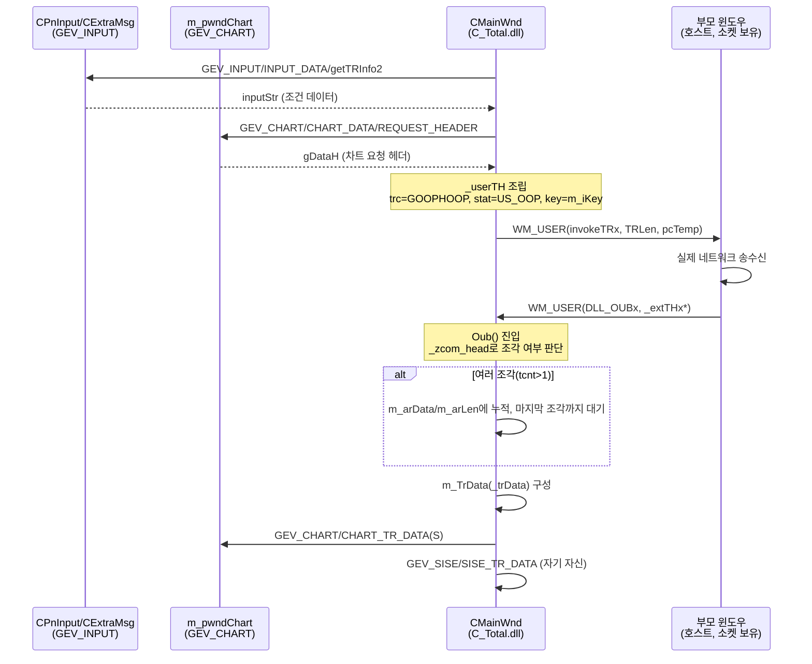

# C_Total TR 요청/응답 구조체 (송수신 프로토콜)

## 목차

- [개요](#개요)
- [요청(송신) 구조체](#요청송신-구조체)
- [응답(수신) 구조체](#응답수신-구조체)
- [메시지 상수 요약](#메시지-상수-요약)
- [전체 흐름](#전체-흐름)
- [코드 근거](#코드-근거)
- [히스토리](#히스토리)

---

## 개요

`C_TotalDataFlow.md`가 다루는 `GEV_SISE`/`GEV_INPUT`/`GEV_CHART`는 **C_Total 내부 패널들
사이**의 메시지입니다. 이 문서가 다루는 건 그것과 별개로, **C_Total(자식 윈도우) ↔ 호스트
(부모 윈도우, 실제 소켓/네트워크 계층을 가진 상위 앱)** 사이에서 TR(Transaction Request)을
요청하고 응답받는 프로토콜입니다. C_Total 자신은 소켓을 직접 만들지 않고, `WM_USER` 메시지로
부모 윈도우(`m_pwndView`)에 "이 바이트열을 네트워크로 보내달라"고 요청하고, 응답도 같은
`WM_USER` 채널로 되돌려받습니다.

핵심 진입점: `CMainWnd::SendRequest()` / `SendRequest2()` / `SendRequestS()`(송신),
`CMainWnd::OnMessage()` → `Oub()`(수신) — 전부 `MainWnd.cpp`.

---

## 요청(송신) 구조체

### `_userTH` — TR 요청 헤더 (`axisfire.h:710`)

```cpp
struct	_userTH	{
	char	trc[8];   // transaction request code (예: "GOOPHOOP")
	char	key;      // user-defined key (응답 매칭용)
	char	stat;     // 요청 옵션 플래그
};
#define	L_userTH	sizeof(struct _userTH)
```

- `trc`: 어떤 TR을 요청하는지 나타내는 8바이트 코드. `SendRequest()`/`SendRequest2()`/
  `SendRequestS()` 세 곳 모두 `GRP_HOOP` 매크로(`axisgenv.h:34`: `#define GRP_HOOP "GOOPHOOP"`)
  를 사용합니다. `SendRequestS()`에는 주석처리된 대안 분기가 남아있어(`MainWnd.cpp:1483-1492`)
  한때 `m_iDtUnit`(데이터 단위: 코드별 vs 그 외)에 따라 `"PIBG0000"` 또는 `"GOOPPOOP"`로 분기할
  계획이 있었던 것으로 보이나, 지금은 조건 없이 항상 `GRP_HOOP`("GOOPHOOP")만 사용합니다.
- `key`: `m_iKey`(패널/컨트롤 인스턴스 식별용)로 채워짐 — 응답이 어느 요청에 대한 것인지
  매칭하는 용도로 추정.
- `stat`: `US_OOP`(`axisfire.h:721`, `0x02`)로 고정. `axisfire.h`의 `stat` 플래그 비트 목록:

  | 플래그 | 값 | 의미 |
  |---|---|---|
  | `US_ENC` | 0x01 | 암호화 |
  | `US_OOP` | 0x02 | **C_Total이 사용하는 값** |
  | `US_PASS` | 0x04 | 비밀번호 포함 |
  | `US_CA` | 0x08 | 공인인증 |
  | `US_KEY` | 0x10 | `userTH` 뒤에 `DATAs[0]`이 TRx 키로 옴 |
  | `US_XRTM` | 0x80 | 실시간(RTM) 없음 |

### 요청 패킷 전체 레이아웃

`SendRequest()` 기준(`SendRequest2`/`SendRequestS`도 동일 패턴):

```
[ m_strIName (nameLen bytes) ][ _userTH (L_userTH bytes) ][ inputStr (inputLen bytes) ][ gDataH (dataHLen bytes) ]
```

- `m_strIName`: 컨트롤/화면 이름(문자열, 길이 가변)
- `_userTH`: 위 요청 헤더
- `inputStr`: `m_pwndInput`(입력 패널)에 `GEV_INPUT`/`INPUT_DATA`/`getTRInfo2`로 요청해서 얻은
  사용자 입력 조건(종목/기간 등, 최대 128바이트 스택 버퍼)
- `gDataH`: `m_pwndChart`(차트 패널)에 `GEV_CHART`/`CHART_DATA`/`REQUEST_HEADER`(또는
  `REQUEST_HEADER2`, `requestHeaderS`)로 요청해서 얻은 차트 쪽 요청 헤더(가변 길이)

세 함수(`SendRequest`/`SendRequest2`/`SendRequestS`)는 각각 다른 `REQUEST_HEADER*` 서브타입으로
차트 패널에 헤더를 요청하고, 완성된 버퍼를 `m_pwndView->SendMessage(WM_USER,
MAKEWPARAM(invokeTRx, TRLen), (long)m_pcTemp)`로 부모 윈도우에 전달해 실제 전송을 위임합니다.

---

## 응답(수신) 구조체

응답은 `CMainWnd::OnMessage()`(`MainWnd.cpp:508`)가 `WM_USER`로 받아
`LOBYTE(LOWORD(wParam))`으로 서브타입을 구분합니다. TR 응답은 `DLL_OUBx` 케이스로 들어와
`Oub()`(`MainWnd.cpp:539`)가 처리합니다.

### `_extTHx` — 외부 전달 래퍼 (`axisgenv.h:814`)

```cpp
struct	_extTHx {
	char	key{};    // userTH.key와 매칭
	int	size{};       // data 크기
	char*	data;     // 실제 페이로드 포인터
};
```

`Oub()`는 `lParam`을 `_extTHx*`로 캐스팅해서 `info->size`/`info->data`를 꺼내고, 이후
`lParam`을 `info->data`로 바꿔치기해서 실제 페이로드를 가리키게 합니다.

### `_zcom_head` — 분할 전송 리어셈블리 헤더 (`axisgenv.h:682`)

```cpp
struct  _zcom_head {
	char ywin[4];
	char tcnt[4];   // 전체 조각 수 (ASCII 숫자)
	char seqn[4];   // 현재 조각 번호 (ASCII 숫자, 0-base)
	char fill[4];
};
#define SZ_ZCOMHEAD	sizeof(struct  _zcom_head)
```

`_extTHx.data`가 가리키는 페이로드의 맨 앞 16바이트가 이 헤더입니다. TR 응답이 너무 커서 여러
조각(packet)으로 나뉘어 올 때, `tcnt`(총 조각 수)/`seqn`(현재 조각 번호)로 순서를 맞춰
재조립합니다.

**재조립 로직** (`Oub()`, `MainWnd.cpp:539` 이후):
1. `iSeqn >= iTCnt`면 잘못된 데이터로 간주하고 무시(`TRACE("Invalid Data...")`)
2. `iTCnt > 10`이면 과도한 조각으로 간주해 트랜잭션 취소
3. `iTCnt > 1`이면 조각을 `m_arData`(`CArray<char*>`)/`m_arLen`(`CArray<int>`)에 순서대로
   누적, 마지막 조각(`iSeqn == iTCnt - 1`)이 도착해야 전체를 이어붙여 하나의 버퍼로 합침
4. `iTCnt == 1`이면 조각 없이 그대로 사용(단, `lParam`을 `SZ_ZCOMHEAD`만큼 건너뛰어 헤더 이후
   실데이터만 가리키게 함)

### `_trData` — 최종 저장 구조체, `CMainWnd::m_TrData` (`axisgwin.h:129`)

```cpp
struct _trData
{
	int	iLen[2];
	int	iSiseLen[2];
	char*	pcData[2];
};
#define	SZ_TRDATA	sizeof(_trData)
```

재조립이 끝난 최종 페이로드는 `m_TrData`의 2-슬롯 배열에 저장됩니다. `Oub()`는 진행 중인
트랜잭션 종류에 따라 3갈래로 분기해서 이 구조체를 채웁니다:

| 분기 조건 | 사용 슬롯 | 이후 전달 |
|---|---|---|
| `m_bExtrTr` (추가 TR) | `[0]`만 채움 | `SetTimer(TIMER_EXTR_TR, 1, NULL)`로 지연 처리 |
| `m_bTransactionS` (단일 데이터 요청, `SendRequestS`) | `[0]`만 채움 | `m_pwndChart`에 `GEV_CHART`/`CHART_TR_DATAS` |
| 기본(`SendRequest`/`SendRequest2`) | `[m_iTRIndex]`(0 또는 1, 다단계 요청 지원) | 자기 자신에 `GEV_SISE`/`SISE_TR_DATA` **+** `m_pwndChart`에 `GEV_CHART`/`CHART_TR_DATA` 이중 전달 |

세 분기 모두 처리 후 `pcData`를 `delete`하고 `m_TrData`를 `ZeroMemory`로 초기화, 트랜잭션
플래그(`m_bTransaction`/`m_bTransactionS`)를 내립니다.

---

## 메시지 상수 요약

| 상수 | 값 | 방향 | 의미 (`axisfire.h` 주석) |
|---|---|---|---|
| `invokeTRx` | 0x02 | 송신 (C_Total → 호스트) | `InvokeTRx(pBytes, nBytes)` |
| `DLL_OUB` | 0x02 | 수신 (호스트 → C_Total) | `Write(pBytes, nBytes)` — 구버전, 미사용(`case DLL_OUB: break;`) |
| `DLL_OUBx` | 0x14 | 수신 (호스트 → C_Total) | `Write(pBytes)` — **실제 TR 응답 처리 경로**, `Oub()` 호출 |
| `DLL_ALERT` | 0x03 | 수신 | `OnAlert(CString, int stat)` — 구버전, 미사용 |
| `DLL_ALERTx` | 0x13 | 수신 | `OnAlert(void* data)` — 실시간 alert, `_extTHx` 구조 |

`invokeTRx`와 `DLL_OUB`가 같은 값(0x02)인 건 우연이 아니라, 각각 서로 다른 `SendMessage`
호출(하나는 C_Total→호스트, 하나는 호스트→C_Total)의 서브타입 enum이라 값 공간이 겹쳐도
무방하기 때문입니다.

---

## 전체 흐름



---

## 코드 근거

- `_userTH` 정의: `CONTROL/ibk_chart_dll_20220831/h/axisfire.h:710-715`
- `US_OOP` 등 stat 플래그: `axisfire.h:720-725`
- `GRP_HOOP`("GOOPHOOP") 정의: `CONTROL/ibk_chart_dll_20220831/h/axisgenv.h:34`
- `invokeTRx`/`DLL_OUB`/`DLL_ALERT`/`DLL_OUBx`/`DLL_ALERTx`: `axisfire.h:524, 764, 767, 809, 807`
- `_extTHx` 정의: `axisgenv.h:814-818`
- `_zcom_head`/`SZ_ZCOMHEAD`: `axisgenv.h:682-688`
- `_trData`/`SZ_TRDATA`: `CONTROL/ibk_chart_dll_20220831/h/axisgwin.h:129-135`
- `m_TrData` 멤버 선언: `CONTROL/C_Total/MainWnd.h:85`
- 요청 함수: `CONTROL/C_Total/MainWnd.cpp` `SendRequest()`(1355~), `SendRequest2()`(1395~),
  `SendRequestS()`(1436~)
- 수신 처리: `CONTROL/C_Total/MainWnd.cpp` `OnMessage()`(508~), `Oub()`(539~)

---

## 히스토리

- **초기 작성**: 2026-08-27
