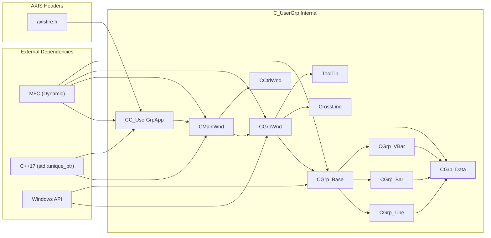

# C_UserGrp 의존성 분석

## 목차

- [의존성 개요](#의존성-개요)
- [내부 의존성](#내부-의존성)
- [외부 의존성](#외부-의존성)
- [DLL/LIB 링크](#dllllib-링크)
- [런타임 동적 로딩 (LoadLibrary)](#런타임-동적-로딩-loadlibrary)
- [포함 경로](#포함-경로)
- [COM/OLE 인터페이스](#comole-인터페이스)
- [순환 의존성](#순환-의존성)

---

## 의존성 개요

C_UserGrp는 MFC 기반 OLE 그래프 컨트롤이며, C++17 (std::unique_ptr, std::shared_ptr) 기반의
현대적 메모리 관리를 특징으로 합니다.

### 의존성 요약

| 카테고리 | 항목 | 의존도 |
|---------|------|--------|
| **MFC** | MFC Dynamic Library | 필수 |
| **COM/OLE** | afxole.h, afxdisp.h | 필수 |
| **C++ Standard** | std::unique_ptr, std::shared_ptr | 필수 |
| **Windows API** | Windows.h, wingdi.h, afxmt.h (스레드 동기화) | 필수 |
| **AXIS 라이브러리** | axisfire.h | 필수 |
| **프로젝트 내부** | chart_dll (없음, 독립적) | 경경 |
| **ODBC/DAO** | afxdb.h, afxdao.h | 선택 |

---

## 내부 의존성

### 모듈별 Include 관계

```
C_UserGrp.h
├─> resource.h
├─> ../../h/axisfire.h        <- AXIS 헤더
└─> std::shared_ptr (C++17)

MainWnd.h
├─> CGrpWnd (forward decl or include)
├─> CCtrlWnd (forward decl or include)
├─> std::unique_ptr (C++17)
└─> struct _param

GrpWnd.h
├─> Grp_Base.h
├─> Grp_Line.h, Grp_Bar.h, Grp_VBar.h
├─> Grp_Data.h
├─> CrossLine.h
└─> ToolTip.h

CtrlWnd.h
└─> (자체 정의)

Grp_Base.h
├─> CDC (MFC), CWnd (MFC)
└─> (렌더링 관련 constants)

Grp_Line.h
└─> Grp_Base.h

Grp_Bar.h
└─> Grp_Base.h

Grp_VBar.h
└─> Grp_Base.h

Grp_Data.h
└─> (데이터 컨테이너)

CrossLine.h
└─> (십자선 관련)

ToolTip.h
└─> (도구 팁 관련)

Ctrl.h
└─> (제어 로직)
```

### 순환 Include 검사

| From | To | 상태 |
|------|-----|------|
| MainWnd.h → GrpWnd.h | CGrpWnd 클래스 필요 | ✓ 안전 |
| GrpWnd.h → Grp_Base.h | Grp_Base 상속 | ✓ 안전 |
| Grp_Line.h → Grp_Base.h | 단방향 | ✓ 안전 |
| Grp_Data.h ↔ GrpWnd.h | 데이터만 전달 | ✓ 안전 |

**결론**: 순환 의존성 없음

---

## 외부 의존성

### 1. MFC (Microsoft Foundation Classes)

**설정**:
```xml
<UseOfMfc>Dynamic</UseOfMfc>
<RuntimeLibrary>MultiThreadedDLL</RuntimeLibrary>
```

**포함 헤더**:
```cpp
#include <afxwin.h>          // MFC core
#include <afxext.h>          // MFC extensions
#include <afxole.h>          // OLE classes
#include <afxodlgs.h>        // OLE dialog classes
#include <afxdisp.h>         // Automation classes
#include <afxtempl.h>        // Template classes (CArray, CMap)
#include <afxmt.h>           // Multithreading (CMutex, CSemaphore)
#include <afxdb.h>           // ODBC database classes (선택)
#include <afxdao.h>          // DAO database classes (선택)
#include <afxdtctl.h>        // Internet Explorer 4 Common Controls
#include <afxcmn.h>          // Windows Common Controls
```

**클래스 사용**:
- `CWinApp` - 애플리케이션 클래스
- `CWnd` - 윈도우 클래스
- `CDC` - 디바이스 컨텍스트
- `CFont`, `CPen`, `CBrush` - GDI 리소스
- `CImageList` - 이미지 관리
- `CString` - 문자열
- `CMutex`, `CSemaphore` - 동기화 (afxmt.h)

**특징**:
- 동적 링킹 (DLL)
- 멀티스레드 지원

---

### 2. C++ Standard Library (C++17)

**포함 헤더**:
```cpp
#include <memory>            // std::unique_ptr, std::shared_ptr
#include <vector>            // std::vector (필요시)
#include <string>            // std::string (필요시)
```

**사용 패턴**:
```cpp
std::unique_ptr<CGrpWnd> m_pGrpWnd;     // CGrpWnd 소유권
std::unique_ptr<CCtrlWnd> m_pCtrlWnd;   // CCtrlWnd 소유권
std::shared_ptr<CImageList> m_pImgCtrl; // 참조 계산 기반 공유
```

**특징**:
- 자동 메모리 관리 (RAII)
- 예외 안전성

---

### 3. COM/OLE (Component Object Model)

**OLE 서버 등록**:
```cpp
// libctrl.cpp에서 추정
COleObjectFactory::RegisterAll();
```

**IDL 파일**:
```
C_UserGrp.odl
├─ library C_UserGrp (uuid A4D058FB-0B09-4C0C-9CEE-FC647CFBAF29)
└─ dispinterface IMainWnd
   └─ coclass MainWnd
```

**Dispatch Interface**:
```cpp
[id(1)] boolean show;
[id(2)] boolean visible;
[id(3)] BSTR GetProperties();
[id(4)] void SetProperties(BSTR str);
[id(5)] void Clear();
[id(8), propget] BSTR RTSCode();
[id(8), propput] void RTSCode(BSTR newVal);
[id(7)] void SetShowLine(short nLine, boolean bShow);
[id(9)] void SetRTS(boolean bRTS);
```

**타입 라이브러리**:
```
C_UserGrp.tlb (생성됨)
├─ CMainWnd dispatch (uuid DFDF3224-37EF-4440-B253-4B9A1E1F0084)
└─ MainWnd coclass (uuid 9D75C469-4951-4974-BF02-A81615B4873C)
```

---

### 4. AXIS 프로젝트 헤더 (../../h/)

#### axisfire.h
- AXIS 이벤트 및 콜백 메커니즘
- 그래프 관련 상수/열거형
- 포맷 정의

**영향도**: CC_UserGrpApp, CMainWnd에서 광범위하게 사용

**변경 시 재빌드**: C_UserGrp 전체 재컴파일 필요

---

### 5. Windows API (직접)

**포함 헤더**:
```cpp
#include <windows.h>         // Windows 기본 (간접 포함)
#include <wingdi.h>          // GDI 함수 (간접 포함)
#include <winuser.h>         // Window 함수 (간접 포함)
#include <winsync.h>         // 동기화 객체 (간접 포함, afxmt.h 통해)
```

**사용 API**:
- `BeginPaint(), EndPaint()` - 페인팅
- `GetClientRect(), MoveWindow()` - 윈도우 관리
- `CreatePen(), CreateBrush()` - GDI 객체 생성
- `SelectObject(), DeleteObject()` - GDI 리소스 관리
- `Rectangle(), Polyline(), Polygon()` - 그리기 함수

---

## DLL/LIB 링크

### Debug 빌드

```xml
<OutputFile>../../../dev/C_UserGrp.dll</OutputFile>
<ImportLibrary>.\Debug\C_UserGrp.lib</ImportLibrary>
<ModuleDefinitionFile>.\C_UserGrp.def</ModuleDefinitionFile>
```

### Release 빌드

```xml
<OutputFile>D:\util\HTS\IBK_SMART/dev\C_UserGrp.dll</OutputFile>
<ImportLibrary>.\Release\C_UserGrp.lib</ImportLibrary>
<ModuleDefinitionFile>.\C_UserGrp.def</ModuleDefinitionFile>
```

### C_UserGrp.def (모듈 정의)

Export 함수 목록:
- DLL_Create (메인 팩토리 함수)
- DLL_Delete
- DLL_SetData
- GetProperties
- SetProperties
- Clear
- SetShowLine
- SetRTS
- ... (OLE 인터페이스 관련 함수)

**참고**: 실제 .def 파일 내용 확인 필요

---

## 런타임 동적 로딩 (LoadLibrary)

`C_Total`의 `axisGMain.dll`/`axisGDlg.dll`과 같은 패턴으로, `C_UserGrp`도 런타임에
`LoadLibrary`로 별도 DLL 하나를 불러옵니다: **`C_UserGrpDlg.dll`**. `.vcxproj` 링크 설정이나
`#include` 관계에는 나타나지 않는 의존성입니다.

**호출 위치 2곳** (둘 다 지연 로딩, 절대경로 폴백 없이 `LoadLibrary("C_UserGrpDlg.dll")` 한 방식만 사용):

```cpp
// C_UserGrp.cpp:114-116 — CC_UserGrpApp::GetSampleData()
if (!m_hDlg)
    m_hDlg = LoadLibrary("C_UserGrpDlg.dll");
// ... GetProcAddress(m_hDlg, "axGetSample") 호출 → 미리보기용 샘플 데이터 획득

// libctrl.cpp:22-28 — 공개 export axPropDlg()
if (!pApp->m_hDlg)
    pApp->m_hDlg = LoadLibrary("C_UserGrpDlg.dll");
// ... GetProcAddress(pApp->m_hDlg, "axPropDlg") 호출 → 속성 설정 다이얼로그 표시
```

- 핸들은 `CC_UserGrpApp::m_hDlg`에 저장(두 호출부가 공유).
- **`axCreate()`(차트 컨트롤 본체 생성, libctrl.cpp)는 이 DLL과 무관** — `C_UserGrp.dll` 자체가
  렌더링을 전부 자체 처리하므로(`C_Total`이 `axisGMain.dll`에 렌더링을 위임하는 것과 대조적),
  `C_UserGrpDlg.dll` 로드 실패는 렌더링에는 영향 없고 **"속성 설정 다이얼로그"와 "샘플 데이터
  미리보기" 기능만 못 씀** — `axisGMain.dll`(필수)보다는 `axisGDlg.dll`(선택)에 가까운 심각도.

### C_UserGrpDlg.dll 자체 의존성

`CONTROL/C_UserGrpDlg/` 소스 확인 결과:

- **정적 링크**: `.vcxproj`에 `AdditionalDependencies` 항목 없음 — MFC/Windows 기본 링크 외
  추가 `.lib` 없음(`C_Total`의 `axisGMain.dll`이 `gData/gIndc/gTool/axMPattern.lib` 4개를
  끌어오는 것과 달리, 훨씬 단순한 구조).
- **Include**: `StdAfx.h`에서 `<AxStd.hpp>`(AXIS 표준 템플릿)와 `../../h/axisugrp.h`(AXIS 공통
  헤더) — 이 프로젝트 전용 공통 헤더로 `axisfire.h`와는 별개.
- **자체 LoadLibrary**: 없음 — `C_UserGrpDlg.dll`이 또 다른 DLL을 부르지는 않음(체인이 여기서 끝남).
- **구성 파일**: `SetupDlg.cpp`(19.1K, 속성 다이얼로그 UI)와 `Controls.cpp`(37.7K, 커스텀
  컨트롤)가 대부분을 차지, `ItemRtsDlg`/`RegionDlg`는 부속 다이얼로그.

```
C_UserGrp.dll
└─ LoadLibrary("C_UserGrpDlg.dll")   [지연 로딩, GetSampleData/axPropDlg 호출 시에만]
   ├─ SetupDlg.cpp (속성설정 UI)
   ├─ Controls.cpp (커스텀 컨트롤)
   ├─ ItemRtsDlg / RegionDlg (부속 다이얼로그)
   └─ Include: AxStd.hpp, axisugrp.h (AXIS 공통 헤더, C_UserGrp의 axisfire.h와 별개)
```

---

## 포함 경로

### 컴파일 인클루드 경로

**Debug**:
```
../../h (axisfire.h 등)
```

**Release**:
```
../../h (axisfire.h 등)
```

**추가 경로**:
```xml
<AdditionalIncludeDirectories>../../h</AdditionalIncludeDirectories>
```

### 상대 경로 분석

| Include | 실제 경로 | 유형 |
|---------|----------|------|
| `#include <afxwin.h>` | $(VCINSTALLDIR)\include (MFC SDK) | MFC |
| `#include <memory>` | $(VCINSTALLDIR)\include (C++ STL) | C++17 STL |
| `#include "../../h/axisfire.h"` | D:\src\IBKS\src\h\axisfire.h | AXIS 공통 |

---

## COM/OLE 인터페이스

### Type Library

```
C_UserGrp.tlb (생성됨)
├─ CMainWnd dispatch interface
└─ MainWnd coclass
```

### Dispatch 메서드 의존성

| 메서드 | 호출 대상 | 의존성 |
|--------|----------|--------|
| GetProperties() | CMainWnd::GetProperties() | GrpWnd 데이터 쿼리 |
| SetProperties() | CMainWnd::SetProperties() | GrpWnd 설정 변경 |
| Clear() | CMainWnd::Clear() | GrpWnd::Clear() |
| SetData() | CMainWnd::SetData() | CGrp_Data::ParseData() |
| SetShowLine() | CMainWnd::SetShowLine() | CGrpWnd::SetShowLine() |
| SetRTS() | CMainWnd::SetRTS() | 실시간 시세 활성화 |
| GetRTSCode() | CMainWnd::GetRTSCode() | 종목코드 조회 |
| SetRTSCode() | CMainWnd::SetRTSCode() | 종목코드 설정 |

---

## 동기화 및 Thread Safety

### 멀티스레드 고려사항

**C_UserGrp에서 사용 가능한 동기화 객체**:
```cpp
#include <afxmt.h>
CMutex m_mutex;           // 뮤텍스
CSemaphore m_semaphore;   // 세마포어
CCriticalSection m_cs;    // 크리티컬 섹션
```

**현재 상태**: 동기화 코드 미확인 (분석 필요)

**권장사항**:
- 데이터 접근 시 CMutex 또는 CCriticalSection 사용
- UI 스레드에서만 렌더링 수행

---

## 의존성 그래프



---

## 변경 영향도 (TBD)

외부 의존성 변경 시 영향:

| 변경 대상 | 영향 범위 | 심각도 |
|----------|----------|--------|
| axisfire.h 수정 | CC_UserGrpApp, CMainWnd | **높음** |
| MFC 버전 업그레이드 | 전체 (재컴파일) | **높음** |
| C++ 표준 변경 | std::unique_ptr/shared_ptr 호환성 | **중간** |
| Windows API 변경 | 렌더링 코드 | **중간** |

---

## 비교: C_Total vs C_UserGrp

| 항목 | C_Total | C_UserGrp |
|------|---------|-----------|
| **C++ 표준** | C++17 | C++17 |
| **메모리 관리** | 혼합 (raw ptr + CArray) | Modern (unique_ptr, shared_ptr) |
| **그래프 엔진** | 단일 (Chart 렌더링) | 다중 (CGrp_Line/Bar/VBar) |
| **Panel 시스템** | 복잡 (CPnCtrl, CPnInput 등) | 단순 (CCtrlWnd) |
| **의존성** | 높음 (Chart common, AXIS) | 낮음 (AXIS만) |
| **스레드 안전** | 미확인 | 미확인 |

---

## 히스토리

- **초기 작성**: 2026-08-27
- **마지막 갱신**: 2026-08-27 (런타임 LoadLibrary 의존성: C_UserGrpDlg.dll 추가)
