# ibks 함수 호출 흐름 분석


## 목차

- [문서 목적](#문서-목적)
- [1. 전체 호출 흐름도](#1-전체-호출-흐름도)
- [2. 세부 호출 흐름](#2-세부-호출-흐름)
  - [2.1 초기화 단계](#21-초기화-단계)
  - [2.2 AddObject 단계 (객체 등록)](#22-addobject-단계-객체-등록)
  - [2.3 LoadScript 단계 (스크립트 실행)](#23-loadscript-단계-스크립트-실행)
  - [2.4 DoProcedure 단계 (함수 호출)](#24-doprocedure-단계-함수-호출)
  - [2.5 Python 스크립트 → COM 메서드 호출](#25-python-스크립트-com-메서드-호출)
  - [2.6 가비지 컬렉션 (순환참조 해결)](#26-가비지-컬렉션-순환참조-해결)
- [3. 엔진 선택 로직 (핵심)](#3-엔진-선택-로직-핵심)
- [4. 예외 처리 흐름](#4-예외-처리-흐름)
  - [Python 예외](#python-예외)
  - [VBS 예외](#vbs-예외)
- [5. axisbuilder 호출 흐름](#5-axisbuilder-호출-흐름)
  - [편집 모드](#편집-모드)
  - [빌드 모드](#빌드-모드)
- [6. 데이터 전달 경로](#6-데이터-전달-경로)
  - [Screen.SetData 예시](#screensetdata-예시)
  - [반환값 처리](#반환값-처리)
- [7. 멀티 스레드 고려사항](#7-멀티-스레드-고려사항)
  - [현재 구조](#현재-구조)
- [8. 성능 프로파일링 포인트](#8-성능-프로파일링-포인트)
- [9. 관련 문서](#9-관련-문서)

---

## 문서 목적

ibks 프로젝트의 진입점(axwizard, axisbuilder)부터 시작하는 주요 호출 흐름을 Mermaid 다이어그램으로 추적합니다.

---

## 1. 전체 호출 흐름도

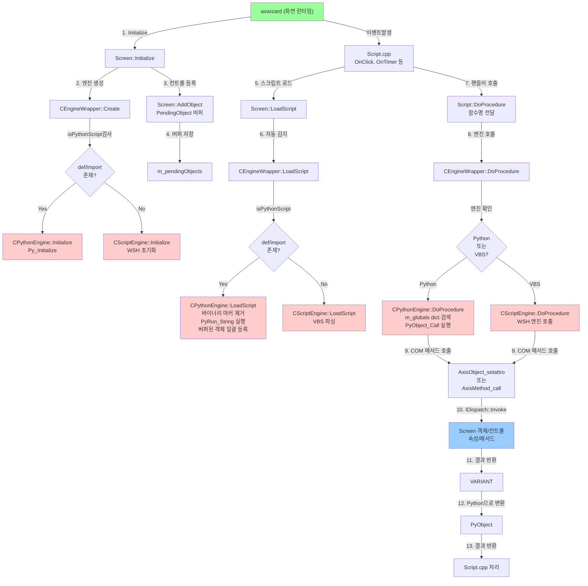

---

## 2. 세부 호출 흐름

### 2.1 초기화 단계

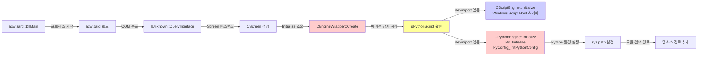

### 2.2 AddObject 단계 (객체 등록)

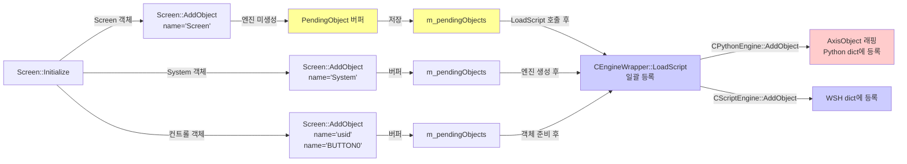

### 2.3 LoadScript 단계 (스크립트 실행)

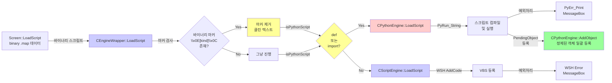

### 2.4 DoProcedure 단계 (함수 호출)

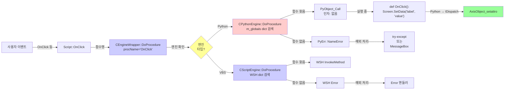

### 2.5 Python 스크립트 → COM 메서드 호출

```mermaid
graph LR
    A["Python 스크립트"] -->|Screen.SetData| B["AxisObject<br/>attribute access"]
    B -->|tp_setattro<br/>호출| C["Python 타입 슬롯"]
    C -->|속성명 'SetData'| D["AxisObject_setattro<br/>처리"]
    D -->|DISPATCH_PROPERTYPUT<br/>또는<br/>DISPATCH_METHOD| E["IDispatch::Invoke"]
    E -->|Screen COM 객체| F["CScreen::SetData<br/>실제 메서드 호출"]
    F -->|값 처리| G["화면 업데이트"]
    
    style B fill:#ffcccc
    style C fill:#ffcccc
    style D fill:#99ff99
    style E fill:#99ccff
    style F fill:#99ccff
```

### 2.6 가비지 컬렉션 (순환참조 해결)

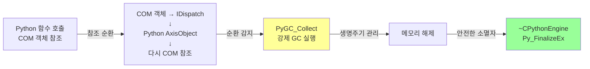

---

## 3. 엔진 선택 로직 (핵심)

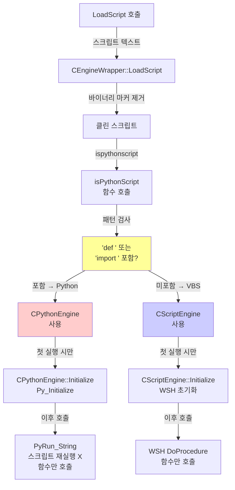

---

## 4. 예외 처리 흐름

### Python 예외

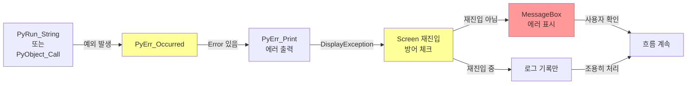

### VBS 예외

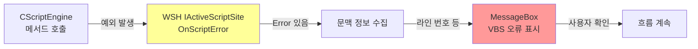

---

## 5. axisbuilder 호출 흐름

### 편집 모드

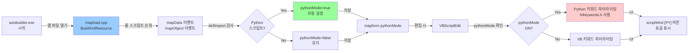

### 빌드 모드

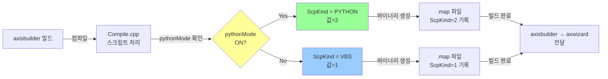

---

## 6. 데이터 전달 경로

### Screen.SetData 예시

```
Python 스크립트:
  Screen.SetData("fieldname", "value")
           ↓
  AxisObject_setattro("SetData", value)
           ↓
  IDispatch::Invoke(DISPATCH_METHOD)
           ↓
  CScreen::SetData(fieldname, value)
           ↓
  컨트롤 찾기 (Objects 컬렉션)
           ↓
  컨트롤.SetData(value)
           ↓
  화면 업데이트 요청
           ↓
  WM_PAINT 메시지
           ↓
  CScreen::OnPaint()
           ↓
  화면 렌더링
```

### 반환값 처리

```
CScreen::GetValue() → VARIANT
           ↓
  Python 타입 변환
           ↓
  PyObject (int/str/float/bool 등)
           ↓
  Python 함수에 반환
           ↓
  result = Screen.GetValue("field")
```

---

## 7. 멀티 스레드 고려사항

### 현재 구조

```
Main Thread (MFC 메시지 루프)
  ├─ Screen::OnClick
  ├─ DoProcedure → Python/VBS
  └─ 화면 렌더링 (OnPaint)

Worker Thread (선택사항)
  ├─ 실시간 데이터 수신
  └─ Screen.SetData(...) 호출
      ↓ 위험: GIL 락 필요
```

**주의:** CPythonEngine은 GIL(Global Interpreter Lock)을 사용하므로, Worker 스레드에서 호출 시 `PyGILState_Ensure/Release` 필수.

---

## 8. 성능 프로파일링 포인트

| 단계 | 오버헤드 | 최적화 여지 |
|------|---------|-----------|
| Py_Initialize | ~100-200ms | 1회만 (지연 초기화) |
| LoadScript (컴파일) | ~50-200ms | 1회만 (코드 캐싱) |
| DoProcedure | ~1-10ms | 호출마다 dict 검색 |
| AxisObject_setattro | ~0.1-1ms | IDispatch::Invoke 오버헤드 |
| 화면 렌더링 | ~10-50ms | UI 최적화 필요 |

---

## 9. 관련 문서

- `@docs/Architecture.md` - 모듈 계층 구조
- `@docs/SourceIndex.md` - 소스 파일별 함수 색인
- `@docs/python_engine_260608.md` - Python 엔진 전환 상세 기록
