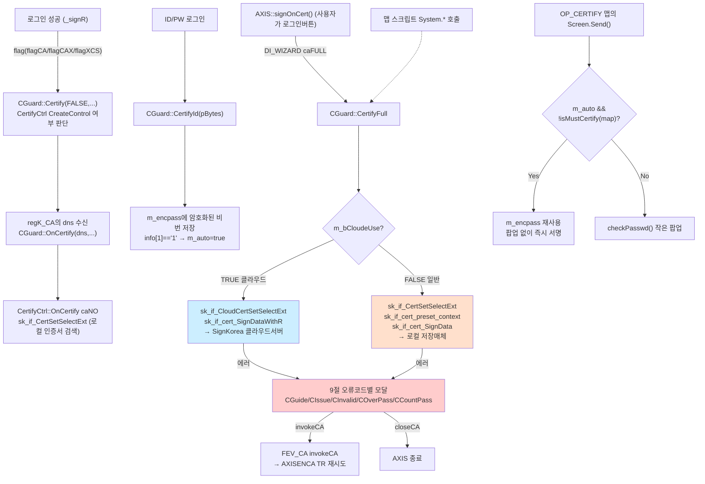
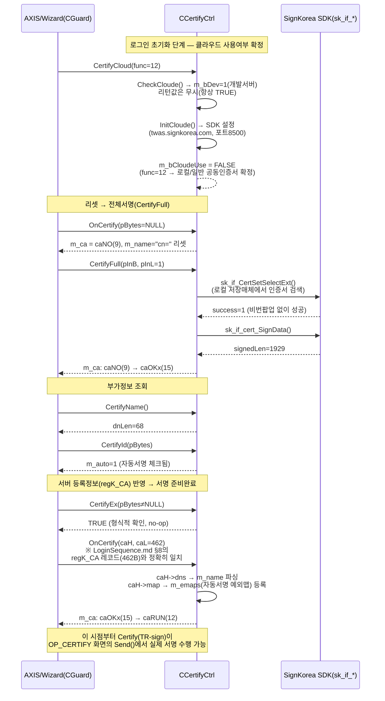

# 공동인증서(CertifyCtrl) 아키텍처 및 프로세스 흐름

## 목차

- [문서 목적](#문서-목적)
- [1. 소스 위치 확정](#1-소스-위치-확정)
- [2. 전체 아키텍처 개요](#2-전체-아키텍처-개요)
- [3. Wizard ↔ CertifyCtrl 양방향 디스패치 카탈로그](#3-wizard--certifyctrl-양방향-디스패치-카탈로그)
- [4. 로그인 시점 흐름](#4-로그인-시점-흐름)
- [5. 일반서명 vs 클라우드(간편인증) 두 갈래](#5-일반서명-vs-클라우드간편인증-두-갈래)
- [6. 클라우드 간편인증 세부 — CertifyCloud(func)](#6-클라우드-간편인증-세부--certifycloudfunc)
- [7. TR 전송 시 자동서명 삽입 — OP_CERTIFY](#7-tr-전송-시-자동서명-삽입--op_certify)
- [8. 스크립트에서 직접 서명 — CxSystem::CertifyFull](#8-스크립트에서-직접-서명--cxsystemcertifyfull)
- [9. 오류코드 카탈로그](#9-오류코드-카탈로그)
- [10. 전체 흐름도](#10-전체-흐름도)
- [10.5. 실측 로그인 시퀀스 (2026-09-04 axlog 검증)](#105-실측-로그인-시퀀스-2026-09-04-axlog-검증)
- [11. Python OpenAPI 프로젝트와의 활용 범위 비교](#11-python-openapi-프로젝트와의-활용-범위-비교)
- [12. 관련 파일](#12-관련-파일)
- [13. 미확인 / 다음 조사](#13-미확인--다음-조사)

---

## 문서 목적

Wizard(axWizard.ocx)에 종속된 공동인증서 모듈(`AxisCertify.CertifyCtrl.IBK2019`)의 프로세스 흐름을 소스 코드로 확인하고, 현재 개발 중인 Python OpenAPI 프로젝트(`IBKSConnector` 자동매매 봇)에서 이 모듈이 실제로 필요한 범위가 어디까지인지 판단하기 위한 문서.

---

## 1. 소스 위치 확정

`AxisCertify.CertifyCtrl.IBK2019` ProgID(`WizardDependency.md` §2, Wizard `Guard.cpp`가 `CreateControl`로 로드)를 등록하는 `IMPLEMENT_OLECREATE_EX`가 소스에 4곳 있으나, **`D:\src\IBKS\src\ibks\certify_cloude\`가 현재 실제로 운영 중인 코드**(사용자 확인, 2026-09-04). `DLL\certify`, `ibks\certify`, `ibks\certify_cloude_log`는 전부 백업/미사용 — 상세는 사용자 메모리 `project_certify_module_tree` 참고. 이하 모든 내용은 `ibks/certify_cloude/CertifyCtrl.cpp/.h`를 직접 읽고 확인함.

---

## 2. 전체 아키텍처 개요

```
Wizard(CGuard, axWizard.ocx)
    │  COM CreateControl("AxisCertify.CertifyCtrl.IBK2019")
    ▼
CCertifyCtrl (ibks/certify_cloude/CertifyCtrl.cpp)
    │
    ├─ 일반(공동)인증서 서명 ──────▶ CaLib(SKComdIF.lib, sk_if_* API) ──▶ 로컬 저장매체의 인증서(PC/USB 등)
    │
    └─ 클라우드(간편)인증 서명 ────▶ sk_if_Cloud*/sk_if_CloudCertSetSelectExt 등
                                         ──▶ SignKorea 클라우드 서버
                                             (twas.signkorea.com:개발 / cert.signkorea.com:운영, 포트 8500)
```

두 서명 방식(로컬 저장매체 vs 클라우드)이 `m_bCloudeUse` 플래그 하나로 완전히 다른 코드 경로를 탄다 — 5절 참고.

---

## 3. Wizard ↔ CertifyCtrl 양방향 디스패치 카탈로그

**Wizard → CertifyCtrl** (`Guard.cpp`가 `m_certify->InvokeHelper(DI_*, ...)`로 호출, `h/axisfire.h:364-370`):

| `DI_*` | 값 | CertifyCtrl 메서드 | Guard.cpp 래퍼 |
|---|---|---|---|
| `DI_ONCA` | 0x01 | `OnCertify(pBytes, nBytes)` | `CGuard::OnCertify` |
| `DI_CA` | 0x02 | `Certify(pBytes, nBytes, infos)` | `CGuard::Certify(char*,int&,CString)` |
| `DI_CAERR` | 0x03 | `CertifyErr(pBytes, nBytes)` | `CGuard::CertifyErr` |
| `DI_CAID` | 0x04 | `CertifyId(pBytes)` | `CGuard::CertifyId` |
| `DI_CAEX` | 0x05 | `CertifyEx(pBytes, nBytes)` | `CGuard::Certify(BOOL,...)`(4-bool 오버로드 안에서 호출) |
| `DI_CAFULL` | 0x06 | `CertifyFull(pInB, pInL, pOutB, pOutL)` | `CGuard::CertifyFull` |
| (미정의 상수, `DI_CANAME`) | — | `CertifyName(pBytes)` | `CGuard::CertifyName` |
| (미정의 상수, `DI_CLOUD`) | — | `CertifyCloud(func)` | `CGuard::CertifyCloude`(함수명에 'e' 추가됨 — dispatch 메서드명 `CertifyCloud`와 Guard 래퍼명 `CertifyCloude`가 철자 불일치, 실사용에는 문제없으나 grep 시 주의) |

**CertifyCtrl → Wizard** (`OnFire(FEV_CA=30, MAKELONG(sub, ...), ...)`, `h/axisfire.h:123-132`):

| 서브코드 | 값 | 의미 | 트리거 예시 |
|---|---|---|---|
| `invokeCA` | 0x01 | TR `AXISENCA` 호출 요청 | `checkPasswd()`에서 서명 시 비밀번호오류(2417) 재입력 필요할 때(`CertifyCtrl.cpp:867,904`) |
| `encryptCA` | 0x02 | 문자열 암호화 요청 | `OnMessage`의 `encryptPass` 케이스(`CertifyCtrl.cpp:209`) |
| `guideCA` | 0x03 | 안내메시지 표시(`SetGuide`) | 서명 실패(`AE_ECERTIFY`) 등 다수 |
| `closeCA` | 0x04 | AXIS 종료 | `OnMessage`의 `rebootAxis`(`CertifyCtrl.cpp:206`), `CertifyEx(NULL,...)`에서 미사용 동의 거부 시 |
| `htmlCA` | 0x05 | HTML 뷰 오픈 | `certify()`/`otherCertificate()` — 인증서 재발급/타기관등록 안내 페이지(`www.ibks.com/.../certificate/...`) |

---

## 4. 로그인 시점 흐름

`LoginSequence.md` §10(공동인증서 로그인 변형 흐름)과 이어지는 부분 — 이 문서에서는 `WizardCtrl.cpp` 쪽 호출 지점을 상세화함.

```
_signR 로그인 응답 수신 (LoginSequence.md §4)
  → WizardCtrl.cpp:893
      m_guard->Certify(FALSE, sign->flag & flagCA, sign->flag & flagCAX, sign->flag & flagXCS)
      서버가 내려준 flag 비트(flagCA=CA가능/flagCAX=CA금지/flagXCS=증권사CA서비스에러)로
      CertifyCtrl 활성화 여부 판단 → 필요시 CreateControl 수행(Guard.cpp:4416 CGuard::Certify)

  → regK_CA 레지스트리 블록(LoginSequence.md §4.5, dns 포함) 파싱 완료 후
      WizardCtrl.cpp:921/928/929
      m_guard->OnCertify(dns, dns.GetLength())
      → CertifyCtrl::OnCertify의 caNO 케이스로 진입, dns를 _caH.dns 자리에 실어
        sk_if_CertSetSelectExt(...)로 실제 인증서 조회 트리거(로컬저장매체에서 DN으로 검색)

ID/PW 로그인 시 자동서명 등록:
  WizardCtrl.cpp:300/306
  m_guard->CertifyId(pBytes[, retry])
  → CertifyCtrl::CertifyId(pBytes) — id(12)+info(10)+pass(30) 고정폭 페이로드 파싱,
    sk_if_GetEncryptedPassword()로 비밀번호를 암호화해 m_encpass에 저장(평문은 즉시 폐기)
    info[1]=='1'이면 m_auto=true(주문마다 비번 재입력 안 함, 7절 참고)

전체서명(로그인 완주) 트리거 — AXIS/MainFrm.cpp::signOnCert() (LoginSequence.md §10)
  → m_wizard->InvokeHelper(DI_WIZARD, MAKELONG(caFULL=0x23,1), ca)
  → WizardCtrl.cpp:574 / 607 (axWizard 디스패치의 caFULL 분기)
      m_guard->CertifyFull(ptr, value, wb, desL)
      → Guard.cpp:6337 CGuard::CertifyFull → DI_CAFULL → CertifyCtrl::CertifyFull(pInB,pInL,pOutB,pOutL)
```

---

## 5. 일반서명 vs 클라우드(간편인증) 두 갈래

`CCertifyCtrl::CertifyFull()`(`CertifyCtrl.cpp:1031`)이 `m_bCloudeUse` 플래그로 완전히 분기한다:

- **`m_bCloudeUse == TRUE` (클라우드/간편인증)**: `sk_if_CloudCertSetSelectExt()`로 클라우드 저장소의 인증서를 선택, 이후 `sk_if_cert_SignDataWithR()`로 서명. 로컬 매체(USB/PC 디스크) 없이 서버 저장 인증서로 처리.
- **`m_bCloudeUse == FALSE` (일반 공동인증서)**: `sk_if_CertSetSelectExt()`(로컬 저장매체 검색) → `sk_if_cert_preset_context()` → `sk_if_cert_SignData()`.

**주의:** `CheckCloude()`(`CertifyCtrl.cpp:1290`)는 `tab\DEV_CLOUDE.ini` 파일 존재 여부로 `m_bDev`(개발/운영 서버 구분)만 판정하고, **함수 끝에서 무조건 `return TRUE`** — 원래 있었을 `[CLOUDELOGIN] USE=` ini 값 기반 분기 코드는 통째로 주석 처리되어 있다(1313-1322행). 즉 현재 코드상으로는 `CheckCloude()`를 호출하면 항상 클라우드 모드로 판정되는 상태 — 다만 `CertifyFull()` 안의 실제 `m_bCloudeUse` 세팅은 `CertifyCloud(func=11/12)`(6절) 호출로도 별도 제어되므로, 최종적으로 어느 값이 쓰이는지는 `CheckCloude()`/`CertifyCloud(11/12)` 호출 순서에 따라 달라질 수 있음(호출부는 이번 조사 범위 밖).

---

## 6. 클라우드 간편인증 세부 — `CertifyCloud(func)`

| func | 동작 | 벤더 API |
|---|---|---|
| 1 | 인증서를 클라우드로 업로드 | `sk_if_UploadPCtoCloud` |
| 2 | 클라우드에서 인증서 내려받기 | `sk_if_DownloadCloudtoPC` |
| 3 | 간편비밀번호 변경 | `sk_if_CertChangePin_inCloud` |
| 4 | 클라우드 인증서 발급 | `sk_if_IssueCert_toCloud` |
| 5 | 클라우드 인증서 갱신 | `sk_if_CertNew_toCloud` |
| 6 | 클라우드 인증서 삭제 | `sk_if_DeleteCert_inCloud` |
| 7 | 연결 확인 | `sk_if_Connected_CloudUser_Confirm` |
| 8 | 자동연결된 기기 조회 | `sk_if_Cloud_AutoConnected_Device` |
| 9 | 회원탈퇴 | `sk_if_CloudUser_DeleteAccount` |
| 10 | 설정(현재 미구현, `return 0`만) | — |
| 11 | 클라우드 사용 전환 | `m_bCloudeUse = TRUE` |
| 12 | 클라우드 미사용 전환 | `m_bCloudeUse = FALSE` |

---

## 7. TR 전송 시 자동서명 삽입 — `OP_CERTIFY`

`Wizard/Stream.cpp:1482`(`MigrationSpec_SocketToDrawing.md` §0.1 송신측 시퀀스의 "OP_CERTIFY면 m_guard->Certify(...)" 지점):

```cpp
if (!m_guard->Certify(&m_sndB[m_sndL], axisL, CString(screen->m_mapH->mapN, L_MAPN)))
```

`.map` 빌드 옵션에 `OP_CERTIFY`가 걸린 화면(이체 등 자금이동류로 추정)은 TR 송신 직전에 페이로드가 `CertifyCtrl::Certify()`를 거쳐 전자서명이 덧붙는다. `Certify()`(`CertifyCtrl.cpp:489`) 내부 분기:

- `m_auto`(로그인 시 "자동서명" 체크) **그리고** `isMustCertify(maps)`가 거짓(=이 맵이 필수 재확인 대상 목록에 없음) → 4절에서 로그인 시 저장해둔 `m_encpass`를 그대로 재사용, **비밀번호 팝업 없이 즉시 서명**.
- 그 외의 경우 → `checkPasswd()`가 작은 비밀번호 입력창을 모달로 띄움(코드 주석 "주문낼때 여기 타고 온다 작은 공인인증창 팝업").

`isMustCertify()`가 참조하는 `m_emaps`(필수 재확인 맵 목록)는 로그인 응답의 `_caH.map` 필드(`caH->map`, `OnCertify`의 `caNO`/`caOKx` 케이스)에서 채워짐 — 서버가 "이 화면들은 자동서명 체크와 무관하게 매번 비번 확인"이라고 지정할 수 있는 구조.

---

## 8. 스크립트에서 직접 서명 — `CxSystem::CertifyFull`

`Wizard/xsystem.cpp:505`에서 `m_guard->CertifyFull(srcB, srcL, retB.GetBuffer(maxCERT), retL)` 호출 — 즉 **VBS/Python 맵 스크립트가 `System` 객체(`WizardArchitecture.md` §7.3 `CxSystem`)를 통해 임의 데이터에 대한 전자서명을 직접 요청할 수 있는 경로**가 존재한다. 정확한 스크립트 API 이름(`System.XXX(...)`)은 이번 조사에서 `xsystem.cpp`의 해당 함수 시그니처까지는 확인하지 않았음 — 13절 미확인 사항으로 남김.

---

## 9. 오류코드 카탈로그

`sk_if_GetLastErrorCode()`가 반환하는 코드별로 서로 다른 모달 다이얼로그가 뜬다(전부 `.DoModal()` 기반, 11절과 직결):

| 코드 | 의미 | 뜨는 다이얼로그 |
|---|---|---|
| 1 | 폐지 | `CGuide(typeREVOKE)` |
| 2 | 정지 | `CGuide(typeSUSPEND)` |
| 3 | 만료 | `CGuide(typeEXPIRE)` |
| 4 | 미등록 | `CIssue` |
| 5 | 신규발급 | `CInvalid` |
| 20 | 비밀번호 5회오류 | `COverPass` |
| 1001, 2417 | 서명오류/비밀번호오류 → `rspPASSWD` | `CCountPass`(오류횟수 표시) |
| 2500 | 인증서 없음 | `CInvalid` |
| 2501 | 사용자 취소 | 안내 문구만(`guideMsg(msg7)`) |
| 2508 | 인증서 갱신 선택 필요 | 안내 문구만(`guideMsg(msg19)`) |
| 3532 | 비밀번호 초과(서버측 응답코드, `CertifyErr` 경로) | `COverPass` |
| 9999, 9998 | SignKorea 접속오류 / 입력값 불일치(서버측) | 안내 문구만 |

---

## 10. 전체 흐름도



---

## 10.5. 실측 로그인 시퀀스 (2026-09-04 axlog 검증)

`certify_cloude_log/CertifyCtrl.cpp`에 `axlog(LOG_CERTIFY, ...)`를 전체 함수에 계측(73개 지점)한 뒤, 실제 개발서버(twas.signkorea.com, `m_bDev=1`) 로그인 1회를 캡처해서 얻은 **실측 시퀀스**. 10절의 흐름도가 코드 리딩으로 재구성한 전체 경로도라면, 이 절은 그중 정확히 어떤 가지가 실제로 도는지 로그로 확정한 것이다.

### `m_ca` 상태값 — dispid enum과 같은 블록에서 이어지는 것으로 실측 확정

`CertifyCtrl.h`에서 `m_ca` enum이 dispid enum(`dispidCertifyCloud=8L`)과 한 `enum` 선언 안에 이어져 있어, 실제 정수값이 8 다음부터 순서대로 매겨진다:

| 상수 | 실측값 |
|---|---|
| `caNO` | 9 |
| `caNOx` | 10 |
| `caOK` | 11 |
| `caRUN` | 12 |
| `caPWD` | 13 |
| `caPWDa` | 14 |
| `caOKx` | 15 |

### 시퀀스 다이어그램



### 관찰 포인트

- **`CertifyCloud`가 로그인 초기화 시점에 명시적으로 `func=12`(클라우드 미사용)를 호출** — 즉 이 세션은 코드상 존재하는 클라우드/간편인증 경로(5·6절)를 타지 않고 처음부터 로컬 공동인증서 경로로 확정된다. `CheckCloude()`는 호출은 되지만(부수효과로 `m_bDev`만 세팅) 반환값 자체는 관찰상 쓰이지 않음 — 5절의 "항상 TRUE 반환" 미스터리와 별개로, **최종 `m_bCloudeUse` 값은 오직 `CertifyCloud(11/12)` 호출로만 결정된다**는 게 이번 실측으로 확인됨.
- **`sk_if_CertSetSelectExt()`가 비밀번호 팝업 없이 `success=1`로 즉시 성공** — 벤더 SDK 내부(블랙박스)에서 캐시/자동선택으로 처리된 것으로 보이며, 저희 axlog로는 이 내부 UI까지는 안 잡힘(실패 시에만 에러코드가 로그에 남음, 9절 참고).
- **`caL=462`가 `LoginSequence.md` §8에서 별도로 확인했던 `regK_CA` 레지스트리 레코드 크기(462바이트)와 정확히 일치** — 로그인 응답에 실린 서버측 CA 등록정보가 `_caH` 구조체 그대로 `OnCertify`에 전달된다는 것이 두 문서(로그인 시퀀스 관점 vs CertifyCtrl 내부 관점)에서 교차검증됨.
- **최종 상태 `m_ca=caRUN(12)`에 도달해야 `Certify(TR-sign)`(7절, `OP_CERTIFY` 자동서명)이 정상 동작** — 그 전 단계(`caNO`/`caOKx`)에서 TR 서명을 시도하면 `Certify()`의 `default:` 분기(`FEV_CA guideCA/AE_ECERTIFY`)로 빠져 실패한다(3절 표).
- **⚠️ 로그에 실사용자(또는 테스트용) 실명이 DN 문자열(`cn=...`)로 그대로 노출됨** — `m_name`을 로그에 찍을 때 전체 문자열 대신 앞부분만 자르거나 마스킹하는 것을 향후 검토할 것(운영 환경 캡처 시 특히 주의).

### 재현성 확인 + 로그인 방식별 컬럼1/컬럼3 실행순서 차이 (2026-09-04, 동일 계정 2회 캡처)

같은 테스트 계정으로 공동인증서 로그인을 다시 한번 캡처한 결과, `signedLen=1929`/`dnLen=68`/`caL=462`/DN 이름까지 첫 번째 캡처와 **완전히 동일** — 이 환경에서 결정론적으로 재현됨을 확인. 이 재확인으로 10절 흐름도의 **컬럼1("로그인 성공 `_signR`")과 컬럼3("`AXIS::signOnCert()`")의 실행 순서가 로그인 방식에 따라 뒤바뀐다**는 게 우연이 아니라 구조적인 차이임이 확정됨:

- **ID/PW 로그인일 때** — 컬럼1이 먼저 돈다. 로그인 응답의 `regK_CA` DN을 받은 `OnCertify`가 `m_ca=caNO` 상태에서 `caH`를 처리 → `sk_if_CertSetSelectExt`로 서버가 알려준 DN에 해당하는 인증서를 **그때 처음** 로컬에서 자동매칭한다. 이후 컬럼3(`CertifyFull`)이 실행되면 이미 선택돼있는 컨텍스트로 서명만 수행.
- **공동인증서 로그인일 때(이번 2회 캡처 전부 이 경우)** — 컬럼3이 먼저 돈다. 로그인 자격증명 자체를 서버에 보내려면 그 전에 인증서를 선택하고 서명해야 하므로(`AXLOGONC` 페이로드 자체가 서명값을 담음, `LoginSequence.md` §10), `signOnCert()`가 `CertifyFull`을 먼저 실행해 `m_ca: caNO→caOKx`로 전이시킨다. 로그인이 성공해 `_signR`이 돌아온 뒤 실행되는 컬럼1의 `OnCertify`는 이미 `m_ca=caOKx`이므로 `caNO` 케이스가 아니라 `caOKx` 케이스로 들어가서 — 인증서를 다시 매칭하지 않고 서버가 보낸 등록정보(DN/필수서명맵 목록)만 반영한 뒤 `caRUN`으로 넘어간다.

즉 두 컬럼은 "서로 다른 두 로그인 방식"이 아니라 **"같은 두 단계(인증서 선택·서명 / 서버등록정보 반영)가 로그인 방식에 따라 실행 순서만 뒤바뀌는 것"**이다.

---

## 11. Python OpenAPI 프로젝트와의 활용 범위 비교

**핵심 결론: 이 모듈은 전면적으로 모달 UI(`CDialog::DoModal()`) 기반으로 설계되어 있어, 헤드리스 Python 자동매매 봇에 그대로 이식할 수 없다.**

- `CGuide`/`CIssue`/`CInvalid`/`COverPass`/`CCountPass`/`CExitPass` — 인증서 상태·오류 처리 경로 전부가 `.DoModal()`을 호출하는 모달 다이얼로그다(9절). `CertifyFull`/`Certify`/`OnCertify` 어느 진입점을 taste 봐도 오류 시 반드시 이 중 하나가 뜨고, 사용자의 클릭(`IDC_ISSUE`/`IDC_OTHER`/`IDOK`)을 동기적으로 기다린다. GUI 메시지펌프가 있는 프로세스에서만 성립하는 구조 — 백그라운드 프로세스에서 그대로 호출하면 다이얼로그가 안 보이는 채로 멈추거나 크래시할 위험이 큼.
- `Dependency.md`의 OPEN API 화이트리스트 조사(2026-08-17)에서 이미 확인된 사실: `axCertify.ocx`가 OPEN API 5대 진입점 중 하나로 배포 폴더에 포함되어 있다. 즉 **배포상으로는 이미 존재**하지만, 지금까지 `project_ibkconnector_python`(로그인/시세/주문/체결)이 다뤄온 범위에서 이 컨트롤을 실제로 `CreateControl`했다는 흔적은 없다 — ID/PW 로그인(`AXLOGONE`, `msgK_SIGN`)은 인증서 없이 완결되는 경로이기 때문(`LoginSequence.md` §10 대조표: `AXISENCA`는 ID/PW 로그인에서도 나가지만 그건 6절/8.9절에서 이미 확인했듯 "인증서 데이터 업로드"이지 CertifyCtrl의 서명 로직을 타는 게 아님 — 단순 로그인만 하는 봇에는 CertifyCtrl 자체가 필요 없다).
- **실질적으로 접점이 생기는 유일한 지점은 7절의 `OP_CERTIFY` 맵**(자금이동/이체류로 추정) TR을 자동화 범위에 넣는 경우다. 이 경우:
  - a) 그런 TR 자체를 자동화 대상에서 제외한다 — 가장 현실적. `project_auto_trading_personal`이 현재 다루는 조회/주문/체결 범위엔 이체가 없어 보여, 당장은 문제되지 않을 가능성이 높음.
  - b) 로그인 시점에 사람이 한 번 "자동서명" 체크를 하고 비밀번호를 입력해 `m_encpass`를 채워두면(4절), 이후 `m_auto && !isMustCertify(maps)` 조건을 만족하는 TR은 팝업 없이 자동 서명된다(7절) — 완전 헤드리스는 아니지만 "로그인 1회는 사람이, 이후 반복 조회/주문은 자동"인 하이브리드 운영이라면 가능할 수 있음.
  - c) `CaLib/InterfaceDLL.h`(`sk_if_*` API)를 직접 호출하는 별도의 헤드리스 서명 유틸리티를 새로 만든다 — 모달 UI 레이어를 완전히 걷어내는 근본적 해법이지만 별도 개발비용이 든다.
- **결론:** 지금 당장 Python OpenAPI 봇에 CertifyCtrl을 끌어올 필요성은 낮다. 다만 향후 이체/자금이동류 TR을 자동화 범위에 포함시키게 되면 이 갭(모달 UI 전제)을 미리 인지하고 (b) 또는 (c) 방향으로 설계해야 함.

---

## 12. 관련 파일

| 파일 | 역할 |
|---|---|
| `ibks/certify_cloude/CertifyCtrl.h/cpp` | 이 문서의 핵심 — 디스패치 맵, 서명 로직, 클라우드 분기 |
| `ibks/certify_cloude/CaLib/InterfaceDLL.h`, `InterfaceTypes.h` | SignKorea CA 벤더 API 헤더(`sk_if_*` 선언) |
| `ibks/certify_cloude/{guide,issue,invalid,overPass,countPass,ExitPass}.h/cpp` | 상태별 모달 다이얼로그 |
| `ibks/Wizard/Guard.cpp` | `CGuard::Certify*`/`OnCertify`/`CertifyId`/`CertifyFull`/`CertifyName`/`CertifyCloude` — Wizard측 래퍼 전체 |
| `ibks/Wizard/WizardCtrl.cpp` | 로그인 응답 처리 중 CA 활성화/DN전달/CertifyFull 트리거 지점 |
| `ibks/Wizard/xsystem.cpp:505` | `CxSystem`을 통한 스크립트 직접 서명 경로 |
| `ibks/Wizard/Stream.cpp:1482` | `OP_CERTIFY` 맵의 TR 송신 시 자동서명 삽입 지점 |
| [[LoginSequence.md]] §10 | 로그인 시퀀스 관점의 공동인증서 흐름(`AXLOGONC`/`pibfenca`), `AXISENCA`와의 관계 |
| [[WizardDependency.md]] §2 | `AxisCertify.CertifyCtrl.IBK2019` 로딩 지점 |
| [[Dependency.md]] | OPEN API 화이트리스트의 `axCertify.ocx` 배포 확인 |

---

## 13. 미확인 / 다음 조사

- `CxSystem::CertifyFull`(`xsystem.cpp:505`)이 스크립트에 어떤 이름(`System.XXX(...)`)으로 노출되는지 정확한 함수 시그니처 미확인.
- `CheckCloude()`가 항상 `TRUE`를 반환하도록 되어 있는 것(5절)이 의도적 하드코딩인지, 원래 ini 분기 로직을 임시로 우회해둔 것인지는 여전히 미확인. **다만 `CertifyCloud(11/12)`와의 상호작용 순서는 2026-09-04 axlog 실측으로 확인됨(10.5절)** — 로그인 초기화 시 `CertifyCloud(func)`가 호출되면 그 안에서 항상 `CheckCloude()`(반환값 무시, `m_bDev`만 세팅)+`InitCloude()`가 먼저 실행된 뒤, `switch(func)`의 11/12 케이스가 `m_bCloudeUse`를 최종 확정한다 — 즉 최종 값은 오직 `CertifyCloud(11/12)` 호출 인자로만 결정되고 `CheckCloude()`의 반환값은 실질적으로 죽은 코드임이 실측으로도 재확인됨.
- `_caH.map`(필수 재확인 맵 목록)에 실제로 어떤 맵코드들이 서버로부터 내려오는지(이체류로 추정만 했을 뿐 실측 로그 없음).
- OPEN API(`IBKSConnector`) 배포본에 포함된 `axCertify.ocx`가 실제로 어떤 시나리오에서 호출되는지(사용자용 수동 로그인 시에만 쓰이는지, 프로그램적으로 접근 가능한 경로가 있는지) — 이번 조사는 Wizard 쪽 코드만 확인했고 `IBKSConnector` 자체 소스의 Certify 관련 호출은 확인하지 않음.

---

**최종 수정:** 2026-09-04
**작성 방식:** `certify_cloude/CertifyCtrl.cpp/.h`, `Wizard/Guard.cpp`, `Wizard/WizardCtrl.cpp`, `Wizard/Stream.cpp`, `Wizard/xsystem.cpp`, `h/axisfire.h` 소스 직접 확인 + `certify_cloude_log/CertifyCtrl.cpp`(axlog 계측 사본, `LOG_CERTIFY` 카테고리) 실측 로그인 캡처 1회 대조(10.5절)
**상태:** 1차 완료 — 13절 미확인 사항 존재
