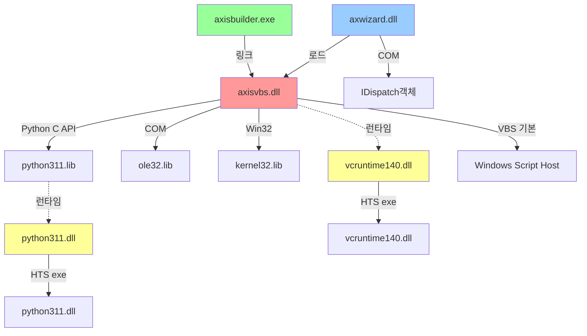

# ibks 프로젝트 의존성 분석


## 목차

- [문서 목적](#문서-목적)
- [1. 전체 의존성 구조](#1-전체-의존성-구조)
- [2. 모듈 별 의존성](#2-모듈-별-의존성)
  - [2.1 axisvbs.dll (핵심 엔진 DLL)](#21-axisvbsdll-핵심-엔진-dll)
  - [2.2 axisbuilder (화면 편집기)](#22-axisbuilder-화면-편집기)
    - [2.2.1 axisBuilder 전체 링크 구조 검증 (2026-08-18, `builder/builder` 신버전 트리)](#221-axisbuilder-전체-링크-구조-검증-2026-08-18-builderbuilder-신버전-트리)
    - [2.2.2 axwizard (화면 런타임)](#222-axwizard-화면-런타임)
- [3. Python 3.11.6 의존성 (신규)](#3-python-3116-의존성-신규)
  - [설치 경로](#설치-경로)
  - [빌드 설정 (axisvbs.vcxproj)](#빌드-설정-axisvbsvcxproj)
  - [Python C API 주요 함수](#python-c-api-주요-함수)
  - [주의사항](#주의사항)
- [4. 내부 Header Include Graph](#4-내부-header-include-graph)
- [5. 외부 의존성 요약](#5-외부-의존성-요약)
  - [필수 (반드시 설치/배포)](#필수-반드시-설치배포)
  - [선택 (기존 프로젝트)](#선택-기존-프로젝트)
- [6. 배포 의존성](#6-배포-의존성)
  - [HTS exe 폴더 필수 DLL](#hts-exe-폴더-필수-dll)
  - [누락 시 발생 오류](#누락-시-발생-오류)
  - [OPEN API(`C:\HTS_OPENAPI\exe\`) 배포 — axWizard.ocx 실측 의존성 (2026-08-17)](#open-apichts_openapiexe-배포-axwizardocx-실측-의존성-2026-08-17)
  - [OPEN API 진입점 5개 전체 — 재귀 의존성 완전 폐쇄집합 (2026-08-17, `C:\HTS_OPENAPI\exe\` 기준 전수 확인)](#open-api-진입점-5개-전체-재귀-의존성-완전-폐쇄집합-2026-08-17-chts_openapiexe-기준-전수-확인)
- [7. 빌드 순서 및 의존성](#7-빌드-순서-및-의존성)
- [8. 순환 의존성 (Circular Dependencies)](#8-순환-의존성-circular-dependencies)
- [9. 버전 호환성](#9-버전-호환성)
  - [Python 버전 선택 이유](#python-버전-선택-이유)
  - [C++ 표준](#c-표준)
- [10. 성능 임팩트](#10-성능-임팩트)
  - [메모리 오버헤드](#메모리-오버헤드)
  - [CPU 오버헤드](#cpu-오버헤드)
- [11. 관련 문서](#11-관련-문서)

---

## 문서 목적

ibks 프로젝트의 Header Include, DLL/LIB 링크, COM, 외부 SDK 의존성을 명시하고 의존성 그래프로 시각화합니다.

---

## 1. 전체 의존성 구조



---

## 2. 모듈 별 의존성

### 2.1 axisvbs.dll (핵심 엔진 DLL)

**정적 링크 라이브러리:**

| 라이브러리 | 용도 | 필수 |
|-----------|------|------|
| `python311.lib` | Python C API | ✓ |
| `ole32.lib` | COM 기본 (CoCreateInstance, IDispatch) | ✓ |
| `oleaut32.lib` | COM Automation (VARIANT, BSTR) | ✓ |
| `kernel32.lib` | Win32 기본 (CreateThread, Sleep 등) | ✓ |
| `user32.lib` | Win32 UI (MessageBox 등) | ✓ |
| `advapi32.lib` | Win32 고급 (레지스트리 등) | △ |

**런타임 의존성:**

| DLL | 출처 | 경로 |
|-----|------|------|
| `python311.dll` | Python 3.11.6 | `C:\Users\IBKS\AppData\Local\Programs\Python\Python311-32\` |
| `vcruntime140.dll` | Visual C++ 런타임 | Python 폴더 또는 System32 |
| `msvcp140.dll` | C++ Standard Library | (optional) |

**Include 의존성:**

```cpp
// Python C API
#include "Python.h"                    // Py_Initialize, PyRun_String 등

// COM/Windows
#include <objbase.h>                   // CoCreateInstance
#include <dispinterface.h>             // IDispatch
#include <olectl.h>                    // Control 기본
#include <atlbase.h>                   // ATL 기본 (IDispatch 래핑)

// MFC (axwizard 통합)
#include <afxwin.h>                    // MFC 기본
#include <afxole.h>                    // MFC OLE (COleDispatchDriver)
```

**Header 파일 구조:**

```
ibks/dll/vbs/
  ├── scriptEngine.h          (기존 VBS 엔진)
  │   └── CScriptEngine : public IDispatch
  │
  ├── pythonEngine.h          (신규 Python 엔진)
  │   ├── AxisObject        (Python 래퍼)
  │   ├── AxisMethod        (메서드 호출)
  │   └── CPythonEngine : public IDispatch
  │
  ├── engineWrapper.h         (엔진 추상화, 자동 선택)
  │   ├── PendingObject     (AddObject 버퍼)
  │   └── CEngineWrapper : public IDispatch
  │
  └── axisvbs.vcxproj        (빌드 설정)
      ├── Python include 경로
      ├── Python lib 경로
      └── 신규 cpp 파일 등록
```

### 2.2 axisbuilder (화면 편집기)

axisbuilder는 `.map` 화면 파일을 만들어내는 상위 편집 도구이고, axwizard(2.2.2절)는 그 `.map`을 로드해 실행하는 런타임이다 — 산출물 흐름상 axwizard가 axisbuilder 하위에 위치하는 게 자연스러워 이 구조로 정리함(2026-08-18).

**정적 링크:**

| 라이브러리 | 용도 |
|-----------|------|
| `awWcc.lib` | 빌드/컴파일 DLL |
| `awBuild.lib` | 맵 로드/파싱 DLL |
| `mfc*.lib` | MFC |

**세부 의존성:**

```
builder/
  ├── VBScriptEdit.cpp        (Python 키워드 추가)
  ├── scriptWnd.cpp           ([PY] 버튼 UI)
  ├── awWcc/
  │   ├── BinaryMngr.h        (#define PYTHON 2 추가)
  │   └── Compile.cpp         (pythonMode 기반 ScpKind)
  └── awBuild/
      └── mapload.cpp         (pythonMode 자동감지)
```

#### 2.2.1 axisBuilder 전체 링크 구조 검증 (2026-08-18, `builder/builder` 신버전 트리)

위 표는 Python 엔진 관련 의존성만 다룬 것이고, axisBuilder 자체의 전체 링크 구조는 별도로 실측 검증함. 사용자가 처음 이해했던 모델(`axisbuilder - awWcc, awBuild, awDlg, awTool, awUser, awCommon, awSock, awObject` / `공유 - axislib, axisform`)과 실제 `.sln`/`.vcxproj`를 대조한 결과, 두 가지가 착각으로 확인됨.

**① `axisBuilder.sln`의 실제 서브프로젝트는 6개뿐:**

```
axisBuilder, awWcc, awBuild, awTool, awSock, awDlg
```

`awUser`/`awCommon`은 신버전 트리(`builder/builder`)에는 프로젝트 자체가 없음. 대신 **`src_7_11/platform/builder/`(구버전 트리)에는 `awCommon/awCommon.vcxproj`, `awObject/awObject.vcxproj`, `awUser/awUser.vcxproj`가 실제로 존재** — 즉 이 모델은 구버전 아키텍처이고, 신버전으로 넘어오며 세 프로젝트가 제거/통합된 것으로 추정됨(정확한 시점/사유는 git 히스토리가 `ffd9e2e4`(2026-02-17) 임포트 이전을 담고 있지 않아 확인 불가).

`axisBuilder.vcxproj`의 실제 `AdditionalDependencies`: `axislib.lib`, `awBuild.lib`, `awCom.lib`, `awWcc.lib`, `awSock.lib`, `awTool.lib`, `awDlg.lib`, `awObject.lib` (+ 일부 설정에서 `axiform.lib`, `axObject.lib`). 이 중 `awObject.lib`/`awCom.lib`는 문자열로는 참조되지만 `libR`/`libD`/`lib_real`에 실제 파일이 없음(대신 `axObject.lib`만 존재) — 신버전 이관 과정에서 이름이 바뀌었는데 vcxproj 참조가 안 고쳐진 흔적으로 보이나, 링크가 실제로 어떻게 성립하는지는 미확인(추가 조사 필요).

**② "공유 - axisform"은 착시 — 이름이 비슷한 별개의 두 DLL이 있음:**

| DLL | 위치 | 실제 사용처 |
|---|---|---|
| `axisform.dll` (25개 클래스, ~4000줄 CfmGrid 포함 — `@docs/AxisformArchitecture.md` 참고) | `builder/dll/form/` | **axwizard만.** `Wizard.vcxproj`가 `../dll/form/release/axisform.lib` 직접 링크 |
| `axiform.dll` ("s" 없음, dllmain/draw/iForm/palette뿐인 소형 DLL) | `builder/dll/iform/` | **axisBuilder만.** `awWcc`/`awTool`/`awDlg`가 `axiform.lib`(+`axObject.lib`) 링크 |

즉 axisBuilder는 자신만의 별도 프리뷰 렌더링 DLL(`axiform`)을 쓰고, axwizard가 런타임에 쓰는 진짜 `axisform`은 axisBuilder 어느 서브프로젝트에서도 링크하지 않음. 두 모듈 간 실제로 공유되는 것은 **`axislib.lib` 하나뿐.**

#### 2.2.2 axwizard (화면 런타임)

axisbuilder가 만든 `.map`을 실제로 로드/실행하는 런타임. 위 2.2.1절에서 확인했듯 axisBuilder의 awXXX 서브프로젝트들과는 `axisform.lib`을 공유하지 않고, 오직 `axislib.lib`만 공유한다.

**정적 링크:**

| 라이브러리 | 용도 |
|-----------|------|
| `axisvbs.lib` | 스크립트 엔진 DLL import |
| `mfc*.lib` | MFC 기본 (CCmdTarget, CWnd 등) |
| `ole32.lib` | COM 기본 |
| `oleaut32.lib` | COM Automation |

**동적 로드:**

| DLL | 로드 시점 |
|-----|----------|
| `axisvbs.dll` | Screen 초기화 시 |
| `python311.dll` | axisvbs.dll 로드 시 (transitively) |

**Include:**

```cpp
#include "engineWrapper.h"             // CEngineWrapper 인터페이스
#include "Screen.h"                    // 화면 컨트롤
#include "Script.cpp"                  // 이벤트 핸들러
```

**Screen.h 변경:**

```cpp
// Before
CScriptEngine* m_vbe;

// After
CEngineWrapper* m_vbe;                 // 엔진 자동 선택
```

---

## 3. Python 3.11.6 의존성 (신규)

### 설치 경로

```
C:\Users\IBKS\AppData\Local\Programs\Python\Python311-32\
  ├── include/
  │   ├── Python.h
  │   ├── object.h
  │   ├── dictobject.h
  │   └── ...
  ├── libs/
  │   └── python311.lib          (import library)
  └── python311.dll              (런타임)
```

### 빌드 설정 (axisvbs.vcxproj)

**Debug & Release:**
```xml
<PropertyGroup>
  <IncludeDirectories>
    C:\Users\IBKS\AppData\Local\Programs\Python\Python311-32\include;
    ...
  </IncludeDirectories>
</PropertyGroup>

<ItemDefinitionGroup>
  <Link>
    <AdditionalLibraryDirectories>
      C:\Users\IBKS\AppData\Local\Programs\Python\Python311-32\libs;
      ...
    </AdditionalLibraryDirectories>
    <AdditionalDependencies>
      python311.lib;
      ...
    </AdditionalDependencies>
  </Link>
</ItemDefinitionGroup>
```

### Python C API 주요 함수

| 함수 | 용도 |
|------|------|
| `Py_Initialize()` | Python 인터프리터 초기화 |
| `PyConfig_InitPythonConfig()` | Python 3.11+ 설정 API |
| `Py_FinalizeEx()` | Python 인터프리터 종료 |
| `PyRun_String()` | 스크립트 실행 |
| `PyDict_GetItem()` | 전역 변수/함수 검색 |
| `PyObject_Call()` | 함수 호출 |
| `PyList_New()`, `PyDict_New()` | 객체 생성 |
| `PyGC_Collect()` | 가비지 컬렉션 강제 실행 |

### 주의사항

1. **GC 순환참조:** Python 객체가 COM 객체(IDispatch)를 참조하고, COM이 Python을 참조하면 순환 → `PyGC_Collect()` 호출 필수
2. **모듈 경로:** sys.path 설정으로 맵소스 경로에서 .py 모듈 로드 가능
3. **스레드 안전성:** GIL(Global Interpreter Lock) 관리 필요

---

## 4. 내부 Header Include Graph

```
┌─ Screen.h
│   └─ engineWrapper.h
│       ├─ pythonEngine.h
│       │   ├─ Python.h
│       │   └─ <dispinterface.h>
│       └─ scriptEngine.h
│           └─ <dispinterface.h>
│
├─ Script.cpp
│   └─ engineWrapper.h
│
└─ xscreen.cpp
    └─ engineWrapper.h
```

---

## 5. 외부 의존성 요약

### 필수 (반드시 설치/배포)

| 항목 | 최소 버전 | 상태 |
|------|----------|------|
| Python 3.11.6 32비트 | 3.11.6 | 설치됨 |
| Visual C++ 런타임 | 140 (VS2015+) | 필수 배포 |
| Windows SDK | 8.1+ | 기본 포함 |

### 선택 (기존 프로젝트)

| 항목 | 용도 |
|------|------|
| Windows Script Host | VBS 엔진 (유지) |
| ActiveX 컨트롤 | 맵 화면 렌더링 |

---

## 6. 배포 의존성

### HTS exe 폴더 필수 DLL

```
exe/
  ├── python311.dll              ← Python 런타임 (신규)
  ├── vcruntime140.dll           ← VC++ 런타임 (신규)
  ├── axisvbs.dll                ← 스크립트 엔진
  ├── axwizard.dll               ← 화면 도구
  └── [기타 기존 DLL]
```

### 누락 시 발생 오류

| 오류 | 원인 | 해결 |
|------|------|------|
| LoadLibrary error 126 | python311.dll 없음 | exe 폴더 복사 |
| "The application failed to initialize properly" | vcruntime140.dll 없음 | exe 폴더 복사 |
| "modulename.pyd not found" | sys.path 오류 | Python 경로 설정 |

### OPEN API(`C:\HTS_OPENAPI\exe\`) 배포 — axWizard.ocx 실측 의존성 (2026-08-17)

**배경:** OPEN API(IBKSConnector.ocx)는 본HTS(`F:\util\HTS\IBK_SMART\exe\`)와 별도의 최소 설치 폴더(`C:\HTS_OPENAPI\exe\`)를 씀. axlog 로깅 추가 후 axWizard.ocx를 재빌드해서 이 폴더에 새로 `regsvr32` 등록하려다 `LoadLibrary error 126`("지정된 모듈을 찾을 수 없습니다") 발생 — `dumpbin /dependents`로 실제 원인 확인.

`dumpbin /dependents axWizard.ocx` 직접 의존성 (VS2019 v142 툴셋 빌드):
```
WS2_32.dll, IMM32.dll, VERSION.dll, WINMM.dll,
axislib.dll, axisform.dll, axisvbs.dll,        ← 커스텀 모듈, 파일 자체는 있었음(아래 참고 - 얘네도 각자 추가 의존성 있음)
mfc140.dll, MSVCP140.dll, VCRUNTIME140.dll,     ← VC++ 2015-2019 재배포런타임, C:\HTS_OPENAPI\exe\에 없어서 1차 원인
KERNEL32.dll, USER32.dll, GDI32.dll, WINSPOOL.DRV, ADVAPI32.dll,
SHELL32.dll, COMCTL32.dll, ole32.dll, OLEAUT32.dll, gdiplus.dll,
api-ms-win-crt-runtime-l1-1-0.dll, api-ms-win-crt-string-l1-1-0.dll,
api-ms-win-crt-convert-l1-1-0.dll, api-ms-win-crt-time-l1-1-0.dll,
api-ms-win-crt-heap-l1-1-0.dll, api-ms-win-crt-stdio-l1-1-0.dll,
api-ms-win-crt-multibyte-l1-1-0.dll, api-ms-win-crt-math-l1-1-0.dll
```
(`WS2_32`~`gdiplus`까지는 표준 시스템 DLL, Windows 자체 제공이라 배포 불필요. `api-ms-win-crt-*`는 Universal CRT API-Set — Windows 10+에 apisetschema로 가상 매핑되어 물리 파일로 안 보이는 게 정상, 배포 불필요.)

**커스텀 모듈 3개의 2차 의존성도 각각 `dumpbin`으로 실측**(단순히 파일이 있다고 끝이 아니라, 그 파일들이 또 뭘 요구하는지까지 확인 필요했음):
- `axislib.dll` → mfc140/VCRUNTIME140 + api-ms-win-crt-*(이미 해결됨)
- `axisform.dll` → **axislib.dll**(위와 동일 체인) + MSIMG32/WINMM(표준) + mfc140/VCRUNTIME140
- `axisvbs.dll` → **`python311.dll`**(!) + mfc140/MSVCP140/VCRUNTIME140 + api-ms-win-crt-*

**조치 (2단계):**
1. `mfc140.dll`/`msvcp140.dll`/`vcruntime140.dll` 3개를 `%WINDIR%\SysWOW64\`에서 `C:\HTS_OPENAPI\exe\`로 복사
2. **`python311.dll`도 없었음** — `F:\util\HTS\IBK_SMART\exe\python311.dll`(본HTS 배포본, axisvbs.dll과 짝맞는 버전)에서 복사

전부 앱 로컬 배포(시스템 전역 재배포런타임/Python 설치에 의존하지 않음) — OPEN API를 가져다 쓸 "부모 프로세스" 환경에 이런 게 깔려있다는 보장이 없으므로 이 방향이 맞음. **최소 모듈 화이트리스트에 위 4개(mfc140/msvcp140/vcruntime140/python311.dll)는 필수 포함 대상.**

**교훈:** `dumpbin /dependents`는 **직접 의존성만** 보여줌 — 커스텀 DLL(axislib/axisform/axisvbs)이 파일로 존재한다고 안심하지 말고, 그 DLL들 각각에도 `dumpbin /dependents`를 돌려서 2차 의존성까지 확인해야 함(재귀적으로).

### OPEN API 진입점 5개 전체 — 재귀 의존성 완전 폐쇄집합 (2026-08-17, `C:\HTS_OPENAPI\exe\` 기준 전수 확인)

`IBKSConnector.ocx`/`axWizard.ocx`/`axSock.ocx`/`axCertify.ocx`/`axXecure.ocx` 5개 전부와, 그 아래 커스텀 DLL을 전부 재귀적으로 `dumpbin /dependents` 돌려서 확인. **표준 Windows 시스템 DLL(System32/SysWOW64에 이미 있는 것, `api-ms-win-*` API-Set 포함)은 배포 불필요라 제외**하고, 비표준(커스텀/재배포) 모듈만 남긴 최종 목록:

```
[진입점 OCX 5개]
IBKSConnector.ocx, axWizard.ocx, axSock.ocx, axCertify.ocx, axXecure.ocx

[axWizard.ocx 계열]
axislib.dll, axisform.dll(→axislib.dll 재사용), axisvbs.dll

[axCertify.ocx 계열 — SK 인증서 모듈]
SKComdIF.dll → SKCommSC.dll, SKCommEM.dll, SKCommCM.dll

[axXecure.ocx 계열 — Xecure 암호화 모듈, 서브모듈 13개+1]
xcon30.dll →
  XecureIO_v20.dll, XecureCrypto_v20.dll, XecureCSP_v20.dll,
  XecurePKCS8_v20.dll, XecurePKC_v20.dll, XecureASN_v20.dll,
  XecurePKCS7_v20.dll, XecureOCSP_v20.dll, XecureLDAP_v20.dll,
  XecureCRL_v20.dll, XecureCodec_v20.dll, XecurePVD_v20.dll,
  XecurePKCS5_v20.dll, xwcs_client.dll

[공용 런타임 — 전부 다 이걸 씀]
mfc140.dll, msvcp140.dll, vcruntime140.dll   ← 재배포런타임, 원래 없었음(조치완료)
python311.dll                                ← axisvbs.dll 전용, 원래 없었음(조치완료)
```

**전수 확인 결과: 위 목록 전부 `C:\HTS_OPENAPI\exe\`에 현재 존재함(재배포런타임 2종 조치 후).** 이 목록이 **OPEN API 화이트리스트 프로젝트(사용자 메모리 `project_openapi_patch_whitelist` 참고)의 "필요 최소 모듈" 초안**이 됨. 다만 이건 정적 PE 임포트 테이블 기준이라, **런타임에 `LoadLibrary`/`CoCreateInstance`로 동적 로드하는 모듈**(예: ProgID 문자열로 그때그때 생성하는 것들)은 이 방법으론 안 잡힘 — DebugLogGuide.md의 axlog나 Process Monitor로 실제 실행 중 로드되는 것까지 교차검증 필요.

---

## 7. 빌드 순서 및 의존성

```
1. axisvbs.dll
   ├─ 입력: pythonEngine.h/cpp, engineWrapper.h/cpp, scriptEngine.h/cpp
   ├─ 링크: python311.lib, ole32.lib, kernel32.lib, user32.lib
   └─ 출력: axisvbs.dll

2. axwizard.dll (axisvbs.dll 이후)
   ├─ 입력: Screen.h/cpp, Script.cpp, xscreen.cpp
   ├─ 링크: axisvbs.lib
   └─ 출력: axwizard.dll

3. axisbuilder.exe (순서 무관)
   ├─ 입력: VBScriptEdit.cpp, scriptWnd.cpp, mapload.cpp 등
   ├─ 링크: awWcc.lib, awBuild.lib
   └─ 출력: axisbuilder.exe
```

---

## 8. 순환 의존성 (Circular Dependencies)

현재 **순환 의존성 없음**:
- axisvbs.dll → (외부 라이브러리만)
- axwizard.dll → axisvbs.dll (단방향)
- axisbuilder.exe → (외부 DLL만)

---

## 9. 버전 호환성

### Python 버전 선택 이유

| 버전 | 장점 | 단점 |
|------|-----|------|
| 3.11.6 (선택) | 최신, API 안정, GIL 개선 | 레거시 코드 호환성 낮음 |
| 3.9.x | 안정적 | 레거시 기능 부족 |
| 2.7.x | 완전 호환 | EOL (2020) |

### C++ 표준

| 항목 | 버전 |
|------|------|
| Visual Studio | 2015+ (v140) |
| C++ 표준 | C++17 이상 권장 |
| MFC 버전 | VS2015+에 포함 |

---

## 10. 성능 임팩트

### 메모리 오버헤드

| 항목 | 크기 | 비고 |
|------|------|------|
| python311.dll | ~3.5 MB | 런타임 메모리 포함 |
| Python 인터프리터 초기화 | ~10-20 MB | 프로세스당 (GC 포함) |
| CPythonEngine 인스턴스 | ~1-5 MB | Screen당 |

### CPU 오버헤드

- Python 스크립트 컴파일: 첫 LoadScript() 시만 소요 (~수십ms)
- 반복 호출(DoProcedure): C/Python 경계 오버헤드 무시할 수준

---

## 11. 관련 문서

- `@docs/Architecture.md` - 모듈 구조 및 계층
- `@docs/python_engine_260608.md` - Python 엔진 전환 상세 기록
- `@docs/Build.md` - 빌드 프로세스 및 환경 설정 (작성 예정)
- `@docs/SourceIndex.md` - 소스 파일 색인 (작성 예정)
