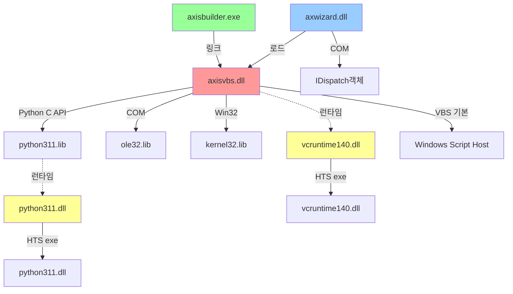

# ibks 프로젝트 의존성 분석

## 문서 목적

ibks 프로젝트의 Header Include, DLL/LIB 링크, COM, 외부 SDK 의존성을 명시하고 의존성 그래프로 시각화합니다.

---

## 1. 전체 의존성 구조



---

## 2. 모듈 별 의존성

### 2.1 axisvbs.dll (핵심 엔진 DLL)

**정적 링크 라이브러리:**

| 라이브러리 | 용도 | 필수 |
|-----------|------|------|
| `python311.lib` | Python C API | ✓ |
| `ole32.lib` | COM 기본 (CoCreateInstance, IDispatch) | ✓ |
| `oleaut32.lib` | COM Automation (VARIANT, BSTR) | ✓ |
| `kernel32.lib` | Win32 기본 (CreateThread, Sleep 등) | ✓ |
| `user32.lib` | Win32 UI (MessageBox 등) | ✓ |
| `advapi32.lib` | Win32 고급 (레지스트리 등) | △ |

**런타임 의존성:**

| DLL | 출처 | 경로 |
|-----|------|------|
| `python311.dll` | Python 3.11.6 | `C:\Users\IBKS\AppData\Local\Programs\Python\Python311-32\` |
| `vcruntime140.dll` | Visual C++ 런타임 | Python 폴더 또는 System32 |
| `msvcp140.dll` | C++ Standard Library | (optional) |

**Include 의존성:**

```cpp
// Python C API
#include "Python.h"                    // Py_Initialize, PyRun_String 등

// COM/Windows
#include <objbase.h>                   // CoCreateInstance
#include <dispinterface.h>             // IDispatch
#include <olectl.h>                    // Control 기본
#include <atlbase.h>                   // ATL 기본 (IDispatch 래핑)

// MFC (axwizard 통합)
#include <afxwin.h>                    // MFC 기본
#include <afxole.h>                    // MFC OLE (COleDispatchDriver)
```

**Header 파일 구조:**

```
ibks/dll/vbs/
  ├── scriptEngine.h          (기존 VBS 엔진)
  │   └── CScriptEngine : public IDispatch
  │
  ├── pythonEngine.h          (신규 Python 엔진)
  │   ├── AxisObject        (Python 래퍼)
  │   ├── AxisMethod        (메서드 호출)
  │   └── CPythonEngine : public IDispatch
  │
  ├── engineWrapper.h         (엔진 추상화, 자동 선택)
  │   ├── PendingObject     (AddObject 버퍼)
  │   └── CEngineWrapper : public IDispatch
  │
  └── axisvbs.vcxproj        (빌드 설정)
      ├── Python include 경로
      ├── Python lib 경로
      └── 신규 cpp 파일 등록
```

### 2.2 axwizard (화면 런타임)

**정적 링크:**

| 라이브러리 | 용도 |
|-----------|------|
| `axisvbs.lib` | 스크립트 엔진 DLL import |
| `mfc*.lib` | MFC 기본 (CCmdTarget, CWnd 등) |
| `ole32.lib` | COM 기본 |
| `oleaut32.lib` | COM Automation |

**동적 로드:**

| DLL | 로드 시점 |
|-----|----------|
| `axisvbs.dll` | Screen 초기화 시 |
| `python311.dll` | axisvbs.dll 로드 시 (transitively) |

**Include:**

```cpp
#include "engineWrapper.h"             // CEngineWrapper 인터페이스
#include "Screen.h"                    // 화면 컨트롤
#include "Script.cpp"                  // 이벤트 핸들러
```

**Screen.h 변경:**

```cpp
// Before
CScriptEngine* m_vbe;

// After
CEngineWrapper* m_vbe;                 // 엔진 자동 선택
```

### 2.3 axisbuilder (화면 편집기)

**정적 링크:**

| 라이브러리 | 용도 |
|-----------|------|
| `awWcc.lib` | 빌드/컴파일 DLL |
| `awBuild.lib` | 맵 로드/파싱 DLL |
| `mfc*.lib` | MFC |

**세부 의존성:**

```
builder/
  ├── VBScriptEdit.cpp        (Python 키워드 추가)
  ├── scriptWnd.cpp           ([PY] 버튼 UI)
  ├── awWcc/
  │   ├── BinaryMngr.h        (#define PYTHON 2 추가)
  │   └── Compile.cpp         (pythonMode 기반 ScpKind)
  └── awBuild/
      └── mapload.cpp         (pythonMode 자동감지)
```

---

## 3. Python 3.11.6 의존성 (신규)

### 설치 경로

```
C:\Users\IBKS\AppData\Local\Programs\Python\Python311-32\
  ├── include/
  │   ├── Python.h
  │   ├── object.h
  │   ├── dictobject.h
  │   └── ...
  ├── libs/
  │   └── python311.lib          (import library)
  └── python311.dll              (런타임)
```

### 빌드 설정 (axisvbs.vcxproj)

**Debug & Release:**
```xml
<PropertyGroup>
  <IncludeDirectories>
    C:\Users\IBKS\AppData\Local\Programs\Python\Python311-32\include;
    ...
  </IncludeDirectories>
</PropertyGroup>

<ItemDefinitionGroup>
  <Link>
    <AdditionalLibraryDirectories>
      C:\Users\IBKS\AppData\Local\Programs\Python\Python311-32\libs;
      ...
    </AdditionalLibraryDirectories>
    <AdditionalDependencies>
      python311.lib;
      ...
    </AdditionalDependencies>
  </Link>
</ItemDefinitionGroup>
```

### Python C API 주요 함수

| 함수 | 용도 |
|------|------|
| `Py_Initialize()` | Python 인터프리터 초기화 |
| `PyConfig_InitPythonConfig()` | Python 3.11+ 설정 API |
| `Py_FinalizeEx()` | Python 인터프리터 종료 |
| `PyRun_String()` | 스크립트 실행 |
| `PyDict_GetItem()` | 전역 변수/함수 검색 |
| `PyObject_Call()` | 함수 호출 |
| `PyList_New()`, `PyDict_New()` | 객체 생성 |
| `PyGC_Collect()` | 가비지 컬렉션 강제 실행 |

### 주의사항

1. **GC 순환참조:** Python 객체가 COM 객체(IDispatch)를 참조하고, COM이 Python을 참조하면 순환 → `PyGC_Collect()` 호출 필수
2. **모듈 경로:** sys.path 설정으로 맵소스 경로에서 .py 모듈 로드 가능
3. **스레드 안전성:** GIL(Global Interpreter Lock) 관리 필요

---

## 4. 내부 Header Include Graph

```
┌─ Screen.h
│   └─ engineWrapper.h
│       ├─ pythonEngine.h
│       │   ├─ Python.h
│       │   └─ <dispinterface.h>
│       └─ scriptEngine.h
│           └─ <dispinterface.h>
│
├─ Script.cpp
│   └─ engineWrapper.h
│
└─ xscreen.cpp
    └─ engineWrapper.h
```

---

## 5. 외부 의존성 요약

### 필수 (반드시 설치/배포)

| 항목 | 최소 버전 | 상태 |
|------|----------|------|
| Python 3.11.6 32비트 | 3.11.6 | 설치됨 |
| Visual C++ 런타임 | 140 (VS2015+) | 필수 배포 |
| Windows SDK | 8.1+ | 기본 포함 |

### 선택 (기존 프로젝트)

| 항목 | 용도 |
|------|------|
| Windows Script Host | VBS 엔진 (유지) |
| ActiveX 컨트롤 | 맵 화면 렌더링 |

---

## 6. 배포 의존성

### HTS exe 폴더 필수 DLL

```
exe/
  ├── python311.dll              ← Python 런타임 (신규)
  ├── vcruntime140.dll           ← VC++ 런타임 (신규)
  ├── axisvbs.dll                ← 스크립트 엔진
  ├── axwizard.dll               ← 화면 도구
  └── [기타 기존 DLL]
```

### 누락 시 발생 오류

| 오류 | 원인 | 해결 |
|------|------|------|
| LoadLibrary error 126 | python311.dll 없음 | exe 폴더 복사 |
| "The application failed to initialize properly" | vcruntime140.dll 없음 | exe 폴더 복사 |
| "modulename.pyd not found" | sys.path 오류 | Python 경로 설정 |

---

## 7. 빌드 순서 및 의존성

```
1. axisvbs.dll
   ├─ 입력: pythonEngine.h/cpp, engineWrapper.h/cpp, scriptEngine.h/cpp
   ├─ 링크: python311.lib, ole32.lib, kernel32.lib, user32.lib
   └─ 출력: axisvbs.dll

2. axwizard.dll (axisvbs.dll 이후)
   ├─ 입력: Screen.h/cpp, Script.cpp, xscreen.cpp
   ├─ 링크: axisvbs.lib
   └─ 출력: axwizard.dll

3. axisbuilder.exe (순서 무관)
   ├─ 입력: VBScriptEdit.cpp, scriptWnd.cpp, mapload.cpp 등
   ├─ 링크: awWcc.lib, awBuild.lib
   └─ 출력: axisbuilder.exe
```

---

## 8. 순환 의존성 (Circular Dependencies)

현재 **순환 의존성 없음**:
- axisvbs.dll → (외부 라이브러리만)
- axwizard.dll → axisvbs.dll (단방향)
- axisbuilder.exe → (외부 DLL만)

---

## 9. 버전 호환성

### Python 버전 선택 이유

| 버전 | 장점 | 단점 |
|------|-----|------|
| 3.11.6 (선택) | 최신, API 안정, GIL 개선 | 레거시 코드 호환성 낮음 |
| 3.9.x | 안정적 | 레거시 기능 부족 |
| 2.7.x | 완전 호환 | EOL (2020) |

### C++ 표준

| 항목 | 버전 |
|------|------|
| Visual Studio | 2015+ (v140) |
| C++ 표준 | C++17 이상 권장 |
| MFC 버전 | VS2015+에 포함 |

---

## 10. 성능 임팩트

### 메모리 오버헤드

| 항목 | 크기 | 비고 |
|------|------|------|
| python311.dll | ~3.5 MB | 런타임 메모리 포함 |
| Python 인터프리터 초기화 | ~10-20 MB | 프로세스당 (GC 포함) |
| CPythonEngine 인스턴스 | ~1-5 MB | Screen당 |

### CPU 오버헤드

- Python 스크립트 컴파일: 첫 LoadScript() 시만 소요 (~수십ms)
- 반복 호출(DoProcedure): C/Python 경계 오버헤드 무시할 수준

---

## 11. 관련 문서

- `@docs/Architecture.md` - 모듈 구조 및 계층
- `@docs/python_engine_260608.md` - Python 엔진 전환 상세 기록
- `@docs/Build.md` - 빌드 프로세스 및 환경 설정 (작성 예정)
- `@docs/SourceIndex.md` - 소스 파일 색인 (작성 예정)
