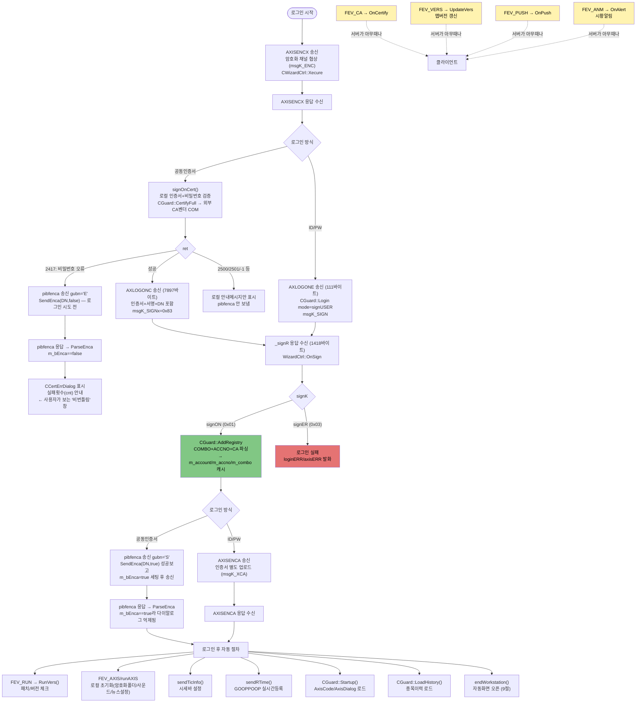

# 로그인 시퀀스 — 송신/수신 전체 카탈로그

## 목차
- [문서 목적](#문서-목적)
- [1. 전체 그림](#1-전체-그림)
- [2. 송신측 시퀀스 (로그인 후 클라이언트가 자동으로 하는 것들)](#2-송신측-시퀀스-로그인-후-클라이언트가-자동으로-하는-것들)
- [3. 수신측 카탈로그 (`OnFireEvent` 전체 분기)](#3-수신측-카탈로그-onfireevent-전체-분기)
- [4. 로그인 응답(`_signR`) 필드 카탈로그](#4-로그인-응답_signr-필드-카탈로그)
- [4.5 로그인 응답에 이어붙는 "레지스트리" 블록 — 계좌정보의 실제 출처](#45-로그인-응답에-이어붙는-레지스트리-블록--계좌정보의-실제-출처)
- [5. axlog 태그 카탈로그 (DebugView 필터용)](#5-axlog-태그-카탈로그-debugview-필터용)
- [6. 실측 예시 (2026-08-28)](#6-실측-예시-2026-08-28)
- [7. 미확인/다음에 볼 것](#7-미확인다음에-볼-것)
- [8. 관련 문서](#8-관련-문서)
- [9. 로그인 성공 후 자동화면 오픈 절차 (`endWorkstation`)](#9-로그인-성공-후-자동화면-오픈-절차-endworkstation)
- [10. 공동인증서 로그인 변형 흐름](#10-공동인증서-로그인-변형-흐름)
- [11. `msgK`/`stat` 전체 코드표](#11-msgkstat-전체-코드표)

## 문서 목적
로그인 한 번에 실제로 오가는 게 얼마나 되는지 — 로그인 자체(`AXLOGONE`)뿐 아니라 그 전후로 자동 실행되는 패치체크/로컬초기화/실시간등록, 그리고 서버가 능동적으로 보내는 알림/PUSH/버전정보까지 — 큰 틀부터 잡고 하나씩 실측으로 채워나가는 문서. [[MigrationSpec_SocketToDrawing.md]]가 TR 하나의 파싱 구조(axisH/ledger/필드데이터)에 집중한다면, 이 문서는 "로그인이라는 하나의 이벤트가 촉발하는 전체 절차"에 집중한다.

## 1. 전체 그림
```
[클라이언트]                                   [서버]
   │
   ├─ AXLOGONE 전송 (Guard.cpp::Login, msgK_SIGN)  ──────────▶
   │                                                          │
   │  ◀────────────────────────── _signR 응답 (signON/signER) ┘
   │   (WizardCtrl.cpp::OnSign, axlog "[OnSign-response]")
   │
   ├─ [MainFrm FEV_RUN] 패치/버전 체크 RunVers() 호출 ───────▶  (infoAXIS.new 등, 상세는 FilePatchProtocol.md)
   │
   ├─ [MainFrm FEV_AXIS/runAXIS] 로컬 초기화
   │     (암호화폴더/사운드/뉴스설정 체크 — 전부 로컬, 서버 요청 없음)
   │
   ├─ sendTicInfo() — 시세바 설정 (서버 송신, 응답 형태 미확인)
   ├─ sendRTime()   — 005930 기준 실시간 등록 (GOOPPOOP TR 송신)
   │
   ├─ CGuard::Startup()      — AxisCode.dll/AxisDialog.dll 로드 (로컬)
   └─ CGuard::LoadHistory()  — 사용자 ini에서 종목이력 로드 (로컬)

   ⚠️ 정정(2026-08-28): 계좌목록(번호+비번)+콤보데이터+CA의 DN은 실은 로그인 응답 패킷 자체에
   이미 실려서 옴 — _signR 뒤에 이어붙는 "레지스트리" 블록, CGuard::AddRegistry가 파싱 (4.5절).
   화면(CX_Account 등)이 하는 건 이 로컬 캐시(m_account/m_accno)를 쓰거나 표시용 상세정보를
   별도 조회하는 것이지, "계좌번호 자체를 처음 받아오는" 단계가 아니었음.

   ◀─────────────────────────────────────── 서버가 아무 때나 능동적으로 보낼 수 있는 것들
      FEV_ANM  (OnAlert)   — 시황 알림/뉴스성 데이터
      FEV_PUSH (OnPush)    — PUSH 데이터
      FEV_VERS (UpdateVers)— 맵(.map) 버전 갱신 알림 (파일패치와는 별개, KnowledgeBase 확인됨)
      FEV_CA   (OnCertify) — 공동인증서 관련
```

### 와이어 레벨 3중검증 완료 (2026-08-30, tshark 자동캡처)
`AXISENCX` 요청(frame 354) → `AXLOGONC` 응답(frame 362, 1418바이트) → `pibfenca` 응답(frame 370) 3개 프레임을 tshark로 캡처해서 원시 hex로 대조함(코드분석+axlog+패킷캡처 3중검증의 4번째 라운드 — 이번엔 GUI 복붙이 아니라 tshark 자동추출).

- **`_axisH` 헤더 레이아웃 확정**: 페이로드 맨 앞이 `trxC[8]`(ASCII TR명) 바로 뒤에 `datL[5]`(ASCII 숫자)가 좌측정렬로 붙는 구조 — `AXISENCX00178`, `AXLOGONC01418` 형태로 원문 바이트에서 그대로 확인.
- **`_signR` 전체 필드 순서·크기 100% 일치** (4절 표와 완전히 동일). 이번에 새로 확인된 값: `absS = 0x64` — ID/PW 로그인·공동인증서 로그인 양쪽 캡처에서 동일하게 관찰(고정값 추정, 의미는 미확인).
- **레지스트리 블록 `regL` 표기 방식 확정**: 우측정렬 4자리 — COMBO 1개면 `"   1"`, ACCNO 10개면 `"  10"`. `regK_ACCNO` 항목 구조(`계좌\t(빈값)\t이름\t라벨|플래그`)도 원문 바이트로 재확인됨(4.5절 정정 내용과 일치).
- `pibfenca` 응답(frame 370)은 `datL` 자리의 폭이 로그인 응답과 다르게 보임 — 일반 TR(msgK_AXIS) 응답 헤더가 로그인(msgK_SIGN/SIGNx) 전용 헤더와 미세하게 다를 가능성이 있음. 7절에 확인사항으로 추가.
- 캡처 파일(`login_capture*.pcapng`)에는 `infox`의 실제 값(주민번호로 보이는 필드 포함)이 원문 그대로 들어있어서, 대조 끝나자마자 즉시 삭제함 — 재검증하려면 다시 캡처해야 함.

### 흐름도 (Mermaid)
ID/PW·공동인증서 두 경로와 로그인 성공 후 자동절차, 서버 능동발신까지 한 그림으로. (Obsidian/GitHub 등 Mermaid 지원 뷰어에서 렌더링됨)



## 2. 송신측 시퀀스 (로그인 후 클라이언트가 자동으로 하는 것들)

| 순서 | 함수 | 파일 | 하는 일 | 서버 요청 여부 |
|---|---|---|---|---|
| 1 | `CGuard::Login(mode, ...)` | `Wizard/Guard.cpp:3020` | `mode==signUSER`면 `AXLOGONE`+`msgK_SIGN`, 아니면 `AXLOGONC`+`msgK_SIGNx`(인증서로그인) | ✅ |
| 2 | `CMainFrame::OnFireRec` `case FEV_RUN` | `AXIS/MainFrm.cpp:5386` | `m_axMisc->RunVers(verUPDATE, ...)` 호출 — 패치/버전 체크 시작 | ✅ (상세는 [[FilePatchProtocol.md]]) |
| 3 | `CMainFrame::OnFireRec` `case FEV_AXIS: case runAXIS` | `AXIS/MainFrm.cpp:5502` | `CheckEncryptDirectory`/`CheckSoundConfig`/`CheckNewsSetting`/`ConfigFrame`, 히스토리파일 기본세팅 생성, 팔레트 체크 | ❌ 전부 로컬 |
| 4 | `CMainFrame::sendTicInfo()` | `AXIS/MainFrm.cpp:18028` | 시세바(BAR) 설정 정보 전송 | ✅ (응답 형태 미확인) |
| 5 | `CMainFrame::sendRTime()` | `AXIS/MainFrm.cpp:22538` | `005930`(삼성전자) 기준 실시간 등록, `trxC=GOOPPOOP` | ✅ |
| 6 | `CGuard::Startup()` | `Wizard/Guard.cpp:349` | `AxisCode.dll`/`AxisDialog.dll` 로드, 팔레트/플래시 설정 | ❌ 전부 로컬 |
| 7 | `CGuard::LoadHistory()` | `Wizard/Guard.cpp:500` | 사용자 ini(`AXISUSER`)에서 저장된 종목코드 이력 로드 | ❌ 전부 로컬 |

**(정정) 계좌정보는 위 표엔 없지만, 실제로는 로그인 응답 자체(1번 항목)에 이미 포함되어 있음** — 4.5절 참고.

## 3. 수신측 카탈로그 (`OnFireEvent` 전체 분기)
`CWizardCtrl::OnFireEvent(int type, char* pBytes, int nBytes)` (`WizardCtrl.cpp:203`)가 서버로부터 오는 모든 것의 최상위 분기점.

| `type` | 처리함수 | 파일:줄 | 내용 |
|---|---|---|---|
| `FEV_AXIS` | `OnRead()` → `OnStream()`/`OnAxis()` | WizardCtrl.cpp:688 | 로그인응답 포함 일반 TR/화면 데이터 (대부분의 트래픽) |
| `FEV_ANM` | `OnAlert()` | WizardCtrl.cpp:636,641 | 시황 알림/뉴스성 데이터 |
| `FEV_PUSH` | `OnPush()` | WizardCtrl.cpp:663 | 서버 능동 PUSH (`anmK_PUSH`) |
| `FEV_VERS` | `m_guard->UpdateVers()` | Guard.cpp:1266 | 맵(.map) 버전 갱신 알림 — **파일패치([[FilePatchProtocol.md]])와는 별개**, `CMainFrame::processMapVersionInfo`가 소비 |
| `FEV_CA` | `OnCertify()` | WizardCtrl.cpp:959 | 공동인증서 관련 (invokeCA/encryptCA 등) |
| `FEV_ERROR` | `OnFire()` 그대로 전달 | WizardCtrl.cpp:216 | 에러, 로그인 중이면 `loginERR/axisERR` 추가 발화 |
| `FEV_CLOSE` | 접속종료 처리 | WizardCtrl.cpp:221 | |
| `FEV_STAT`/`FEV_SIZE` | 호스트로 전달 | WizardCtrl.cpp:225 | 패치 진행률 등 상태값 (`m_mode==mtRUN`이 아닐 때만) |
| (default) | `OnAxis()` | WizardCtrl.cpp:237 | 그 외 일반 axis 프로토콜 메시지 |

## 4. 로그인 응답(`_signR`) 필드 카탈로그
`h/axis.h:176`, `L_signR = sizeof(struct _signR)`.

| 필드 | 타입 | 의미 |
|---|---|---|
| `signK` | byte | `signON`(0x01)=성공 / `signOX`(0x02)=로그아웃 / `signER`(0x03)=에러 |
| `mask` | byte | 보안마스크 갱신방식(`maskNO`/`OR`/`AND`/`XOR`) |
| `absS`/`incS[4]`/`excS[4]` | byte | 보안 비트마스크 절대값/포함/제외 |
| `termN[8]` | char | 단말명 |
| `flag` | byte | `flagENC`(0x01) 암호화단말 / `flagVER`(0x02) 맵버전체크 / `flagACN`(0x04) 계좌번호편집 / `flagCA`(0x08) CA가능 / `flagENX`(0x10) 암호화금지 / `flagCAX`(0x20) CA금지 / `flagXXX`(0x40) 암호화+CA금지 / `flagXCS`(0x80) 증권사CA서비스에러 |
| `dev` | byte | 장치 플래그 |
| `mapN[8]` | char | 로그인 후 진입 맵명 |
| `sign[12]` | char | 사인 식별자(로그인ID) |
| `name[20]` | char | 사용자명 |
| `menu[12]` | char | 메뉴셋 |
| `trx[3]` | char | **TR 응답 타임아웃(초)** — 서버가 권고하는 값, 실제 Wizard가 타이머로 활용하는지는 미확인 (7절 참고) |
| `usage[3]` | char | 이용시간 제한(분) |
| `idle[3]` | char | 유휴 타임아웃(분) |
| `guide[70]` | char | 안내메시지 |
| `service[10]` | char | 서비스번호 |
| `info[64]` | char | 부가정보, "서버시간 + \t + ..." (주석 기준) — `t=<유닉스타임>` 형태로 실측 확인됨 |
| `infox[192]` | char | ⚠️ **개인정보 포함 확인됨 (2026-08-29) — 절대 평문 로그 금지.** 탭 구분 필드들 중에 주민등록번호로 보이는 필드, 성명, IP, 전화번호로 보이는 필드, 타임스탬프 여러 개가 포함되어 있음(실제 값은 이 문서에도 기록하지 않음). `OnSign-response` 로그는 이제 `infoxLen`(길이)만 남기고 내용은 절대 안 찍도록 수정함(WizardCtrl.cpp::OnSign). **앞으로 이 필드를 다시 로그로 찍어야 할 일이 있으면 반드시 마스킹하고 찍을 것.** |

## 4.5 로그인 응답에 이어붙는 "레지스트리" 블록 — 계좌정보의 실제 출처
**2026-08-28 핵심 발견.** `CGuard::Sign()` (Guard.cpp:1608~1619)을 보면:
```cpp
idx = L_signR;              // 고정크기 _signR 헤더만큼 건너뜀
...
case signON:
    m_status |= WS_SIGN;
    RemoveRegistry();
    AddRegistry(&signB[idx], signL-idx, dns);   // 그 뒤에 이어붙은 가변길이 데이터를 파싱
    break;
```
**로그인 응답 패킷 하나가 `[고정크기 _signR] + [가변길이 "레지스트리" 블록]`로 구성되어 있고, 계좌목록은 별도 TR이 아니라 이 레지스트리 블록 안에 실려서 옴.**

### 레지스트리 블록 구조 (`_regH`, axis.h:242)
`regK`(1바이트, 종류) + `regL`(4바이트, 개수) 헤더가 반복되는 TLV 스트림. `CGuard::AddRegistry(char* datB, int datL, CString& dns)` (Guard.cpp:1755)가 파싱.

| `regK` | 값 | 포맷 | 저장처 | 의미 |
|---|---|---|---|---|
| `regK_COMBO` | 0x01 | `name\tdata` 반복 | `m_combo` | 일반 참조용 콤보 데이터 |
| **`regK_ACCNO`** | 0x02 | `계좌번호\t(빈값)\t이름\t라벨\|활성플래그(1)` 반복(2026-08-30 Wireshark 실측으로 정정, 아래 참고) | `m_account`(맵, 값 전체를 `lz4enc()` 인코딩 후 저장)+`m_accno`(배열) | **계좌 목록** (진짜 비밀번호 값은 여기 없는 것으로 보임) |
| `regK_CA` | 0x09 | `_caH`(ecode[5]/pwdn/dns[200]/map[256], axis.h:254) | `dns`(참조인자로 반환) | 인증서 DN |

`CGuard::RemoveRegistry()`가 `m_combo`/`m_account`/`m_accno`/`m_stock_accs`/`m_future_accs`를 전부 비우고, `AddRegistry` 직전에 항상 먼저 호출됨(재로그인 시 이전 세션 잔재 제거).

### 실측 완료 (2026-08-28) — 레지스트리 블록 레코드별 로그
`CGuard::AddRegistry()`에 레코드 단위 로그(`LOG_LOGIN` 카테고리, `[AddRegistry]` 태그) 추가 후 실제 로그인 1회 캡처:
```
[AddRegistry] ENTER datL=1000
[AddRegistry] record regK=0x01 regL=1   → COMBO count=1
[AddRegistry] record regK=0x02 regL=10  → ACCNO count=10
[AddRegistry] record regK=0x09 regL=462 → CA
[AddRegistry] EXIT combo=1 account=10 accno=10
```
**`regK`는 0x01/0x02/0x09 세 개만 나왔고, `axis.h`에 정의된 것도 이 3개가 전부라 — 이 레지스트리 블록 안에서는 완전히 다 확인됨(`UNKNOWN regK` 없음).**

**`AN00` COMBO 값 해독** (262자, 안 잘림 — `\t`로 split):
```
[0] 00100014444                              ← 기본/대표 계좌 (단독)
[1] 00100014444 + 001-00-014444              ← 계좌1: [평문 11자리][대시포맷 DDD-TT-SSSSSS]
[2] 50100131744 + 501-00-131744              ← 계좌2
[3] 51100075466 + 511-00-075466              ← 계좌3
[4] 55700002848 + 557-00-002848              ← 계좌4
[5] 00110014444 + 001-10-014444              ← 계좌5
[6] 00151014444 + 001-51-014444              ← 계좌6
[7] 50110131744 + 501-10-131744              ← 계좌7
[8] 51110075466 + 511-10-075466              ← 계좌8
[9] 55710002848 + 557-10-002848              ← 계좌9
[10]00153014444 + 001-53-014444              ← 계좌10
```
`ACCNO`로 받은 10개 계좌와 정확히 1:1 매칭 — **콤보박스(`CAccCombo` 등)가 별도 TR 없이 이 값 하나로 바로 채워지는 구조로 추정.** 부서(앞3자리)/타입(중간2자리, 00=위탁 등)/일련번호(뒤6자리) 조합으로 계좌 10개가 부서 4개(001/501/511/557) × 타입 여러 개(00/10/51/53)로 구성됨. 타입 `00`인 4개(00100014444/50100131744/51100075466/55700002848)는 같은 세션에서 확인한 IBKSConnector(OPEN API)의 `SACAQ504` 계좌약정조회 4건과 정확히 일치(교차검증됨).

`CA` 레코드: `dns=cn=<실명>-<고유번호>,ou=HTS,ou=<지점>,ou=증권,o=SignKorea,c=KR`, `map=IB120900IB821100`(맵 2개 이어붙음, CA비번 재확인 필요한 화면으로 추정). **⚠️ 실명+인증서 고유번호가 그대로 로그에 남으므로, 이 로그를 공유/보관할 때 개인정보 노출에 주의.**

**남은 미확인**: `m_account`/`m_accno`에 세팅된 이 로컬 캐시를 이후 CX_Account 등 화면들이 실제로 어떻게 소비하는지(직접 참조하는지, 자체 TR로 이름 등 상세정보만 덧붙이는지)는 코드 추적 안 됨.

### 1000바이트 전체 바이트 재구성 (2026-08-30, `remainDatL` 로그로 검산)
`_signR`(고정 418바이트) + 이 레지스트리 1000바이트 = 1418바이트 → 실측 `AXLOGONE` 응답의 `nBytes=1418`과 정확히 일치.

| 레코드 | 헤더(`regK`1+`regL`4) | 실제 데이터 | 소계 | 비중 |
|---|---|---|---|---|
| `regK_COMBO`(AN00) | 5B | 268B ("AN00\t"+262자 값+NUL) | 273B | 27.3% |
| `regK_ACCNO`(계좌 10개) | 5B | 250B (평균 25B/계좌 — 아래 "실측 정정" 참고) | 255B | 25.5% |
| `regK_CA`(인증서) | 5B | 462B (`_caH` 그대로: ecode5+pwdn1+dns200+map256) | 467B | 46.7% |
| **합계** | | | **1000B** | **100%** |

`remainDatL` 값을 따라가면 1000→995→727→722→467→462→0 순으로 바이트 하나 안 남고 정확히 맞아떨어짐(미확인 구간 없음). **결론: 이 1000바이트는 "전부 계좌정보"가 아니라 계좌(COMBO+ACCNO, 52.8%)+인증서(CA, 46.7%)가 거의 반반 섞인 블록** — CA 쪽이 오히려 더 큼.

### Wireshark 원시 패킷캡처로 3중검증 + `regK_ACCNO` 구조 정정 (2026-08-30)
사용자가 Wireshark로 `AXLOGONC` 응답 패킷 원문(1418바이트 전체)을 캡처해서 대조함. **`_signR` 전체 필드(signK/mask/absS/termN/flag/dev/mapN/sign/name/menu/trx/service/info)가 순서·크기까지 바이트 단위로 100% 일치** — 코드분석+axlog+패킷캡처 3중검증 완성. `infox`에 주민등록번호로 보이는 값이 **`statENC` 없이 실제 네트워크 위에서 평문으로 전송되는 것도 이번에 확정**됨(중요 — 8절 하단 참고, 실제 값은 기록 안 함).

**`regK_ACCNO` 항목 구조 정정**: 이전에 `계좌번호\t비밀번호`로 적었던 게 틀렸음. 실제 10개 항목을 원문으로 보니:
```
계좌번호 \t (완전히 빈 값) \t 이름 \t 라벨(대부분 빈값, 일부만 숫자/한글 값 있음) | 활성플래그(1) \0
```
계좌번호 바로 다음 필드가 **항상 비어있음** — 진짜 비밀번호 값 자체는 이 레지스트리 블록에 안 실려있는 것으로 보임(서버가 의도적으로 비워서 보내는 것으로 추정). 두 번째 파이프 앞 필드는 몇몇 계좌만 값이 차 있어서 **즐겨찾기 라벨/메모 같은 사용자 설정 필드**로 추정됨. `entry`(코드 변수명)를 "비밀번호"로 다룬 건 코드 읽을 때의 오해였고, 실제로는 "계좌번호 다음의 나머지 전체(이름+라벨+플래그)"가 그대로 `lz4enc()`되어 `m_account`에 저장되는 것.

## 5. axlog 태그 카탈로그 (DebugView 필터용)
**2026-08-28 추가**: `LOG_LOGIN` 신설. **2026-08-29 추가**: 예전부터 있던 무조건-`OutputDebugString`(카테고리 게이팅 없는 옛날 방식, `Guard.cpp`의 소켓 송신부/`WizardCtrl.cpp`의 `[axwizrd][Receive]` 소켓 수신부)를 새 카테고리 체계로 편입 — `LOG_SOCK_SEND`(소켓 저수준 송신), `LOG_SOCK_RECEIVE`(소켓 저수준 수신, 로그인 포함 전체 메시지). 카테고리명 최장이 `SOCK_RECEIVE`(12자)가 되어 `axlogImpl`의 필드폭도 9→12로 조정됨.

로그인 관련만 보려면:
```
[WIZARD][LOGIN
```
전체(로그인+소켓+일반 채널) 다 보려면:
```
OnSign-response|AddRegistry|OnCertify|FEV_RUN|runAXIS|sendTicInfo|sendRTime|CGuard::Startup|CGuard::LoadHistory|OnAlert|OnPush|UpdateVers|CGuard::Write|trxC=
```
| 태그 | 카테고리 | 위치 |
|---|---|---|
| `[OnSign-response]` | **LOG_LOGIN** | WizardCtrl.cpp::OnSign |
| `[AddRegistry]` | **LOG_LOGIN** | Guard.cpp::AddRegistry |
| `[OnCertify]` | **LOG_LOGIN** | WizardCtrl.cpp::OnCertify |
| `CGuard::Write(1)`/`[0-Write-send]`/`CGuard::Write(2)` | **LOG_SOCK_SEND** | Guard.cpp::Write (소켓 저수준 송신, 로그인 전용 아님 — 모든 TR 송신이 여길 지남) |
| `trxC=... winK=... msgK=...`(함수명은 `CWizardCtrl::OnRead`) | **LOG_SOCK_RECEIVE** | WizardCtrl.cpp::OnRead (소켓 저수준 수신, 로그인 전용 아님 — `trxC=AXLOGON`으로 로그인 패킷만 필터 가능) |
| `FEV_RUN` / `runAXIS` | (기존 WriteLog, 카테고리 없음) | AXIS/MainFrm.cpp::OnFireRec |
| `sendTicInfo` / `sendRTime` | (기존/신규 WriteLog) | AXIS/MainFrm.cpp |
| `[CGuard::Startup]` / `[CGuard::LoadHistory]` | LOG_INIT | Wizard/Guard.cpp |
| `[OnAlert]` | LOG_DATA (로그인 전용 아님) | WizardCtrl.cpp::OnAlert |
| `[OnPush]` | LOG_DATA (로그인 전용 아님) | WizardCtrl.cpp::OnPush |
| `[UpdateVers]` | LOG_DATA (로그인 전용 아님) | Guard.cpp::UpdateVers |

## 6. 실측 예시 (2026-08-28)
실제 HTS 로그인 1회 캡처한 `[OnSign-response]` 로그:
```
[OnSign-response] signK=1 mask=0x00 flag=0x09 dev=0 termN=CH029242 mapN= sign=khs779 name=김현식
  menu=HTS001 trx=060sec usage=min idle=min service=033 guide= info=t=1787475095
```
- `flag=0x09` = `flagENC(0x01) | flagCA(0x08)` → 암호화단말 + CA사용가능 상태로 로그인됨
- `info=t=1787475095` → 유닉스타임 변환 시 2026년 8월 말 — 서버시간으로 추정, 실측으로 정합성 확인됨
- `mapN`/`usage`/`idle`이 공백으로 옴 — 정상(값 없음)인지 별도 확인 필요한 필드인지는 미확정
- `trx=060sec`이 실제로 어딘가 SetTimer 등에 반영되는지는 코드상 확인 안 됨 (7절)

같은 세션에서 확인된 OPEN API(IBKSConnector) 쪽 로그인 흐름(별도 프로세스, 참고용):
```
AXLOGONE(msgK=130=0x82) 로그인
  → pidouini (S_PIDOUINI, senm=ALLOW_USER/skey=ENABLE) — "이 사용자가 IBKSConnector 쓸 수 있는지" 서버 등록
  → piboPBxQ/SACAQ504 × 4 (계좌마다 1회, 200ms 간격) — 계좌별 시스템매매(자동매매) 약정 여부 확인
```
(`IBKSConnectorCtl.cpp::S_PIDOUINI`/`CheckValidUser`, `IBKSConnectorCtl.cpp:1040-1112` 계좌약정조회 루프)

## 7. 미확인/다음에 볼 것
- [x] ~~`regK_COMBO`/`ACCNO`/`CA` 데이터 내용~~ — **완료.** 4.5절 실측 예시 참고 (AN00 콤보 해독, 계좌 10개, CA의 DN 확인).
- [x] ~~`infox[192]` 내용 미해독~~ — **완료, 그리고 즉시 로그 축소 조치함(2026-08-29).** 탭 구분 필드에 주민등록번호로 보이는 값+성명+IP+전화번호로 보이는 값+타임스탬프 여러 개가 포함된 것으로 확인됨 — **개인정보라 실제 값은 이 문서/로그 어디에도 남기지 않음.** `WizardCtrl.cpp::OnSign`의 로그를 `infoxLen`(길이)만 남기도록 즉시 수정함. ⚠️ 앞으로 이 필드를 다시 들여다볼 일이 있으면 반드시 사전에 마스킹 방법부터 정하고 접근할 것 — 계좌번호(레지스트리 블록)보다 훨씬 민감함.
- [ ] **`OnAlert`/`OnPush`/`OnCertify`/`UpdateVers`가 2026-08-28 실측 로그인 캡처에서 전부 한 번도 안 찍힘.** 로그 자체는 정상 배치돼있음(코드 확인됨) — 발생조건이 이 세션에 없었던 것뿐인지, 아니면 애초에 이 시점엔 거의 안 쓰이는 채널인지 아직 판단 안 됨. 클라이언트를 좀 더 오래 띄워두거나 특정 동작(맵 변경, 알림 발생 등) 후 재캡처 필요.
- [ ] `_signR.trx`(TR 타임아웃 권고값)가 클라이언트 어딘가에서 실제로 소비되는지 — 코드 검색으론 못 찾음. 서버 무응답 시 안내 메시지가 없다는 이전 조사(같은 세션)와 연결지어 볼 것.
- [ ] `sendTicInfo()`의 응답 형태 미확인 (요청만 확인, 돌아오는 게 있는지/뭔지 안 봄).
- [ ] `mapN`/`usage`/`idle` 필드가 공백으로 온 것이 정상 케이스인지, 계정 설정에 따라 채워지는 경우가 있는지 추가 로그인 샘플로 교차검증 필요.
- [ ] `m_account`/`m_accno`(4.5절, 로그인 응답의 계좌 레지스트리)를 이후 화면들이 정확히 어떻게 소비하는지 미추적.
- [ ] `regK_CA`로 받은 `dns`와 `MainFrm.cpp`의 `m_strDN`(→`SendEnca`가 쓰는 값)이 같은 값인지 — 관련되어 보이지만 코드로 직접 연결 확인 안 됨(10절).
- [ ] `endWorkstation()`(9절) 각 단계 중 `m_accTool`/`MAPN_SISECATCH1`/`IB770000`/`IB0000X8`이 실제로 여는 화면의 정체와, 그 화면들이 여는 시점에 실제로 어떤 TR을 쏘는지 미확인.
- [x] ~~`_signR`/레지스트리 블록을 원시 패킷으로 직접 검증~~ — **완료(2026-08-30, tshark).** 1절 "와이어 레벨 3중검증" 참고. `absS=0x64` 실측값 신규 확인.
- [ ] **신규(2026-08-30):** `pibfenca` 같은 일반 TR 응답의 헤더에서 `datL` 자리 폭이 로그인(`AXLOGONC`) 응답과 다르게 보임 — 일반 msgK_AXIS 응답과 msgK_SIGN/SIGNx 응답의 헤더 포맷 차이 여부 미확인. 추가 캡처로 확인 필요.

## 8. 관련 문서
- [[MigrationSpec_SocketToDrawing.md]] — TR 하나의 파싱 구조(axisH/ledger/필드데이터), 이 문서보다 더 하위 레벨
- [[FilePatchProtocol.md]] — 2절 "패치/버전 체크"의 상세 (infoAXIS/infoRSC, MakeUpdateList 판정로직)
- [[DebugLogGuide.md]] — axlog 카테고리 전체 카탈로그

## 9. 로그인 성공 후 자동화면 오픈 절차 (`endWorkstation`)
`CMainFrame::endWorkstation()` (AXIS/MainFrm.cpp:7581)가 로그인 성공 후 클라이언트가 자동으로 실행하는 전체 마무리 시퀀스. **이미 `WriteLog("[AXIS] endWorkstation - Step N")`가 Step 1~20까지 다 있어서, DebugView에 `endWorkstation` 하나만 필터링해도 전체 순서가 보임** — 새 로그 불필요.

| 단계 | 하는 일 | 서버/화면 관련 |
|---|---|---|
| (시작) | `ProcessFileManager`, `AccEncrypt()`, `Sendpibojggb()`(TR송신), `initShared()`, `SetPCData()` | `Sendpibojggb` TR송신 |
| Step 1 | 부서정보 확인(`ACCNTDEPT.INI`), 메뉴 조정 | 로컬 |
| Step 2 | `ChangeLogo()` | 로컬 |
| Step 3 | 스킨/리소스 로드, 키보드 후킹 | 로컬 |
| Step 4 | `LoadGuide()`, 메뉴/스킨 재적용 | 로컬 |
| Step 5 | `if (!m_bExit) return;` | 조건부 조기종료 |
| Step 6 | `preload_screen()`, 메인창 핸들 저장, 직원 비밀번호 만료/경고 팝업 | 로컬+UI |
| Step 7 | `load_tabview()` | 로컬 |
| Step 8 | `load_history()` | 로컬 |
| Step 9~10 | (`!m_bdnInterest`일 때만) **`load_eninfomation()`**(관심종목 시작화면 `IB0000X8` 자동오픈, 마지막상태/지정시작화면 복원), **`IB820850`**(신용정보제공 동의화면, 숨김), **`load_start_notice()`**(초기 공지사항) | **화면 오픈** |
| Step 11 | `load_hkey()` (핫키) | 로컬 |
| Step 12 | `SetConclusion()` (체결통보 설정 추정) | 미확인 |
| Step 13 | `CSmcall` 생성 (고객센터/전화 관련 추정) | 미확인 |
| Step 14 | 시계 위젯 위치 | 로컬 |
| Step 15 | **`m_accTool->ShowWindow(SW_SHOW)`** — 계좌관리 툴 창 표시 | **계좌 관련** |
| Step 16 | **`load_hidescreen(MAPN_SISECATCH1)`** — 시세캐치 숨김화면 로드 | **실시간시세 관련(추정)** |
| Step 17 | CPU/플랫폼 정보, `ShowInformation()` | 로컬 |
| Step 18 | (`!m_bdnInterest`일 때만) **`IB770000` 화면 자동오픈** | **관심종목 메인화면(추정)** |
| Step 19 | `CFirstJob`, `ProcessInitMap()` | 미확인 |
| Step 20 | 공지맵 읽기, 슈퍼유저 체크, `ScrapInformation()`, TOP10 설정에 따라 조건부 `Send2018()` | 조건부 TR송신 |

## 10. 공동인증서 로그인 변형 흐름
**2026-08-30 실측 완료 — ID/PW 로그인과 나란히 캡처해서 대조함.** 순서:
```
AXISENCX (CWizardCtrl::Xecure, msgK_ENC) — 암호화 채널 협상, 로그인 방식과 무관하게 항상 가장 먼저
  ↓
AXLOGONC (CGuard::Login, mode!=signUSER → msgK_SIGNx=0x83) — 로그인 요청, 7897바이트(ID/PW의 AXLOGONE은 111바이트뿐)
  │  구조: [빈ID+부서+IP+MAC유사값] + [HEX인코딩 X.509 DER 인증서] + [공백 고정폭 패딩] + [Base64 서명값] + [평문 DN]
  │  → 인증서 자체가 로그인 요청 안에 통째로 실려서 감
  ↓ (signON 응답 1418바이트 — _signR+레지스트리 구조는 ID/PW와 완전히 동일, 계좌10개도 동일)
pibfenca (CMainFrame::SendEnca(sDN, bSuccess), MainFrm.cpp:7955) — 'S'(성공)/'E'(실패) + DN을
  서버에 보고 (winK=30, 257바이트, 응답은 단 2바이트 ack). ParseEnca()가 에러 시 안내창 표시.
```

### ID/PW 로그인과의 핵심 차이 (실측 대조)
| | ID/PW(`AXLOGONE`) | 공동인증서(`AXLOGONC`) |
|---|---|---|
| 로그인 요청 크기 | 111바이트 | **7897바이트**(인증서+서명 포함) |
| `AXISENCA`(msgK_XCA, 인증서 별도 업로드) | ✅ 로그인 직후 나감 | ❌ **안 나감** — 인증서가 이미 로그인 요청에 포함됨 |
| `pibfenca`(`SendEnca`, 로컬검증결과 보고) | ❌ 안 나감 | ✅ 로그인 직후 나감(성공시)*, 로그인 시도 전에도 나갈 수 있음(비밀번호 오류시)* |
| 로그인 응답(`_signR`+레지스트리) | 1418바이트, 계좌10개 | 1418바이트, 계좌10개 — **완전히 동일** |

*`pibfenca`의 두 시점(로그인 전 실패보고/로그인 후 성공보고)과 `CCertErrDialog` 발동 조건은 아래 [`pibfenca`는 로그인 후 성공보고 전용이 아니다](#pibfenca는-로그인-후-성공보고-전용이-아니다--비밀번호-오류-리포트-채널이기도-함-2026-08-30-정정) 참고.

**`AXISENCA`와 `pibfenca`는 상호배타적(mutually exclusive)이다** — 인증서 정보를 "로그인 요청 자체에 실어 보내느냐(`AXLOGONC`), 로그인 후 별도 TR로 보내느냐(`AXISENCA`)"의 차이일 뿐, 서버 입장에서 인증서 정보 자체는 결국 한 번은 받는 구조로 보임. (11절의 "ID/PW 로그인에서도 AXISENCA가 매번 전송되는 것으로 추정" 서술은 이 대조로 더 명확해짐 — 정확히는 "로그인 요청에 인증서가 없을 때만" 나가는 것.)
`SendEnca`가 쓰는 `m_strDN`이 4.5절의 `regK_CA` → `dns`와 같은 값인지는 아직 코드로 직접 연결 확인 안 됨(7절 미확인 항목).

### ID/PW 로그인 실측 타이밍 (2026-08-30, 실제 타임스탬프)
| 시각 | 이벤트 | 경과 |
|---|---|---|
| 14:41:10.489 | `AXISENCX` 송신 | — |
| 14:41:10.628 | `AXISENCX` 응답 수신 | +139ms |
| 14:41:10.683 | `AXLOGONE` 송신 | +55ms |
| 14:41:10.747 | `AXLOGONE` 응답 + `OnSign`+`AddRegistry` 처리 완료 | +64ms |
| 14:41:10.903 | `AXISENCA` 송신 | +156ms |
| 14:41:10.969 | `AXISENCA` 응답 수신 | +66ms |

**전체 로그인 핸드셰이크(`AXISENCX` 송신 → `AXISENCA` 응답까지) 약 480ms.** `AXLOGONE` 응답 처리 완료(10.747)와 `AXISENCA` 송신(10.903) 사이 156ms 간격은 `OnCertify`(`invokeCA`)가 UI스레드 메시지루프를 거쳐 트리거되는 데 걸리는 시간으로 추정 — 동기 처리가 아니라는 방증.

### `AXISENCA` 페이로드 추가 확인 (2026-08-30, ID/PW 로그인 캡처로 더 선명하게 보임)
같은 세션에서 이번엔 preview에 다음이 읽힘 — 전부 CA(인증기관) 공개 인프라 정보라 개인정보 아님:
- 인증서 유효기간: `260329051925Z` ~ `270417145959Z` (2026-03-29 ~ 2027-04-17, X.509 표준 UTCTime 포맷)
- 발급기관 체인: `SignKorea` → `AccreditedCA` → `SignKorea CA4` → 루트 `KISA RootCA 4`(`KISA`="Korea Certification Authority Central")
- CPS(인증서 정책) 주소: `http://www.signkorea.com/cps.html`
- 디렉토리(LDAP) 조회 주소: `ldap://dir.signkorea.com:389/ou=dp6p7098,ou=AccreditedCA,o=SignKorea,c=KR`
- OCSP(실시간 유효성 검증) 주소: `http://ocsp.signkorea.com`
- payload 맨 앞쪽에 `key`, 로그인ID(`khs779`)가 같이 섞여 들어있음 — PKCS#7/CMS류 서명 구조로, 인증서 자체와 "이 키/사용자에 대한 것"이라는 메타데이터가 함께 패키징된 것으로 추정(OCX 내부 포맷이라 정확한 스펙은 확인 불가).

### `pibfenca`는 로그인 후 성공보고 전용이 아니다 — 비밀번호 오류 리포트 채널이기도 함 (2026-08-30 정정)
**기존 서술 정정:** 10절 표에서 "`pibfenca`는 로그인 직후에만 나감"이라고 적었는데, 실제로는 **`AXLOGONC` 로그인 시도 자체보다 먼저, 로컬 인증서 비밀번호 검증 단계에서도 나갈 수 있다.** `CMainFrame::SendEnca()`(MainFrm.cpp:7955) 호출부가 코드상 두 곳이고, 각각 성격이 다름:

| 호출 위치 | 시점 | `gubn`(S/E) | 의미 |
|---|---|---|---|
| `runAXIS`(MainFrm.cpp:5515) | **로그인 성공 후**, `m_bCertLogin`일 때 로컬 초기화 단계에서 | `true`→`'S'` | "로그인 잘 됐다" 성공 리포트. 직전에 `m_bEnca=true` 세팅됨 |
| `signOnCert()`(MainFrm.cpp:8152) | **로그인 시도 전**, 로컬 인증서 비밀번호 검증에 실패했을 때(`ret==2417`) | `false`→`'E'` | "비밀번호 틀렸다" 실패 리포트. `AXLOGONC`는 아예 안 나감 |

`signOnCert()`(MainFrm.cpp:7993)의 흐름 — 로그인 버튼을 누르면(`OnFireRec` case `axSIGNON`, MainFrm.cpp:3838) `m_bCertLogin`일 때 이 함수가 불림:
1. `m_wizard->InvokeHelper(DI_WIZARD, ..., MAKELONG(caFULL,1), ca)` — Wizard OCX에 "인증서 전체 정보" 요청. 내부적으로 `CGuard::CertifyFull()`(Guard.cpp:6337) → 외부 CA벤더 COM 객체(`m_certify`, `DI_CAFULL`)를 호출 — **사용자가 입력한 인증서 비밀번호로 실제 개인키 복호화를 시도하는 지점은 이 벤더 라이브러리 내부**(SignKorea 계열로 추정, 이 코드베이스 밖이라 더 못 들어감).
2. 리턴값 `ret`으로 분기:
   - **`ret==2417`** — "인증서 비밀번호 오류입니다" 로컬 안내(`SetGuide`) + **`SendEnca(m_strDN, false)`로 `pibfenca` 즉시 송신**(로그인 시도 전!)
   - `ret==2500` — "인증서 정보가 정확하지 않습니다" 로컬 안내만, `SendEnca` 호출은 코드상 주석처리되어 있어 안 나감
   - `ret==2501` — 사용자 취소, 안내만
   - `ret==-1` — "AXCERTIFY 또는 초기화 오류입니다", 안내만
   - 그 외 `ret>1` — "오류코드 [%d]" 형태로 일반 오류 표시
   - 성공 시 — `sCAFull`/`sDN`을 추출해 계속 진행 → `CGuard::Login(mode!=signUSER,...)` 호출 → 그제서야 `AXLOGONC` 송신

**서버 응답이 실제로 다이알로그를 띄우는 지점**은 `CMainFrame::ParseEnca()`(MainFrm.cpp:7971, `pibfenca` 응답을 msgK case `'H'`로 받음):
```cpp
struct enca_mid { char gubn[1]; char dnxx[256]; };  // 클라 → 서버 (pibfenca 요청 페이로드)
struct enca_mod { char ret[1];  char cnt[1];  };    // 서버 → 클라 (pibfenca 응답 페이로드)
// ret: 처리성공(1)/처리실패(0), cnt: 실패횟수

void CMainFrame::ParseEnca(char* dat,int len) {
    const struct enca_mod* mod = (struct enca_mod*)dat;
    if(mod->ret[0] == '1' && mod->cnt[0] != '5') {
        if(m_bEnca == true) return;      // 로그인 성공 리포트 응답이면 억제
        CCertErrDialog dlg(m_axConnect); // ★ 사용자가 보고 있는 "비밀번호 틀림" 다이알로그
        dlg.SetErrCount(CString(mod->cnt,1));  // 실패횟수 표시
        dlg.DoModal();
    }
}
```
`m_bEnca`는 로그인 **성공 후** `runAXIS`에서만 `true`로 세팅되므로, 비밀번호 실패 리포트 시점(로그인 성공 전)엔 항상 `false` → 다이알로그가 뜬다. 반대로 성공 리포트(`gubn='S'`)의 응답이 왔을 때는 `m_bEnca==true`라서 이 다이알로그가 절대 안 뜨게 막아주는 가드 역할.

**정리:** `pibfenca`는 로그인 성공/실패 여부와 무관하게 "로컬에서 인증서 관련 처리가 어떻게 됐는지"를 서버에 알리고, 그 ack로 필요하면 `CCertErrDialog`를 띄우는 **양방향 상태보고 채널**이다. 로그인 흐름 안에서 시점이 두 가지(로그인 시도 전 실패보고 / 로그인 성공 후 성공보고)라는 게 핵심 — 1절 흐름도에도 반영함.

## 11. `msgK`/`stat` 전체 코드표
**2026-08-30 확인.** `h/axis.h:44-83`. `_axisH`(24바이트 헤더)의 `msgK`(메시지 종류)와 `stat`(상태 비트) 전체 정의. `[WIZARD][SOCK_SEND]`/`[WIZARD][SOCK_RECEIVE]` 로그의 `msgK=`/`stat=` 필드를 해석할 때 이 표를 참고.

### `msgK` (메시지 종류)
| 값(hex/dec) | 이름 | 의미 | 실측 확인된 trxC |
|---|---|---|---|
| 0x20 / 32 | `msgK_AXIS` | 일반 TR 데이터 | `GOOPPOOP`/`PIBOTICK`/`pibojggb`/`pibfstup`/`pibo2018`/`pidouini`/`piboPBxQ` 등 대부분 |
| 0x21 / 33 | `msgK_HTM` | html 메시지 | — |
| 0x22 / 34 | `msgK_TAB` | 탭구분 메시지 | — |
| 0x24 / 36 | `msgK_SVC` | 서비스 호출 | — |
| 0x25 / 37 | `msgK_APC` | 승인 호출 | — |
| 0x26 / 38 | `msgK_CTRL` | 컨트롤 데이터 | `PIDOSETa`(CX_Account 계좌그룹조회) |
| 0x27 / 39 | `msgK_UPF` | 파일 업로드 | — |
| 0x28 / 40 | `msgK_DNF` | 파일 다운로드 | — |
| 0x30 / 48 | `msgK_RSM` | 런타임 리소스(맵파일 등) | — |
| 0x40 / 64 | `msgK_RTM` | **실시간 데이터** | (로그인 캡처 범위 밖 — 화면이 실시간 등록한 이후에 흐름) |
| 0x50 / 80 | `msgK_MAPX` | 맵 변경 | — |
| **0x80 / 128** | **`msgK_ENC`** | **암호화 키 데이터** | **`AXISENCX`** |
| **0x81 / 129** | **`msgK_XCA`** | **인증 데이터** | **`AXISENCA`** |
| 0x82 / 130 | `msgK_SIGN` | 로그인(sign on/off) | `AXLOGONE` |
| 0x83 / 131 | `msgK_SIGNx` | 인증서 로그인 | `AXLOGONC` |
| 0x90 / 144 | `msgK_TICK` | 알림/공지 패널 | — |
| 0x91 / 145 | `msgK_POP` | 모덜리스 다이얼로그 | — |
| 0x92 / 146 | `msgK_ARM` | 알람 메시지 | — |
| 0x93 / 147 | `msgK_AUX` | AUX 실시간 메시지 | — |
| 0x94 / 148 | `msgK_DIAL` | 확인 다이얼로그 | — |
| 0x99 / 153 | `msgK_ERR` | 에러 메시지 | — |

### `stat` (상태 비트, 조합 가능)
| 값 | 이름 | 의미 |
|---|---|---|
| 0x01 | `statNEW` | 대상 창이 없으면 새로 생성 |
| 0x02 | `statENC` | 암호화된 데이터 |
| 0x04 | `statREP` | 반복 TR(맵에 정의된 주기) |
| 0x08 | `statCON` | 계속됨(아직 대기중) — `CWorks::OnStream`/`CWizardCtrl::OnStream` 재조립 판단 기준 |
| 0x10 | `statNOC` | 커서 안 바꿈 |
| 0x20 | `statCNV` | 코드 변환 |
| 0x40 | `statCLS` | 화면 클리어+리셋 |
| 0x80 | `statAUX` | auxH 포함 |

### 실측 정정
`PIDOSETa`(msgK=38=`msgK_CTRL`)의 `stat=128`은 `statAUX`(auxH 포함)였음 — 지난 실측 당시 "암호화(0x80)"로 잘못 추측했던 걸 정정함. `stat`은 `msgK_ENC/XCA/SIGN`처럼 msgK 자체가 암호화/인증 성격을 나타내는 것과 별개로, **같은 msgK 안에서도 추가로 켜질 수 있는 비트 플래그**임에 유의.

### `AXISENCX` — 암호화용 키 교환 (2026-08-30 정리)
**목적**: 이후 통신에 쓸 암호화 키를 서버와 맞추는, 실제 로그인(`AXLOGONE`) 이전에 이루어지는 **키 교환 단계**. `msgK_ENC`("encription key data")라는 이름 자체가 이 뜻.

**동작**: `CWizardCtrl::Xecure()`가 `Xecure(NULL, 0)`으로 호출됨 — **입력이 처음부터 NULL.** 즉 "기존 평문을 암호화해서 보내는" 게 아니라, closed-source `AxisXecure.XecureCtrl` OCX(`DI_XEC` 메서드)가 **그 자리에서 새로 키교환용 값을 생성**해서 그 결과(`retv`)를 `AXISENCX`라는 이름으로 서버에 보냄. 서버도 이에 대한 응답(`msgK=128`, 로그의 `trxC=`(공백) 항목)을 돌려주는데, 이 값들을 바탕으로 이후 세션에서 쓸 키가 확정되는 것으로 추정됨.

**왜 "원문"이 없는지**: 대칭키를 사전에 가지고 있다가 그걸 암호화해서 보내는 구조가 아니라, **OCX가 키교환 알고리즘(추정: RSA/DH류)을 그 안에서 전부 수행**하고 클라이언트 코드(Wizard)는 결과값만 받아서 전달하는 블랙박스 구조라, "암호화 전 평문"이라는 개념 자체가 우리 쪽 코드엔 존재하지 않음. OCX 내부까지는 소스가 없어 확인 불가.

### `AXISENCA` — 공동인증서 자체의 업로드 (2026-08-30 정리)
**목적**: 로그인에 사용된 **공동인증서(X.509) 정보를 서버에 제출**하는 것 — "암호화"가 아니라 "인증(certify) **데이터**"임. `msgK_XCA`("certify data")라는 이름이 이 뜻이고, `AXISENCA`의 "ENCA"도 맥락상 "ENC + CA(인증기관/인증서)"로 읽는 게 맞아 보임(암호화와는 무관).

**동작**: preview에 `cn=`/`SignKorea`/`AccreditedCA`/`KISA RootCA` 등 읽을 수 있는 X.509 DN·발급기관 구조가 그대로 보임 — 인증서는 원래 공개정보라 암호화 없이 DER(바이너리 인코딩, 그래서 일부는 사람이 못 읽는 바이트로 섞여 보임) 그대로 전송됨. **이미 로그에 보이는 preview가 사실상 인증서 원문 그 자체.**

**정정(2026-08-30, ID/PW·공동인증서 로그인 나란히 실측 대조 완료 — 10절 참고)**: "로그인 때마다 매번 전송"이 아니었음. **`AXISENCA`는 ID/PW 로그인(`AXLOGONE`)에서만 나가고, 공동인증서 로그인(`AXLOGONC`)에서는 전혀 안 나감** — 공동인증서 로그인은 인증서 원본을 이미 `AXLOGONC` 요청 자체에 통째로 실어 보내기 때문에 별도로 또 보낼 필요가 없는 것. 즉 `AXISENCA`와 (공동인증서 로그인 후에만 나가는) `pibfenca` 둘은 **상호배타적** — "인증서 정보를 로그인 요청에 실어 보내느냐, 로그인 후 별도 TR로 보내느냐"의 차이. 4.5절의 `regK_CA`(서버→클라이언트, 로그인 응답에 포함된 CA 등록정보)는 로그인 방식과 무관하게 항상 내려옴 — 이건 여전히 유효.

**타이밍**: 오늘 실측 순서는 `AXLOGONE`(로그인)→`AddRegistry`(계좌+CA정보 수신) 완료 **직후**에 `AXISENCA`가 나감 — 로그인 성공 자체보다는, 로그인 응답으로 받은 CA 관련 정보(`regK_CA`)를 트리거로 그 다음에 이어지는 것으로 보임.

### "심볼 1~999" — 추정, 미확정
사용자가 언급한 "실시간에 사용되는 심볼 1~999"는 두 가지로 갈릴 수 있음:
1. TR 요청 페이로드의 "심볼" 필드 — 이미 이전 조사([[MigrationSpec_SocketToDrawing.md]] 8.x절)에서 **단일 심볼이 아니라 "조회할 필드코드들을 탭으로 이어붙인 문자열"**임을 확인함.
2. (더 유력) `msgK_RTM`(0x40) 실시간 틱 하나가 담는 **`raw data[0~998]` 슬롯 배열** — `APPL/IB202700[서버최적화]/StdAfx.h`의 `DF_RTS_TIMER` 주석에서 확인됨: "틱마다 raw data[] 슬롯(0~998)을 그대로 깊은복사해서 종목코드 키로 캐시". 이건 **화면이 실시간 등록(`GOOPPOOP` 등)한 "이후"에 흐르는 스트림**이라 로그인 캡처(1~4번) 범위엔 원래 안 나옴. 5번(`GOOPPOOP`, 시세처리) 이후 주제로 분류하는 게 맞아 보임 — **사용자 확인 대기 중.**
