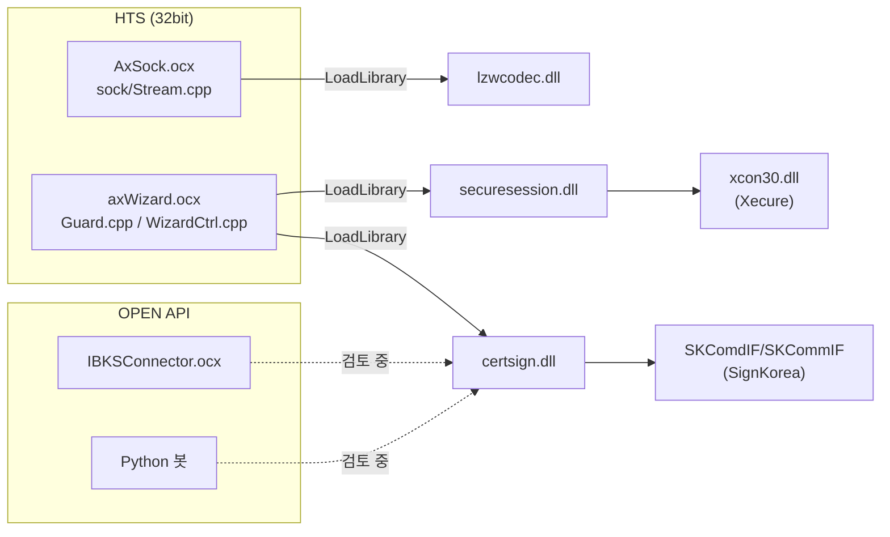
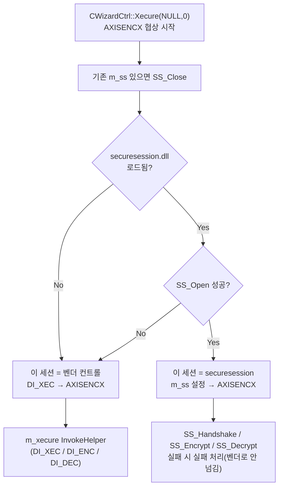
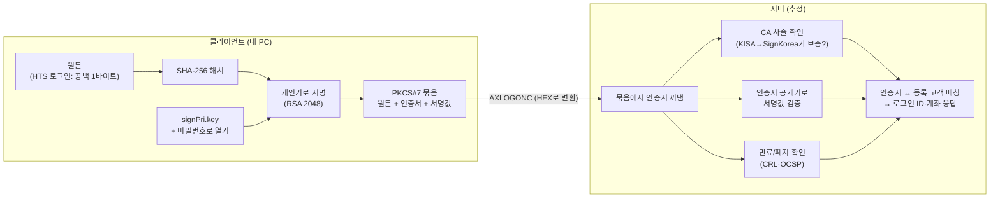
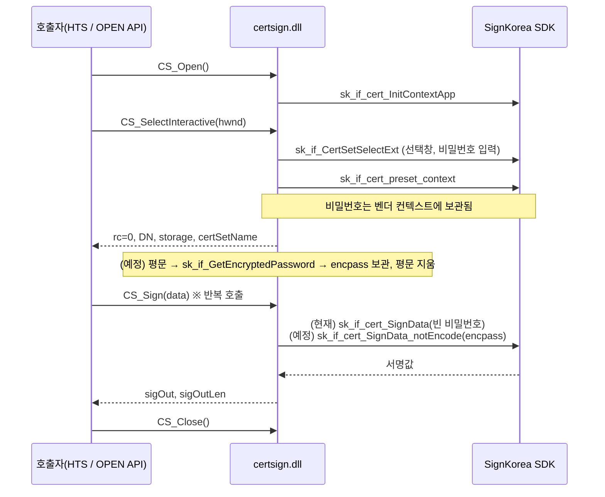
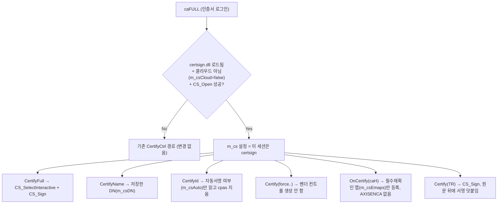

# HTS 기능 모듈 분리 프로젝트 (certsign / lzwcodec / securesession)

## 목차

- [문서 목적](#문서-목적)
- [1. 배경과 목표](#1-배경과-목표)
- [2. 모듈 한눈에 보기](#2-모듈-한눈에-보기)
- [3. 공통 설계 원칙](#3-공통-설계-원칙)
- [4. lzwcodec — 송수신 패킷 압축](#4-lzwcodec--송수신-패킷-압축)
- [5. securesession — 송수신 패킷 암호화](#5-securesession--송수신-패킷-암호화)
- [6. certsign — 공동인증서 서명](#6-certsign--공동인증서-서명)
  - [6.0 공동인증서 기본 개념](#60-공동인증서-기본-개념-개발-전-이해용)
- [7. 빌드 환경 메모](#7-빌드-환경-메모)
- [8. 미해결 이슈 / 위험 목록](#8-미해결-이슈--위험-목록)
- [9. 다음 단계](#9-다음-단계)
- [10. 작업 이력](#10-작업-이력)
- [11. 관련 문서](#11-관련-문서)

---

## 문서 목적

HTS 내부(소켓 OCX, Wizard, 벤더 ActiveX)에 묶여 있던 압축·암호화·공동인증서 기능을 **독립된 C 인터페이스 DLL**로 분리하는 작업의 진행 기록입니다. 모듈별 API, HTS에 연결된 지점, 확인된 사실, 미해결 이슈를 한곳에 모아 작업하면서 계속 갱신합니다.

> 사무실 PC는 DRM 때문에 이 문서를 편집할 수 없습니다. 문서 갱신은 노트북에서 합니다(2026-10-04).

---

## 1. 배경과 목표

| 목표 | 설명 |
|---|---|
| 벤더 ActiveX 의존 제거 | `AxisXecure.XecureCtrl`(암호화), `AxisCertify.CertifyCtrl`(인증서)는 COM 등록·모달 UI를 전제로 합니다. 이를 벤더 SDK(lib)를 직접 호출하는 DLL로 바꿉니다 |
| OPEN API 재사용 | 같은 DLL을 HTS(Wizard/소켓)와 OPEN API(IBKSConnector, Python 봇) 양쪽에서 씁니다. 공동인증서는 [CertifyArchitecture.md](CertifyArchitecture.md) §11의 결론(모달 UI 전제라 헤드리스 이식 불가)에 대한 해법입니다 |
| 안전한 전환 | HTS 쪽은 `LoadLibrary`로 동적 로드하고, DLL이 없으면 기존 경로를 쓰도록 설계했습니다(단, securesession은 §8의 이슈 1 참고) |

---

## 2. 모듈 한눈에 보기

| 모듈 | 기능 | 위치 | 벤더/원본 | HTS 연결 | 상태 |
|---|---|---|---|---|---|
| **lzwcodec** | 패킷 압축/해제 | `ibks/lzwcodec/` | 기존 `sock/Compress.cpp`·`Zip.cpp`를 이식 | ✅ `sock/Stream.cpp` | 연결 완료 |
| **securesession** | 패킷 암호화(키교환+암/복호화) | `ibks/securesession/` | Xecure SDK `xcon30.lib`(+`xcon30.dll`) | ✅ `Wizard/Guard.cpp`, `WizardCtrl.cpp` (`DF_MD_XECURE`) | 연결 완료, 폴백 이슈 있음 |
| **certsign** | 공동인증서 선택·서명 | `ibks/certsign/` | SignKorea SDK `SKComdIF.lib`/`SKCommIF.lib` | 🔧 `Wizard/Guard.cpp`, `WizardCtrl.cpp` (`DF_MD_CERTSIGN`) — 인증서 로그인 + TR 서명 | 연결 코드 완료(2026-10-05), 실동작 검증 중 |

---

## 3. 공통 설계 원칙

세 모듈이 같은 모양을 따릅니다.

- **불투명 핸들:** `HLZW`/`HSS`/`HCS`(`void*`). 호출자는 내부 구조를 모릅니다.
- **C 링키지 export:** `extern "C" __declspec(dllexport)`. 장식 없는 이름으로 `GetProcAddress` 할 수 있어 Python `ctypes`에서도 바로 부를 수 있습니다.
- **생명주기:** `XX_Open` → 작업 함수 → `XX_Close`.
- **버퍼 규칙(securesession/certsign):** `outLen`이 in일 때 버퍼 크기, out일 때 실제 길이입니다. 반환값은 0=성공, 음수=실패이고 certsign은 벤더 오류코드를 그대로 돌려줍니다.
- **호출 규약:** 전부 기본 `__cdecl`입니다.

---

## 4. lzwcodec — 송수신 패킷 압축

### API (`lzwcodec/lzwcodec/lzwcodec.h`)

| 함수 | 설명 |
|---|---|
| `HLZW LZW_Open(int bits)` | 압축기 생성. `bits`(13/16)는 **아직 반영 안 됨**(TODO) |
| `int LZW_Compress(h, in, inLen, out)` | 압축, 반환값 = 출력 길이 |
| `int LZW_Decompress(h, in, inLen, out)` | 해제, 반환값 = 출력 길이 |
| `void LZW_Close(h)` | 해제 |
| `int LZW_CompressFile(ofname, cfname, keepOriginal)` | 파일 압축. `keepOriginal`이면 `<이름>_YYMMDDHHMM.<확장자>`로 원본을 먼저 백업합니다(내부 `CZip`이 원본을 지우기 때문) |
| `int LZW_DecompressFile(...)` | 파일 해제, 백업 규칙 동일 |

### HTS 연결 (`sock/Stream.cpp`)

- 생성자에서 `LoadLibraryA("lzwcodec.dll")` → `LZW_Open(13)`.
- 수신: `CStream::ParseFrame()`의 `fmC_NRM` 분기. `fmH->stat & stat_PACK`이면 `LZW_Decompress`.
- 송신: 프레임 조립부에서 `LZW_Compress`. 압축 결과가 원본보다 크거나 0 이하면 원본을 그대로 보냅니다.
- DLL이 없으면 기존 내장 `CCompress`(`m_zip`)를 씁니다. **폴백이 실제로 동작하는 구조**입니다.

---

## 5. securesession — 송수신 패킷 암호화

### API (`securesession/securesession/securesession.h`)

| 함수 | 설명 |
|---|---|
| `HSS SS_Open(password, confPath, outBuf, outLen)` | `XC_INIT`(클라이언트 모드) 후 첫 핸드셰이크 메시지(`AXISENCX` 페이로드)를 만들어 줍니다 |
| `int SS_Handshake(h, inBuf, inLen, outBuf, outLen)` | 서버 응답 처리. 0=완료, 1=`outBuf`를 서버로 다시 보내고 재호출, -1=실패 |
| `int SS_Encrypt / SS_Decrypt(h, in, inLen, out, outLen)` | 핸드셰이크 완료(`SS_STATE_RUN`) 후에만 동작. 최대 64KB |
| `void SS_Close(h)` | 세션 해제 |
| `const char* SS_GetLastError()` | `XC_GETERR()` 그대로 |

상태 전이: `HELLO → OK(SS_Open 후) → RUN(SS_Handshake rc=0 후)`.

### HTS 연결 (`DF_MD_XECURE`, `Wizard/pch.h`에서 정의)

| 위치 | 역할 |
|---|---|
| `CGuard::Initial()` (`Guard.cpp:247`) | `LoadLibrary("securesession.dll")`, export 6개 확보 |
| `CWizardCtrl::Xecure(char*,int)` (`WizardCtrl.cpp:1133`) | 로그인 초반 키교환. 최초 호출에서 `SS_Open` → `AXISENCX` 송신, 이후 서버 응답마다 `SS_Handshake` |
| `CGuard::Xecure(helper,...)` (`Guard.cpp:2167`) | TR 페이로드 암/복호화(`DI_ENC`/`DI_DEC`). [MigrationSpec](MigrationSpec_SocketToDrawing.md) §8.9의 그 진입점 |

- `xc_conf.ini`는 실행 exe와 같은 폴더에서 찾습니다.

### 폴백 규칙 — 세션 단위로 엔진을 정한다 (2026-10-04 수정)

압축과 달리 암호화는 **패킷 단위로 엔진을 바꿀 수 없습니다.** `AXISENCX` 키교환을 우리 DLL로 했다면 세션 키가 우리 DLL 안에만 있어서, 벤더 컨트롤은 그 키를 모릅니다. 그래서 규칙은 다음과 같습니다.

| 시점 | 조건 | 동작 |
|---|---|---|
| 협상 시작 `Xecure(NULL,0)` | 이전 세션 핸들(`m_ss`)이 있으면 | `SS_Close`로 먼저 정리(재협상 대비) |
| 〃 | DLL 로드됨 + `SS_Open` 성공 | **이 세션은 우리 DLL**(`m_ss` 설정) |
| 〃 | DLL 없음 또는 `SS_Open` 실패 | **이 세션은 벤더 컨트롤.** 아직 서버에 아무것도 안 보낸 시점이라 안전 |
| 협상 중 `SS_Handshake` / TR 암복호화 | `m_ss`가 있는데 실패 | **벤더로 넘기지 않고 실패 처리**(-1 / FALSE) |
| 〃 | `m_ss`가 없음 | 벤더 컨트롤 경로 |
| `~CGuard` | — | `SS_Close` + `FreeLibrary` |

구현상 판단 기준은 `m_guard->m_ss != NULL` 하나뿐입니다(헤더 변경 없음). `DF_MD_XECURE`를 켜도 벤더 코드가 항상 빌드에 포함됩니다.

로그 태그(`[Xecure-Nego]`): `engine=ours SS_Open ...`, `engine=ours SS_Handshake rc=...`, `SS_Open FAILED err=... - this session uses vendor control`, `securesession.dll not loaded - this session uses vendor control`. TR 단계 실패는 `[Xecure] helper=ENC/DEC(ours) FAILED err=... (no vendor fallback mid-session)`.
- 로그 태그: `[Xecure-Nego] SS_Open/SS_Handshake`, `[Xecure] helper=ENC/DEC(ours)` ([DebugLogGuide.md](DebugLogGuide.md) §12).

---

## 6. certsign — 공동인증서 서명

### 6.0 공동인증서 기본 개념 (개발 전 이해용)

**한 줄 요약:** 나만 가진 비밀 열쇠(**개인키**)로 도장을 찍고, 누구나 가진 공개 열쇠(**인증서 안의 공개키**)로 그 도장이 진짜인지 확인하는 방식입니다. "이 공개키가 정말 이 사람의 것"이라는 사실은 공인기관(**CA**)이 보증합니다.

#### 구성요소 세 가지

| 구성요소 | 비유 | 실제 | 누가 갖나 |
|---|---|---|---|
| **개인키** | 인감도장 | `signPri.key` 파일. 인증서 비밀번호로 **암호화된 채** 저장 | 본인만 (PC 하드디스크/USB/보안토큰/클라우드) |
| **인증서** | 인감증명서 | `signCert.der` 파일. 이름(DN), 일련번호, 유효기간, **공개키**를 담고 CA가 서명해 둠 | 공개해도 됨 |
| **CA(인증기관)** | 동사무소 | 루트 KISA → 중간 SignKorea CA → 사용자 인증서로 이어지는 신뢰 사슬 | 서버·클라이언트 모두 신뢰 |

- 하드디스크 인증서는 보통 `C:\Users\<사용자>\AppData\LocalLow\NPKI\SignKorea\USER\<DN 폴더>\`에 두 파일이 있습니다. 선택창의 "하드디스크"(`storage=3`)가 이 위치입니다.
- **인증서 비밀번호는 개인키 파일을 여는 열쇠일 뿐, 서버로 가지 않습니다.** 서버가 대조하는 값이 아니어서, 틀리면 PC의 벤더 SDK가 바로 2417(비밀번호 오류)을 냅니다.

#### 전자서명의 원리

서명값은 **개인키를 가진 사람만 만들 수 있고**, 검증은 **공개키만 있으면 누구나** 할 수 있습니다. 아래 테스트 결과의 `Verified OK`가 "공개키로 서명값 검증" 단계를 OpenSSL로 직접 해 본 것입니다.

#### 서명값(PKCS#7) 안에 든 것 — 테스트 서명 1944바이트 기준

| 부분 | 크기(대략) | 내용 |
|---|---|---|
| 헤더 | 수십 바이트 | 해시 알고리즘(SHA-256), 데이터 타입 |
| 원문 | 1바이트 | 공백 `' '` |
| **인증서** | 약 1460바이트 | DN, 일련번호, 유효기간, 공개키, 발급자, CRL·OCSP 주소, **VID** |
| 서명자 정보 + **서명값** | 약 440바이트 | 그중 실제 RSA 서명값은 256바이트 |

- **절반 이상이 인증서 자체**입니다. 그래서 서버는 ID 없이도 누가 서명했는지 압니다.
- **VID(가상 식별번호)**는 인증서 SAN 확장에 들어 있는 **"주민번호 + 랜덤값 R"의 해시(SHA-256)**입니다. 서버가 주민번호를 알고 R을 받으면 "이 인증서 주인이 이 주민번호의 사람인지" 본인확인을 할 수 있습니다. 클라우드 로그인 코드의 `SignDataWithR`이 돌려주는 R이 이 값입니다(현재 HTS는 R을 받기만 하고 서버로 보내지 않음).

#### 로그인 방식별 인증서의 역할

| | ① 공동인증서 | ② 클라우드 | ③ 아이디 |
|---|---|---|---|
| 개인키 위치 | 내 PC/USB | **SignKorea 서버** (PC에 파일 없음) | — |
| 신원 증명 수단 | **서명 결과(인증서 포함)** | 서명 결과(클라우드 개인키로 서명) | **ID+비밀번호** |
| 서버로 보내는 ID | 없음(공백) | 없음 | 있음 |
| 서버가 사용자를 아는 방법 | 묶음 속 인증서 ↔ 등록 고객 | 동일 | ID |
| 인증서 사용 | 로그인 자체 | 로그인 자체 | **2차 인증**: 로그인창의 인증서 비밀번호로 인증서를 열어 **로그인 ID 문자열에 서명** → `AXISENCA`(`"key\t"+서명`). 이후 이체 등 TR 서명에도 사용 |

①·②에서는 **인증서가 곧 ID**입니다. 그래서 "이 인증서를 우리 증권사의 어느 고객과 연결할지" 미리 정하는 **인증서 등록**(타기관 인증서 등록 등)이 필요합니다. 등록되지 않은 인증서는 서명이 유효해도 고객 매칭이 안 돼 로그인에 실패할 것으로 보입니다(서버 소스 미확인).

#### certsign 함수와 개념 매핑

| 함수 | 개념상 하는 일 |
|---|---|
| `CS_Open` | 벤더 SDK 작업공간(`APP_CONTEXT`) 준비 |
| `CS_SelectInteractive` | NPKI 폴더·USB 등의 인증서 목록 표시 → 선택 + 비밀번호 입력 → 선택 결과(`SD_API_CONTEXT`, 비밀번호 포함)를 `preset_context`로 작업공간에 연결 |
| `CS_Sign` | 원문 해시 → 개인키로 서명 → PKCS#7 묶음 생성 |
| `CS_Close` | 벤더 컨텍스트 해제, 세션 메모리 정리 |

**주의 — 벤더는 선택 결과를 복사하지 않고 "주소"만 기억합니다.** `preset_context`는 넘겨받은 `SD_API_CONTEXT`의 주소를 `appCtx.pInterfaceContext`에 저장하고, 서명할 때마다 거기서 비밀번호를 읽습니다. 그래서 그 메모리는 **세션 동안 살아 있어야** 합니다(세션 구조체 `s->sd`, CertifyCtrl의 `m_contextNew`). 지역변수를 넘겼다가 생긴 버그가 이슈 #10입니다. 반복 서명이 팝업 없이 되는 것도, `CS_Close` 뒤에는 다시 선택창이 떠야 하는 것도 이 구조 때문입니다.

#### 헷갈리기 쉬운 점

1. **서명 ≠ 통신 암호화.** 공동인증서(certsign)는 "누가 보냈는지"를 증명하고, 패킷 내용을 숨기는 것은 Xecure(securesession)입니다. 별개 모듈입니다.
2. **원문이 같으면 서명값도 매번 같습니다.** HTS 로그인은 고정 원문(공백 1바이트)에 서명하므로 인증서가 만료될 때까지 서명값이 늘 같습니다. 주문처럼 원문이 매번 다르면 서명값도 달라집니다.
3. **비밀번호는 PC 밖으로 나가지 않습니다.** 서버는 인증서 비밀번호를 모르고, 알 필요도 없습니다.

### API (`certsign/certsign/certsign.h`)

| 함수 | 설명 |
|---|---|
| `HCS CS_Open()` | `sk_if_cert_InitContextApp` |
| `int CS_Select(h, dn, password, storage, certSetName)` | 선택창 없이 DN+비밀번호로 직접 선택(`sk_if_CertSetSelect`) |
| `int CS_SelectInteractive(h, hwnd, dnOut, cap, storageOut, certSetNameOut, cap)` | **SignKorea 선택창**을 띄워 사용자가 고르게 함(`sk_if_CertSetSelectExt`, `CONTEXT_SELECT2`, 전체 매체). 고른 DN/저장매체/CertSetName을 돌려줌 |
| `int CS_Sign(h, data, dataLen, sigOut, sigOutLen)` | `sk_if_cert_SignData`. 버퍼가 작으면 -2 |
| `void CS_Close(h)` | `sk_if_cert_static_context_release` 후 해제 |
| `const char* CS_GetLastError()` | 벤더 오류 메시지 |

### 진행 방향 (2026-10-04 결정)

**선택창 방식(`CS_SelectInteractive`)으로 갑니다.** 기존 HTS(`CertifyCtrl::CertifyFull`)와 같은 경로라 검증되어 있고, OPEN API에서도 사용자가 직접 인증서를 고르는 쪽이 자연스럽습니다. 테스트 하네스에서 선택창이 정상적으로 뜨는 것까지 확인했습니다(Ver 10.0.6.6, 하드디스크 매체).

### 비밀번호 처리 — 기존 CertifyCtrl에서 확인한 사실

`ibks/certify_cloude/CertifyCtrl.cpp` 대조 결과입니다.

1. 선택창 → `sk_if_cert_preset_context`까지 하고 나면, 사용자가 입력한 비밀번호가 **벤더 컨텍스트 안**(`m_context.pInterfaceContext->szOldPasswd`)에 남습니다.
2. `CertifyFull`은 그 직후 **비밀번호 인자를 빈 값**으로 `sk_if_cert_SignData`를 부릅니다. 벤더가 컨텍스트의 비밀번호를 대신 씁니다. → `CS_SelectInteractive` 뒤 `CS_Sign`도 같은 조건이라 **첫 서명은 될 것으로 예상**합니다(검증 전).
3. 반복 서명(자동서명)은 `savePasswd()` 패턴을 씁니다. 컨텍스트의 평문을 `sk_if_GetEncryptedPassword`로 **33바이트 암호화 값**으로 바꿔 보관하고, 서명할 때는 `sk_if_cert_SignData_notEncode(&ctx, encpass, ...)`를 씁니다.
4. 자동서명이 아니면 CertifyCtrl은 컨텍스트 비밀번호를 지웁니다 → 서명할 때마다 비밀번호 팝업이 뜹니다.

### HTS 로그인에서 공동인증서가 하는 일 (2026-10-04 소스 확인)

**결론: 인증서 로그인(1·2번)에서는 ID 대신 "전자서명 결과(PKCS#7 SignedData)" 자체가 신원 증명입니다.** 서명 결과 안에 **서명자 인증서 전체**가 들어 있습니다. 서버는 서명을 검증한 뒤 인증서(DN/일련번호)를 미리 등록된 고객과 매칭해서 사용자를 알아냅니다. 실제로 인증서 로그인 응답(`_signR.sign`)에 로그인 ID가 채워져서 돌아오는 것이 실측으로 확인되어 있습니다([LoginSequence.md](LoginSequence.md) §10: 응답 1418바이트, 계좌 10개가 ID 로그인과 동일).

**무엇에 서명하나** — 서버가 준 값(챌린지)이 아니라 **고정된 원문**입니다.

| 로그인 방식 | 서명 원문 | 서명 API | 출처 |
|---|---|---|---|
| ① 공동인증서 | 공백 `' '` **1바이트** | `sk_if_cert_SignData` | `AXIS/MainFrm.cpp::signOnCert()` → `caFULL`(길이 1) → `CertifyFull` 일반 분기 |
| ② 클라우드 | `"abcdefghijklmnopqrstuvwxyz1234567890!@#$%^&*()-="` | `sk_if_cert_SignDataWithR` (R값은 결과에 담기지 않음, 버려짐) | `CertifyCtrl.cpp` `CertifyFull` 클라우드 분기 |
| ③ 아이디 | **로그인 ID 문자열**(예: `khs779`). 결과를 `"key\t"+서명`으로 `AXISENCA` 송신 | `sk_if_cert_SignData` | `CertifyCtrl::sign()` — [CertifyArchitecture.md](CertifyArchitecture.md) §14.3 (2026-10-04 정정) |

**서버로 올라가는 것 — `AXLOGONC`(msgK_SIGNx) 페이로드 `i_pc`** (`MainFrm.cpp::signOnCert`)

| 필드 | 크기 | 내용 |
|---|---|---|
| `user` | 12 | **비어 있음(공백)** — 인증서 로그인이라 ID 없음 |
| `pass` | 10 | 공백 |
| `dats` | 10 | `m_axConnect->GetSignInfo()` (로그인 옵션 정보) |
| `cpas` | 30 | 공백 |
| `uips` | 15 | PC IP |
| `madr` | 16 | MAC 주소 |
| `sdat` | 6776 | **서명 결과(PKCS#7)를 HEX 문자열로 변환한 것**. Wizard `caFULL` 처리에서 `ConvertHEX` 후 `[cert길이5][DN길이5][HEX서명][DN]` 형태로 받고, 그중 HEX 서명 부분만 넣음 |

LoginSequence.md §10에 기록된 실측 구조("빈ID+부서+IP+MAC / HEX X.509 인증서 / 공백 패딩 / Base64 서명값 / 평문 DN")와 맞습니다. HEX 인증서와 서명값이 따로 보였던 것은 PKCS#7 안에 인증서와 서명이 함께 들어 있기 때문으로 보입니다(테스트 서명값으로 구조 확인 예정).

**서버가 할 것으로 추정되는 일(서버 소스 미확인):** PKCS#7 서명 검증 → 내장 인증서 추출 → 유효성(만료/폐지, OCSP 등) 확인 → 인증서(DN/일련번호)와 등록 고객 매칭 → `_signR`에 ID/계좌를 채워 응답.

**관찰(보안):** 원문이 고정값이고 서버 챌린지(nonce)가 없어서, 서명 결과 자체는 매번 재사용이 가능한 형태일 수 있습니다. 다만 PKCS#7에 서명 시각 속성이 들어가는지, 서버가 그 시각을 검사하는지는 미확인입니다. 또 `AXLOGONC` 이전에 `AXISENCX`로 채널이 암호화됩니다. 테스트에서 같은 세션의 서명 2회 결과가 같은지(`same=`)로 일부 확인할 수 있습니다.

### 테스트 결과 — 선택창 + 서명 2회 (2026-10-04, 노트북, 테스트 인증서)

| 항목 | 결과 |
|---|---|
| `CS_SelectInteractive` | rc=0, 하드디스크(storage=3)의 테스트 인증서 선택 |
| `CS_Sign` #1 / #2 | 둘 다 rc=0, **1944바이트**, 922ms / 2016ms |
| 두 서명 비교 | **바이트 단위로 완전히 동일** |
| 실사용 인증서(본인, 하드디스크) | 두 서명 모두 rc=0, **1872바이트, 62ms / 47ms**, 두 서명 동일. 테스트 인증서가 느렸던 것은 해당 인증서/저장 환경 문제로 보임 → 실제로는 주문마다 서명해도 지연 부담이 작음 |
| `CS_GetLastError()` | "스마트카드 열기 오류" — rc=0이므로 선택창이 전체 매체를 검색하다 남긴 이전 메시지로 보이며 무시 가능 |

**서명값 구조 (OpenSSL `asn1parse`로 확인)**
- 최상위가 ContentInfo로 감싸지지 않은 **PKCS#7 `SignedData` 본체**입니다(`30 82 07 94 02 01 00 ...`). digest=SHA-256, 서명=RSA 2048 (sha256WithRSAEncryption).
- **원문이 내부에 포함**(attached)되어 있습니다: `pkcs7-data` → OCTET STRING 1바이트 `' '`.
- **서명자 인증서 전체가 포함**되어 있습니다(일련번호 `0EB7AC`, 유효기간 2025-11-25 ~ 2028-12-20). 서버는 이 안의 인증서로 사용자를 식별하는 것으로 보입니다.
- **signedAttrs(서명 시각 등)가 없습니다.** RSA PKCS#1 v1.5는 결정적이라 같은 원문이면 서명이 항상 같습니다 → 이번에 두 서명이 같았던 이유입니다.
- **비표준:** SignerInfo의 `issuerAndSerialNumber`에 발급자 DN이 아니라 **서명자 본인 DN(subject)**이 들어 있습니다. 그래서 OpenSSL `cms -verify`는 "signer certificate not found"로 실패합니다. 대신 인증서 공개키로 원문 SHA-256 서명을 직접 검증하면 **`Verified OK`**입니다. 서버 쪽 검증기도 이 벤더 형식에 맞춰져 있을 것입니다.

**의미**
- 인증서 로그인의 `sdat`(HEX 서명값)는 같은 인증서라면 **로그인할 때마다 같은 값**입니다(만료 전까지). 서버가 별도의 일회성 값(nonce)을 섞지 않는 한 재사용(replay)을 서명 단계에서 막지는 못합니다. 채널은 `AXISENCX` 암호화로 보호되지만, 이 점은 보안 검토 항목으로 남깁니다.
- 반복 서명은 같은 세션에서 동작했습니다. 두 번째 서명에서 비밀번호 팝업이 떴는지는 사용자 확인이 필요합니다(소요시간이 922ms → 2016ms로 늘어남).

### OPEN API에서 쓸 때 조건

- 선택창은 모달이라 **UI 스레드(메시지 루프가 있는 스레드)**에서 호출해야 합니다. 부모 HWND는 IBKSConnector를 품은 창을 넘깁니다.
- 로그인할 때 선택창을 **한 번만** 띄우고, 이후 주문 서명은 암호화 비밀번호로 팝업 없이 처리하는 구조를 목표로 합니다.

### 테스트 하네스

`src/TestDlg-b_TestDlg/TestDlg-b_TestDlg/TestDlgDlg.cpp`(UTF-8)의 `CTestDlgDlg::OnBnClickedBtnWrite32()`.
- (2026-10-04, 2차) 세션(`HCS`)을 파일 static으로 버튼 밖에 유지. 첫 클릭: 선택창+서명 / 이후 클릭: **선택창 없이 서명만** / Shift+클릭: 세션 닫고 재선택. "로그인 때 한 번 선택, 이후 서명만" 시나리오 확인용.
- (2026-10-04, 1차) `CS_SelectInteractive` → `CS_Sign` 2회(원문은 HTS와 같은 공백 1바이트). 메시지박스에 rc/길이/소요시간/두 서명 동일 여부(`same`)/앞 16바이트를 표시하고, 서명값 전체를 HEX로 `%TEMP%\certsign_sig.hex`에 저장합니다.
- 이전 `CS_Select`(DN 직접 지정) 코드는 주석으로 남겨 두었습니다(비밀번호는 `<password>`로 치환).
- 경로는 `DF_PLACE_COMPANY` 매크로로 사무실(`D:\src\IBKS\...`)/노트북(`F:\src\IBK\...`)을 나눕니다.
- (2026-10-05, 3차) 결과창에 `samePrev` 추가. `%TEMP%\certsign_sig.hex`를 덮어쓰기 전에 첫 줄(직전 실행의 서명)과 비교합니다. `SignData`(평문) → `SignData_notEncode`(암호화 비밀번호)로 바꾼 뒤에도 출력이 같은지 확인하는 용도입니다(1 = 같음, -1 = 이전 파일 없음).

### 비밀번호 보관 방식 변경 (2026-10-05, 이슈 #6·#7)

| | 이전 | 이후 |
|---|---|---|
| 보관 | 평문(`s->password`, 벤더 컨텍스트의 `szOldPasswd`) | 33바이트 암호화 값(`s->encpass`)만 |
| 평문 | 세션 동안 메모리에 남음 | `preset_context` 직후 `SecureZeroMemory` (`CS_Select`, `CS_SelectInteractive` 공통, 내부 `savePasswd()`) |
| 서명 | `sk_if_cert_SignData(평문)` | `sk_if_cert_SignData_notEncode(encpass)` — CertifyCtrl 자동서명 경로와 동일 |
| `CS_Close` | `delete`만 | 세션 구조체 전체를 지운 뒤 `delete` |

### 내부 로그(`cslog`) — 2026-10-05, 사용자 작업

certsign은 MFC 없는 Win32 DLL이라 `CString`을 쓰는 `h/axlog.h`를 include할 수 없습니다. 대신 `char` 고정 버퍼 + `_vsnprintf_s(_TRUNCATE)` + `OutputDebugStringA`로 된 `cslog(fmt, ...)` 매크로를 씁니다. 머리말은 `[CERTSIGN][함수명:줄]`이고, DebugView에서 `[CERTSIGN]`으로 필터합니다.

주의(이슈 #14):
- 현재 공개 헤더 `certsign.h`에 들어 있습니다. TestDlg·Wizard가 이 헤더를 include하면 `cslog`/`cslogImpl`이 호출 쪽에도 생기고 `windows.h` 선행이 필요해집니다. `certsign.cpp` 안으로 옮기는 게 맞습니다.
- `CS_Sign`의 `data=[%s]`는 길이 1짜리 원문(끝에 NUL 없음)을 `%s`로 찍어 **뒤쪽 메모리(DN 등)까지 읽습니다.** `%.*s`(길이 지정)나 hex로 찍어야 합니다. 실제로 원문은 공백 1바이트인데 DN이 함께 찍혀, "비밀번호를 넣지 않았는데 데이터가 있다"는 오해가 있었습니다.
- 비밀번호·`encpass`는 찍지 않습니다. DN에는 실명이 들어 있으니 운영 로그에서는 앞부분만 찍습니다.

### HTS 연결 (`DF_MD_CERTSIGN`, `Wizard/pch.h`) — 2026-10-05

**범위:** 공동인증서 로그인과 로그인 후 TR 서명(`OP_CERTIFY`). ID 로그인과 클라우드는 기존 CertifyCtrl을 그대로 씁니다.

**`CertifyFull`만 바꾸면 안 되는 이유:** CertifyCtrl은 로그인 내내 `m_ca` 상태를 이어서 씁니다. 로그인 서명만 DLL로 돌리면 CertifyCtrl은 `caNO`로 남습니다. 그러면 로그인 응답 뒤 `OnCertify(caH)`가 ID 로그인 경로(`queryDn`)로 빠집니다. 빈 비밀번호로 인증서를 열다 실패하면 `"pswd\t"`를 서버로 보내 **비밀번호 오류 횟수가 올라갈 수 있습니다**([CertifyArchitecture.md](CertifyArchitecture.md) §14.6). 그래서 securesession(§5)과 같은 **세션 단위 엔진 선택**을 씁니다.

**변경 지점**

| 위치 | `m_cs`가 있을 때 동작 | CertifyCtrl 대응 |
|---|---|---|
| `Guard.h` | `PFN_CS_*` 함수포인터, `m_hCertSign`, `m_cs`, `m_csDN`, `m_csAuto`, `m_csCloud`, `m_csEmaps`, `CloseCertSign()`, `SelectCertSign()` | — |
| `CGuard()` / `~CGuard()` | 초기화 / `CloseCertSign` + `FreeLibrary` | — |
| `CGuard::Initial` | `LoadLibrary("certsign.dll")` + export 5개. 하나라도 없으면 해제하고 벤더 사용 | — |
| `CGuard::CertifyFull` | 이전 세션 닫기 → `CS_Open` → 선택창 → `CS_Sign`. 반환값은 벤더 오류코드 그대로(2417/2500/2501)라 `MainFrm::signOnCert`·`pibfenca 'E'` 처리는 변경 없음. `CS_Open` 실패일 때만 벤더 경로로 | `CertifyFull` |
| `CGuard::CertifyName` | `m_csDN` 복사 | `CertifyName` |
| `CGuard::CertifyId` | `dats[1]=='1'` → `m_csAuto`, `cpas`(오프셋 32, 30바이트)를 공백으로 지움 | `CertifyId` |
| `CGuard::Certify(force,…)` | 즉시 `TRUE` (컨트롤 생성·`DI_CAEX` 안 함) | — |
| `CGuard::OnCertify` | `_caH.map`의 8자리 맵코드를 `m_csEmaps`에 등록, 0 반환 | `OnCertify` `caOKx` 분기 |
| `CGuard::Certify(p,&n,maps)` | `WS_SELF` 확인 → (자동서명이 아니거나 필수맵이면 선택창 재호출) → `CS_Sign` → 원문 뒤에 서명, `n += sigLen` | `Certify` (`DI_CA`) |
| `CGuard::CertifyCloude` | `gubn==11` → `m_csCloud=true`, `12` → `false` (벤더 호출 전에 기록) | `CertifyCloud(11/12)` |
| `CWizardCtrl::RunAxis` `signUSER` | `CertifyId` 전에 `CloseCertSign()` — ID 로그인은 반드시 벤더 경로 | — |

**v1 제한:** 자동서명을 체크하지 않았거나 필수 재확인 맵이면, 기존의 작은 비밀번호 창(`CertifyCtrl::checkPasswd`) 대신 **인증서 선택창이 다시 뜹니다.** 다음 단계에서 비밀번호만 확인하는 함수(`CS_VerifyPassword`)를 certsign에 추가해 바꿉니다(이슈 #12). 스크립트 서명(`CxSystem` → `CertifyFull`)도 선택창을 다시 띄웁니다. 기존 CertifyCtrl도 매번 다시 선택하므로 동작은 같습니다.

**로그(`LOG_CERTIFY`, DebugView `[CertSign]`)**

| 로그 | 의미 |
|---|---|
| `CGuard::Initial certsign.dll loaded OK` / `not found - fallback to vendor control` | 시작 시 DLL 로드 결과 |
| `[CertSign] SelectInteractive rc=… storage=…` | 선택창 결과 |
| `[CertSign] CertifyFull engine=ours rc=… sigLen=…` | 로그인 서명 |
| `[CertSign] CS_Open FAILED - this session uses vendor control` | 이 세션은 벤더 |
| `[CertSign] CertifyId auto=…` | 자동서명 여부 |
| `[CertSign] OnCertify caL=… emaps=…` | 로그인 응답의 `_caH` 반영 (`caL=462` 예상) |
| `[CertSign] TR-sign maps=… rc=… dataLen=… sigLen=…` | TR 서명 |

**빌드 상태:** Wizard Release Win32 컴파일·링크 통과(출력 `src/release/axWizard.ocx`). 사용자 반영분에 오타 2개(`Certify(TR)`의 닫는 괄호 하나 더 있음, `CertifyId`의 `32. 30`)가 있어 수정했습니다. 사용자 확인: 새 ocx로 HTS 실행 정상.

**남은 실동작 검증**
1. `certsign.dll`을 exe 폴더에 두고 인증서 로그인 → `engine=ours rc=0` → `CertifyId auto=` → `OnCertify caL=462` 순서로 찍히고 로그인 성공(계좌 정상)
2. 비밀번호를 일부러 틀림 → `rc=2417`, 기존과 같은 `CCertErrDialog`
3. 로그인 후 `OP_CERTIFY` 화면에서 주문/이체 → `TR-sign rc=0`, 서버 응답 정상
4. ID 로그인 → `[CertSign]` 로그 없이 기존 경로
5. `certsign.dll` 제거 후 인증서 로그인 → `not found` 로그 후 기존 경로로 정상

---

## 7. 빌드 환경 메모

- **세 모듈 모두 Win32(x86)로 빌드해야 합니다.** HTS 전체가 32비트이고, 벤더 lib도 32비트 전용입니다.
  - 확인 사례(2026-10-04): securesession을 x64로 빌드하면 `LNK2001 XC_INIT/XC_ENCODE/XC_DECODE/XC_GETERR`가 납니다. `xcon30.lib`의 머신 타입이 `14C (x86)`이고 심볼이 `_XC_INIT@12`(x86 `__stdcall` 장식)라서, x64가 찾는 장식 없는 `XC_INIT`을 못 찾습니다. 솔루션 플랫폼을 `x86`으로 바꾸면 해결됩니다.
- 툴셋: v142(VS2019).
- **런타임 배포:** `securesession.dll`은 실행할 때 `xcon30.dll`이 필요합니다(`dumpbin /dependents`로 확인). certsign은 `SKComdIF.dll` 등 SignKorea 모듈이 필요합니다(OPEN API 배포 폴더 목록은 [Dependency.md](Dependency.md) 참고).
- **SignKorea SDK 버전 불일치 — axCertify.ocx `LoadLibrary error=127` (2026-10-05):** `ibks/certify_cloude`(운영)·`certify_cloude_log`(axlog 사본)를 빌드하면 `registerControl`에서 127(`ERROR_PROC_NOT_FOUND`)이 납니다.
  - 원인: 링크하는 `certify_cloude/CaLib/SKComdIF.lib`(2025-03-18)는 최신 SDK인데, 배포된 `SKComdIF.dll`은 F:\util·C:\IBKS·C:\HTS_OPENAPI 모두 **10.0.6.6**입니다. ocx가 쓰는 29개 함수 중 `sk_if_Cloud_AbroadPhoneAuthenticationOnOff`(해외 전화 ARS 버튼, `InitCloude()`) 하나가 DLL에 없습니다. `CaLib/back/`의 2023·2024 lib에도 이 함수는 없습니다.
  - 운영 중인 axCertify.ocx(C:\IBKS, 06-02)는 이 함수 없이 28개만 씁니다. 즉 저장소 소스·lib이 배포 DLL보다 앞서 있습니다.
  - 조치: 그 한 줄을 주석 처리하고 빌드하면 운영본과 같아집니다. 2026-10-05에는 `certify_cloude_log`에만 반영했고, **운영 트리 `certify_cloude/CertifyCtrl.cpp:1691`은 아직 그대로**입니다. 이 기능이 필요하면 2025-03-18 lib과 짝이 맞는 새 SignKorea DLL을 받아 배포해야 합니다.
  - 진단법: `dumpbin /imports:SKComdIF.dll axCertify.ocx`와 `dumpbin /exports SKComdIF.dll`의 `sk_if_*` 목록을 비교하면 없는 함수가 바로 나옵니다. certsign은 이 함수를 쓰지 않아 영향이 없습니다.
- **Wizard 빌드 후 이벤트 `MSB3073`(노트북):** Release 빌드 끝의 `symstore.exe add`가 `C:\Program Files (x86)\Windows Kits\8.1\Debuggers\x86\symstore.exe`를 찾지 못해 실패합니다. ocx는 정상 생성되므로 무시해도 됩니다.
- **빌드 출력 위치:** certsign → `src/release/certsign.dll`, axWizard → `src/release/axWizard.ocx`, axCertify(`certify_cloude_log`) → `src/release/axCertify.ocx`. 테스트하려면 exe 폴더(`F:\util\HTS\IBK_SMART\exe`)로 복사해야 합니다.
### 기존(벤더/내장) 방식으로 되돌리는 법

exe 폴더에서 DLL을 지우고 HTS를 재시작하면 됩니다. 어느 엔진을 쓸지는 프로그램 시작 시 `LoadLibrary` 시점에 정해집니다.

| 지울 DLL | 결과 | 전제 |
|---|---|---|
| `securesession.dll` | 벤더 `AxisXecure.XecureCtrl`로 암호화 | 2026-10-04 수정된 axWizard.ocx가 배포되어 있어야 함(이전 OCX는 폴백이 없음) |
| `lzwcodec.dll` | AxSock 내장 `CCompress`로 압축 | 없음(원래 폴백 구조) |
| `certsign.dll` | 기존 CertifyCtrl로 공동인증(`certsign.dll not found - fallback to vendor control`) | 2026-10-05 이후 axWizard.ocx. TestDlg는 정적 링크라 실행 불가. **SignKorea DLL(`SKComdIF.dll` 등)은 벤더 컨트롤도 쓰므로 지우지 않음** |

주의:
- **`xcon30.dll`은 지우지 않습니다.** 벤더 컨트롤(`axXecure.ocx`)도 사용합니다.
- 파일 이름만으로 `LoadLibrary`하므로, exe 폴더에서 지워도 Wizard가 PATH에 넣는 **`dev` 폴더 등 다른 검색 경로**에 같은 파일이 있으면 그것이 로드됩니다.
- 확인 로그: `CGuard::Initial securesession.dll not found - fallback to vendor control`, `[Xecure-Nego] securesession.dll not loaded - this session uses vendor control`.

### 소스 인코딩

- `certsign.cpp`, `securesession.h`, `ssapi.cpp`, `lzwcodec.h`, `lzwapi.cpp` 등은 한글 주석이 있는 CP949입니다. 수정할 때는 iconv 왕복 절차를 따릅니다.

---

## 8. 미해결 이슈 / 위험 목록

| # | 모듈 | 내용 | 영향 | 상태 |
|---|---|---|---|---|
| 1 | securesession | `DF_MD_XECURE`가 켜지면 벤더 컨트롤 코드가 `#else` 쪽이라 컴파일되지 않아 실제 폴백이 없었고, `CGuard::Xecure`는 반환값 없이 함수 끝에 도달했음 | DLL 누락·실패 시 암호화 TR이 깨질 수 있었음 | **코드 수정 완료(2026-10-04), 컴파일 확인.** §5 "폴백 규칙" 참고. 실동작 검증(DLL 있음/없음 두 경우 로그인) 남음 |
| 2 | securesession | `SS_Open`의 프로필 암호가 `WizardCtrl.cpp`에 `"qwer1234"`로 하드코딩 | 보안/설정 | 미해결 |
| 3 | securesession | `SS_Close`가 `XC_CTX` 정리 없이 `delete`만 함 | 자원 누수 가능 | 미확인 |
| 4 | lzwcodec | `LZW_Open(bits)`의 `bits` 미사용(TODO) | 기능 미완 | 미해결 |
| 5 | lzwcodec | `LZW_Compress/Decompress`가 출력 버퍼 크기를 받지 않음 | 오버플로 가능 | 미해결 |
| 6 | certsign | 반복 서명을 위한 암호화 비밀번호 보관(§6의 3번 패턴) 미구현 | OPEN API 자동서명 불가 | **코드 수정 완료(2026-10-05), 빌드 확인.** 선택/`CS_Select` 직후 `szOldPasswd`를 `sk_if_GetEncryptedPassword`로 33바이트 `encpass`에 보관, `CS_Sign`은 `sk_if_cert_SignData_notEncode(encpass)`. 실동작 검증 남음 |
| 7 | certsign | `CS_Select`가 평문 비밀번호를 세션에 보관하고, `CS_Close`에서 지우지 않음 | 메모리에 평문 잔존 | **수정 완료(2026-10-05):** 세션의 평문 필드 삭제, `preset_context` 이후 `s->sd.szOldPasswd`를 `SecureZeroMemory`, `CS_Close`에서 세션 전체 지움. 평문을 지워도 `notEncode` 서명이 되는지가 #6 검증 항목 |
| 8 | certsign | `CS_Close`가 전역 `sk_if_cert_static_context_release`를 호출 | 세션을 여러 개 열면 서로 간섭 가능 | 미확인 |
| 10 | certsign | `CS_SelectInteractive`가 **지역변수** `ctxNew.sd`를 `sk_if_cert_preset_context`에 넘김. 벤더는 그 주소를 `appCtx.pInterfaceContext`에 보관했다가 서명할 때 거기서 비밀번호(`szOldPasswd`)를 읽으므로, 함수 반환 후 댕글링 포인터가 됨. 같은 함수 호출 흐름 안의 서명은 우연히 성공하고, 다음 버튼 클릭(세션 재사용)에서는 **2417(비밀번호 오류)**로 실패 | 세션 재사용(반복 서명) 불가 | **수정 완료(2026-10-04):** `s->sd`에 먼저 복사한 뒤 그 주소로 `preset_context`, 지역 사본의 비밀번호는 `SecureZeroMemory`. 기존 CertifyCtrl이 `m_contextNew`를 멤버로 둔 것과 같은 이유. **재테스트 통과**: 세션 재사용 클릭에서 선택창 없이 rc=0, 1872바이트(47/62ms) |
| 9 | certsign | 테스트 코드의 DN 직접 지정 값이 실제 테스트 인증서와 다르고, 비밀번호 끝에 공백이 있음 | `CS_Select` 실패(2500/2417)의 유력한 원인 | 선택창 방식으로 전환하며 우회 |
| 11 | axCertify | 저장소 SignKorea lib(2025-03-18)이 배포 DLL(10.0.6.6)보다 새것 → `sk_if_Cloud_AbroadPhoneAuthenticationOnOff` 때문에 ocx 로드 127 | 운영 트리로 빌드하면 공동인증 컨트롤 로드 불가 | `certify_cloude_log`만 주석 처리(2026-10-05). **운영 트리 1691행 미반영**, 새 SDK DLL 배포 여부 결정 필요 (§7) |
| 12 | certsign HTS 연결 | 자동서명이 아니거나 필수 재확인 맵일 때, 작은 비밀번호 창 대신 선택창이 다시 뜸(v1) | UX 차이 | `CS_VerifyPassword`(CertifyCtrl::checkPasswd 대응) 추가 예정 |
| 13 | certsign HTS 연결 | ID 로그인(`queryDn`, 선택창 없이 DN+암호화 비번으로 열기)과 클라우드 로그인은 미지원 → 벤더 경로 | 기능 범위 | 다음 단계. ID 로그인은 `sk_if_SetPasswordEncMode(1)` + 암호화 비번을 `szOldPasswd`에 넣는 방식으로 `CS_Select`를 확장할 수 있음(CertifyArchitecture §14.7) |
| 14 | certsign | `cslog`가 공개 헤더 `certsign.h`에 있고, `CS_Sign`의 `data=[%s]`가 버퍼를 넘어 읽음 | 호출 쪽 이름 충돌·`windows.h` 의존, 로그에 엉뚱한 내용(DN) | `certsign.cpp`로 이동, `%.*s` 또는 hex로 변경 필요 |

---

## 9. 다음 단계

1. ~~TestDlg에서 `CS_SelectInteractive` → `CS_Sign` 호출~~ — **완료(2026-10-04)**, §6 테스트 결과 참고. 남은 확인: 두 번째 서명 때 비밀번호 팝업이 떴는지, 다른 프로세스/재시작 후에도 같은 값인지.
2. ~~certsign에 암호화 비밀번호 보관과 `SignData_notEncode`를 반영~~ — **코드 완료(2026-10-05)**. TestDlg로 확인할 것: (a) 첫 클릭 `sign#1/#2 rc=0`, (b) 재클릭(세션 재사용)에서도 rc=0 — 평문을 지운 상태라 이게 핵심, (c) `samePrev=1` — 어제 `SignData`로 저장한 1872바이트와 바이트 단위 동일하면 출력 형식이 같다는 뜻.
3. ~~HTS 연결 방식 결정~~ — **코드 완료(2026-10-05)**, §6 "HTS 연결" 참고. 남은 것: 그 절의 실동작 검증 1~5, 이슈 #12(`CS_VerifyPassword`), #13(ID 로그인/클라우드), #11(운영 트리 1691행), #14(로그 정리).
4. OPEN API(IBKSConnector / Python ctypes) 연결을 검토합니다.
5. securesession 폴백 실동작 검증: (a) `securesession.dll`을 둔 채 로그인 → `engine=ours` 로그, (b) DLL을 치운 채 로그인 → `this session uses vendor control` 로그 후 정상 조회.

---

## 10. 작업 이력

| 날짜 | 내용 |
|---|---|
| 2026-09-23 | lzwcodec 모듈 추가(커밋 `a1fd4bae`) |
| 2026-09-27 | lzwcodec vcxproj 수정(`8ba19ab6`) |
| 2026-10-02 | certsign, securesession 모듈 추가(`f80c641a`), Wizard/소켓 연결 |
| 2026-10-04 | 노트북에서 현황 정리. securesession x64 링크 오류 → x86 빌드로 해결. certsign 선택창 방식으로 방향 확정, CertifyCtrl 비밀번호 처리 패턴 조사. securesession 폴백 부재 이슈 발견. 이 문서 작성 |
| 2026-10-04 | securesession 폴백을 세션 단위로 재구성(`Guard.cpp` `CGuard::Xecure`·`~CGuard`, `WizardCtrl.cpp` `CWizardCtrl::Xecure`). 벤더 코드 항상 빌드 포함, `m_ss` 기준 분기. Release Win32 컴파일 확인(링크·실동작 미검증) |
| 2026-10-04 | CertifyCtrl 로그인 함수 흐름 전수 조사 → [CertifyArchitecture.md](CertifyArchitecture.md) §14(호출 표면, ID/인증서 로그인 시퀀스, `m_ca` 상태머신, DLL 전환 시 정리). ID 로그인 `AXISENCA` = 로그인 ID에 대한 인증서 서명으로 정정 |
| 2026-10-04 | 이슈 #10 수정 후 세션 재사용 검증 통과 — 두 번째 클릭부터 선택창·비밀번호 없이 서명(rc=0). "로그인 때 한 번 선택, 이후 서명만" 구조 확인 |
| 2026-10-04 | §6.0 공동인증서 기본 개념 정리(구성요소, 서명 원리, PKCS#7 내용, VID, 로그인 방식별 역할, certsign 함수 매핑) |
| 2026-10-04 | 세션 재사용 테스트에서 2417 발생 → `CS_SelectInteractive` 댕글링 포인터 버그(이슈 #10) 수정. certsign 빌드 출력은 `src/release/certsign.dll`(vcxproj `OutputFile`)이며, TestDlg 실행 폴더(`TestDlg-b_TestDlg/release/`)로 복사해야 반영됨 |
| 2026-10-04 | certsign 선택창+서명 2회 성공(1944바이트, 두 서명 동일). PKCS#7 구조 분석: 원문·인증서 포함, signedAttrs 없음, SignerInfo가 subject DN 사용(비표준), 공개키 직접 검증 OK |
| 2026-10-04 | TestDlg를 선택창+서명 2회 테스트로 변경. 로그인 방식별(공동인증/클라우드/ID) 서명 원문과 `AXLOGONC` 페이로드(`i_pc`) 소스 확인, §6에 정리 |
| 2026-10-05 | certsign 이슈 #6·#7 코드 반영(암호화 비번 보관 + `SignData_notEncode`, 평문 즉시 삭제). TestDlg에 이전 저장 서명과의 비교(`samePrev`) 추가. certsign/TestDlg Release Win32 빌드 확인 |
| 2026-10-05 | 사용자가 certsign에 `cslog` 추가. `CS_Sign` 로그에 DN이 찍히는 현상 → `%s` 버퍼 초과 읽기로 판명(이슈 #14) |
| 2026-10-05 | 기존 모듈 확인용 axCertify.ocx 빌드 → `LoadLibrary error=127`. SignKorea SDK lib/DLL 버전 불일치(`sk_if_Cloud_AbroadPhoneAuthenticationOnOff`)로 판명, `certify_cloude_log`에서 해당 줄 주석 처리 후 정상(이슈 #11) |
| 2026-10-05 | HTS 연결 코드(`DF_MD_CERTSIGN`) 작성 — 세션 단위 엔진 선택, 인증서 로그인 + TR 서명. 사용자 반영 후 오타 2개 수정, Wizard Release Win32 빌드 통과, HTS 실행 정상(사용자 확인) |

---

## 11. 관련 문서

- [CertifyArchitecture.md](CertifyArchitecture.md) — 기존 CertifyCtrl 구조, §11 OPEN API 활용 범위 결론
- [LoginSequence.md](LoginSequence.md) — `AXISENCX`/`AXLOGONC`/`pibfenca` 로그인 흐름
- [MigrationSpec_SocketToDrawing.md](MigrationSpec_SocketToDrawing.md) §8.9 — 페이로드 암호화 규칙
- [DebugLogGuide.md](DebugLogGuide.md) §12 — `[Xecure]`/`[Xecure-Nego]` 로그
- [Dependency.md](Dependency.md) — OPEN API 배포 모듈 목록(xcon30, SKComdIF 등)

---

**최종 수정:** 2026-10-05
**상태:** 진행 중 — certsign HTS 연결 코드 완료, 실동작 검증 단계
