# Wizard(axWizard.ocx) 의존성 분석 — 빌드타임 링크 vs 런타임 로딩

## 목차

- [문서 목적](#문서-목적)
- [의존성 개요](#의존성-개요)
- [① 빌드타임 링크 — 전부 MFC 확장(Extension) DLL](#①-빌드타임-링크--전부-mfc-확장extension-dll)
- [② 런타임 — COM 컨트롤(ActiveX, CreateControl)](#②-런타임--com-컨트롤activex-createcontrol)
- [③ 런타임 — 고정 이름 LoadLibrary (시스템 플러그인)](#③-런타임--고정-이름-loadlibrary-시스템-플러그인)
- [④ 런타임 — 맵/스크립트가 이름을 지정하는 동적 플러그인 DLL](#④-런타임--맵스크립트가-이름을-지정하는-동적-플러그인-dll)
- [전체 계층 그래프](#전체-계층-그래프)
- [의존성 요약표](#의존성-요약표)
- [주의사항](#주의사항)
- [히스토리](#히스토리)

---

## 문서 목적

`Wizard/`(axWizard.ocx)가 실제로 의존하는 모든 모듈을 **①빌드타임 링크(암시적) / ②런타임 COM 컨트롤
/ ③런타임 고정이름 LoadLibrary / ④런타임 가변이름(맵·스크립트 지정) LoadLibrary** 4계층으로 나눠
정리합니다. `C_TotalDependency.md`에서 확립한 "빌드타임 링크가 곧 런타임 검색경로를 의미하지 않는다"
원칙을 Wizard에도 동일하게 적용하되, Wizard는 C_Total보다 훨씬 많은 런타임 플러그인을 갖고 있어
④번 계층(맵마다/스크립트마다 이름이 달라지는 동적 로딩)이 별도로 필요합니다 — 이게 바로
`CONTROL/CX_*`, `CONTROL/C_*` 등 그동안 다뤄온 커스텀 컨트롤 DLL들이 실제로 Wizard에 꽂히는 지점입니다.

---

## 의존성 개요

| 계층 | 확정 시점 | 개수 | 특징 |
|---|---|---|---|
| ① 빌드타임 링크 | 컴파일/링크 | 3개 (axislib/axisform/axisvbs) | 전부 **MFC 확장 DLL** — C++ 클래스를 직접 공유 |
| ② COM 컨트롤 | 런타임, `CreateControl` | 3개 (Xecure/Sock/Certify) | ProgID로 인스턴스화되는 ActiveX 컨트롤(레지스트리 등록 필요) |
| ③ 고정이름 LoadLibrary | 런타임, `AfxLoadLibrary` | 7개 (Login/Code/Dialog/Codx/secure/secure2/fds) | 파일명이 소스에 하드코딩(또는 ini로 설정), `GetProcAddress`로 C함수 몇 개만 빌림 |
| ④ 가변이름 LoadLibrary | 런타임, 맵/스크립트가 이름 지정 | 무제한(맵/스크립트 개수만큼) | `{root}\dev\{이름}.dll`, `axCreate()` export 하나로 COM 객체 생성 — `CONTROL/CX_*`, `CONTROL/C_*` 전부 이 경로 |

---

## ① 빌드타임 링크 — 전부 MFC 확장(Extension) DLL

**`Wizard.vcxproj` `AdditionalDependencies`:**
```
ws2_32.lib;imm32.lib;version.lib;winmm.lib;
../dll/lib/release/axislib.lib;
../dll/form/release/axisform.lib;
../dll/vbs/Release/axisvbs.lib;
```

`ws2_32`/`imm32`/`version`/`winmm`은 표준 시스템 lib(소켓/IME/버전정보/멀티미디어). 나머지 3개는 이
저장소 자체 산출물이고, **셋 다 `AFX_EXTENSION_MODULE`/`AfxInitExtensionModule` 시그니처가 소스에
있어 진짜 MFC 확장 DLL로 확인됨**(`grep -l AFX_EXTENSION_MODULE dll/*/*.cpp` → `axislib.cpp`,
`axisform.cpp`, `axisvbs.cpp` 전부 매치) — `C_TotalDependency.md`에서 확인한 `axisGData` 등과 완전히
같은 패턴입니다.

| DLL | 역할 | Wizard와의 관계 |
|---|---|---|
| **axislib.dll** | 공통 유틸리티(문자열/암호화 헬퍼 등으로 추정) | `axislib.lib` 링크, 클래스 직접 공유 |
| **axisform.dll** | 컨트롤 렌더링 레이어(`CAxisForm`/`CfmBase` 24종, `AxisformArchitecture.md`) | `CScreen : public CAxisForm` — **기반 클래스 자체가 이 DLL에 있음**. 새 가상함수를 중간에 끼워넣으면 vtable이 밀려 크래시 나는 그 사례(`AxisformArchitecture.md` §8)가 바로 이 링크 때문 |
| **axisvbs.dll** | 스크립트 엔진(VBS/Python, `CEngineWrapper`) | `Screen.h`의 `m_vbe` 타입(`CEngineWrapper*`)이 이 DLL의 클래스 |

**주의(2026-08-27, `Build.md` 오류5 기록):** `Wizard.vcxproj`가 실제로 링크하는 axisvbs는 `ibks/dll/vbs`가
아니라 `src_7_11/platform/dll/vbs` 트리를 가리키던 시절이 있었음(상대경로 이슈) — 지금은
[[project_wizard_python_scope]] 메모리 기준 `ibks/dll`이 유일한 기준 트리로 통일된 상태. 링크 경로가
갑자기 안 맞으면 이 이력을 의심할 것.

---

## ② 런타임 — COM 컨트롤(ActiveX, `CreateControl`)

`Guard.cpp`의 `CGuard::Initial()`(세션 시작)에서 3개를 전부 `CreateControl(ProgID, ...)`로 인스턴스화합니다. 이건 파일명이 아니라 **레지스트리에 등록된 ProgID**로 찾으므로, ①/③과 달리 "어느 폴더의 어느 dll이냐"가 소스에 안 보이고 레지스트리 등록 상태에 의존합니다.

| 멤버 | ProgID | 역할 |
|---|---|---|
| `m_xecure` | `AxisXecure.XecureCtrl.IBK2019` | 암/복호화(Xecure) — `MigrationSpec_SocketToDrawing.md` §8.9 |
| `m_sock` | `AxisSock.SockCtrl.IBK2019` | 소켓 통신 — 지난 대화에서 다룬 `CSockCtrl`/`CStream`/`CWsh` 그 모듈. **자기 자신은 `axislib`처럼 링크되는 게 아니라 COM 컨트롤로 임베딩됨** |
| `m_certify` | `AxisCertify.CertifyCtrl.IBK2019` | 공동인증서(CA) — `LoginSequence.md` §10. 로그인 흐름 중 재생성되기도 함(`CGuard::Certify()`, `Guard.cpp:4428`) |

---

## ③ 런타임 — 고정 이름 LoadLibrary (시스템 플러그인)

전부 `AfxLoadLibrary()` + `GetProcAddress()`로 C 함수 몇 개만 빌리는 패턴(②처럼 클래스를 통째로 공유하지 않음 — ①의 확장DLL 방식과도 다름). `GetProcAddress`로 얻은 함수는 이름이 `ax`로 시작하는 관례.

| DLL | 로드 위치 | 경로 | 수명 | Export 함수 | 역할(추정 근거) |
|---|---|---|---|---|---|
| **AxisLogin.dll** | `CGuard::Initial()` (`Guard.cpp:306`) | bare name (PATH 검색 — `exe;dev` 순서, [[project_axis_crash_analysis]]에서 다룬 그 PATH 세팅 바로 다음 줄) | 세션 내내 유지(`m_loginx`) | (핸들만 확인, 함수 미조사) | 로그인 관련 모듈(`ibks/dll/login/axislogin.vcxproj`로 별도 프로젝트 존재) |
| **AxisCode.dll** | `CGuard::Startup()` (`Guard.cpp:356`) | bare name | 세션 내내 유지(`m_symbol`) | `axCreateEx`/`axGetCode`/`axGetName`/`axGetUpInfo`/`axGetInfo` | 종목코드/명 조회(symbol master) |
| **AxisDialog.dll** | `CGuard::Startup()` (`Guard.cpp:378`) | bare name | 세션 내내 유지(`m_dialog`) | `axDialog` | 공용 다이얼로그 헬퍼 |
| **AxisCodx.dll** | `CGuard::Startup()` (`Guard.cpp:411`) | bare name | **즉시 사용 후 `AfxFreeLibrary`로 해제** | `axGetMaster` | 코드마스터 테이블을 초기 1회만 읽고 버림 — 위 AxisCode.dll과 이름은 비슷하지만 수명 패턴이 정반대(one-shot vs persistent) |
| **(ini 지정 파일)** | `CGuard::Secure()` (`Guard.cpp:2183`) | `{root}\{axis.ini의 [Secure] file= 값}` — **파일명 자체가 설정파일에서 옴** | 최초 호출 시 지연로드(`m_secure`) | `axEncrypt`/`axDecrypt` | 레거시/커스터마이즈 가능한 암호화 훅. 값이 비어있으면 아예 로드 안 하고 원문 그대로 반환 |
| **cx_sha256.dll** | `CGuard::Secure2()` (`Guard.cpp:2224`) | `{root}\dev\cx_sha256.dll` | 최초 호출 시 지연로드(`m_secure2`) | `axEncrypt`(SHA256용) | 계좌비밀번호 SHA256 해시 — `LoginSequence.md` §4.5 `regK_ACCNO`의 `epwd`(384바이트 버전) 필드와 연결되는 것으로 추정 |
| **CX_FDS.dll** | `CGuard::GetFdsValue()` (`Guard.cpp:6244`) | `{root}\dev\CX_FDS.dll` | 최초 호출 시 지연로드(`m_fds`) | `axFDSValue` | 시세데이터서비스(FDS) 값 조회 — `MigrationSpec_SocketToDrawing.md` §1 `_axisH.auxs`의 `auxsFDS`(0x02) 플래그와 이름이 일치, 실제 소비처로 확인됨 |

---

## ④ 런타임 — 맵/스크립트가 이름을 지정하는 동적 플러그인 DLL

여기가 `CONTROL/CX_Account`, `CONTROL/CX_Symbol`, `CONTROL/CX_Notify`, `CONTROL/CX_WEBEDGE`,
`CONTROL/CX_ANITICKER`, `CONTROL/C_Total`(엄밀히는 `axCreateEx`/`DLL_CreateEx` 계열이라 살짝 다르지만
`FM_OBJECT`/`FM_CONTROL` 경로로 붙는 컨트롤들) 등 **그동안 다뤄온 거의 모든 커스텀 컨트롤 DLL이 실제로
Wizard에 꽂히는 공통 진입점**입니다. 완전히 동일한 패턴이 코드베이스 안에 **3벌 중복 구현**돼 있습니다:

| 구현 | 캐시 범위(scope) | 위치 |
|---|---|---|
| `CClient::GetControl(name)` | 그 작업영역(창)당 1회 로드, `m_control`에 캐싱 | `Client.cpp:3130` — `CScreen::Parse()`가 `publicR` 목록의 이름들을 여기로 조회(`WizardArchitecture.md` §3) |
| `CObjects::CreateObject(name)` | `CGuard`(세션) 전체에서 1회 로드, `m_objects`에 캐싱 | `Objects.cpp:42` |
| `CScreen::CreateObject(name)` | 그 화면(`CScreen`) 인스턴스당 1회 로드, `m_objects`에 캐싱 | `Screen.cpp:3421` — 스크립트의 `Screen.CreateObject(name)` 호출이 여기로 옴(`CxScreen::_CreateObject`) |

셋 다 **완전히 동일한 로직**입니다:
```cpp
path.Format("%s/%s/%s.dll", root, DEVDIR, name);   // {root}\dev\{이름}.dll
hinst = AfxLoadLibrary(path);
axCreate = (CCmdTarget* (APIENTRY*)(void)) GetProcAddress(hinst, "axCreate");
target = (*axCreate)();                              // COM 객체(CCmdTarget*) 하나 획득
```

`CDll::Attach`(`Dll.cpp:444`, `WizardArchitecture.md` §7.2)도 같은 계열이지만 컨트롤 객체 하나가
아니라 **화면 전체**를 그 DLL에 위임하는 더 큰 단위의 변형(`axCreate`/`axCreateEx`/`axCreateX` 세
진입점 중 성공한 것을 씀)입니다.

**핵심 시사점:** ③번(시스템 플러그인)과 ④번(화면/컨트롤 플러그인)은 로딩 메커니즘(`AfxLoadLibrary`+`GetProcAddress`) 자체는 똑같지만, ③은 **파일명이 소스에 고정**돼 있는 반면 ④는 **`.map` 화면정의나 스크립트가 런타임에 이름을 결정**한다는 게 본질적 차이입니다. 즉 "Wizard가 어떤 DLL에 의존하는가"라는 질문에 ①②③은 정적으로 답할 수 있지만, ④는 **"그 시점에 열려있는 화면들이 뭘 요구하느냐"에 따라 매번 달라지는 열린 집합**입니다 — 배포 체크리스트를 만들 때 이 부분이 가장 누락되기 쉬운 지점입니다.

---

## 전체 계층 그래프

```mermaid
graph TD
    subgraph L1["① 빌드타임 링크 — MFC 확장 DLL (컴파일 시점 확정, 3개 고정)"]
        Wiz["Wizard.dll<br/>(axWizard.ocx)"]
        AxLib["axislib.dll"]
        AxForm["axisform.dll<br/>CScreen이 상속하는 CAxisForm 위치"]
        AxVbs["axisvbs.dll<br/>VBS/Python 스크립트 엔진"]
        Wiz -- "axislib.lib" --> AxLib
        Wiz -- "axisform.lib" --> AxForm
        Wiz -- "axisvbs.lib" --> AxVbs
    end

    subgraph L2["② 런타임 COM 컨트롤 — ProgID로 CreateControl (3개 고정)"]
        Xec["AxisXecure.XecureCtrl<br/>암/복호화"]
        Sock["AxisSock.SockCtrl<br/>소켓통신"]
        Cert["AxisCertify.CertifyCtrl<br/>공동인증서"]
        Wiz -. "CreateControl(ProgID)" .-> Xec
        Wiz -. "CreateControl(ProgID)" .-> Sock
        Wiz -. "CreateControl(ProgID)" .-> Cert
    end

    subgraph L3["③ 런타임 고정이름 LoadLibrary — 소스에 파일명 하드코딩 (7개 고정)"]
        Login["AxisLogin.dll"]
        Code["AxisCode.dll<br/>(상주)"]
        Dialog["AxisDialog.dll<br/>(상주)"]
        Codx["AxisCodx.dll<br/>(1회 로드 후 즉시 해제)"]
        SecIni["ini지정 Secure DLL<br/>(파일명도 런타임 결정)"]
        Sha["cx_sha256.dll"]
        Fds["CX_FDS.dll"]
        Wiz -. "AfxLoadLibrary(고정경로)" .-> Login
        Wiz -. "AfxLoadLibrary(고정경로)" .-> Code
        Wiz -. "AfxLoadLibrary(고정경로)" .-> Dialog
        Wiz -. "AfxLoadLibrary+즉시Free" .-> Codx
        Wiz -. "AfxLoadLibrary(ini경로)" .-> SecIni
        Wiz -. "AfxLoadLibrary(dev\\)" .-> Sha
        Wiz -. "AfxLoadLibrary(dev\\)" .-> Fds
    end

    subgraph L4["④ 런타임 가변이름 LoadLibrary — .map/스크립트가 이름 지정 (개수 무제한)"]
        Plugin["{root}\\dev\\{이름}.dll<br/>axCreate() export"]
        CxAcc["CX_Account.dll"]
        CxSym["CX_Symbol.dll"]
        CxNotify["CX_Notify.dll"]
        CxWeb["CX_WEBEDGE.dll"]
        CxAni["CX_ANITICKER.dll"]
        Etc["... .map에 정의된 만큼"]
        Wiz -. "CClient::GetControl /<br/>CObjects::CreateObject /<br/>CScreen::CreateObject" .-> Plugin
        Plugin -.-> CxAcc
        Plugin -.-> CxSym
        Plugin -.-> CxNotify
        Plugin -.-> CxWeb
        Plugin -.-> CxAni
        Plugin -.-> Etc
    end

    style L1 fill:#eef,stroke:#88a
    style L2 fill:#fef,stroke:#a8a
    style L3 fill:#efe,stroke:#8a8
    style L4 fill:#fee,stroke:#a88
```



---

## 의존성 요약표

| 계층 | 모듈 | 로딩 메커니즘 | 파일명 결정 시점 | 실패 시 |
|---|---|---|---|---|
| ① | axislib / axisform / axisvbs | 암시적 링크(import lib) | 컴파일 | 링크 에러(빌드 자체 실패) |
| ② | AxisXecure / AxisSock / AxisCertify | `CreateControl(ProgID)` | 레지스트리(등록시점) | `axlog`로 실패 로그만, 이후 관련 기능 불능 |
| ③ | AxisLogin/Code/Dialog/Codx/Secure/cx_sha256/CX_FDS | `AfxLoadLibrary`+`GetProcAddress` | 소스 하드코딩(Secure만 ini) | 함수포인터 NULL로 남고 해당 기능만 조용히 비활성화 |
| ④ | CX_*/C_* 등 화면 컨트롤 전체 | `AfxLoadLibrary`+`GetProcAddress("axCreate")` | `.map` 화면정의 또는 스크립트 런타임 | 그 컨트롤/화면만 생성 실패 |

---

## 주의사항

- **② COM 컨트롤은 정적 분석(grep)만으로 대상 파일을 특정할 수 없습니다** — ProgID→CLSID→파일경로 매핑이 레지스트리에 있어서, 배포 시 "레지스트리 등록이 됐는가"까지 확인해야 완전한 체크리스트가 됩니다.
- **④는 열거가 불가능한 계층입니다** — `.map` 5,391개(전체 맵소스 규모, `python_engine_260608.md` 기준) 각각이 서로 다른 컨트롤 DLL을 요구할 수 있어, "Wizard가 의존하는 전체 DLL 목록"은 정적으로 완결되지 않습니다. 특정 화면의 의존성을 알고 싶으면 그 `.map`의 `publicR`/`FM_OBJECT`/`FM_CONTROL` 정의를 직접 확인해야 합니다.
- **AxisCode.dll과 AxisCodx.dll은 이름이 비슷해서 혼동하기 쉽지만 완전히 다른 수명 패턴**입니다(상주 vs 1회성) — 트러블슈팅 시 주의.
- `③`의 `ini지정 Secure DLL`처럼 **파일명 자체가 설정으로 바뀌는 경우**가 있어, "런타임 고정이름"이라고 다 소스 grep으로 잡히는 건 아닙니다(`axis.ini`의 `[Secure] file=` 확인 필요).

---

## 히스토리

- **2026-09-04 초기 작성**: `Wizard.vcxproj` 빌드타임 링크(axislib/axisform/axisvbs, 전부 MFC 확장
  DLL로 확인) + `Guard.cpp`/`Client.cpp`/`Objects.cpp`/`Screen.cpp`/`Dll.cpp` 전수 grep으로 런타임
  `CreateControl`/`AfxLoadLibrary` 호출 13곳을 계층별(COM컨트롤/고정이름/가변이름)로 정리.
  `C_TotalDependency.md`에서 확립한 "빌드타임≠런타임검색경로" 원칙을 Wizard에도 적용.
