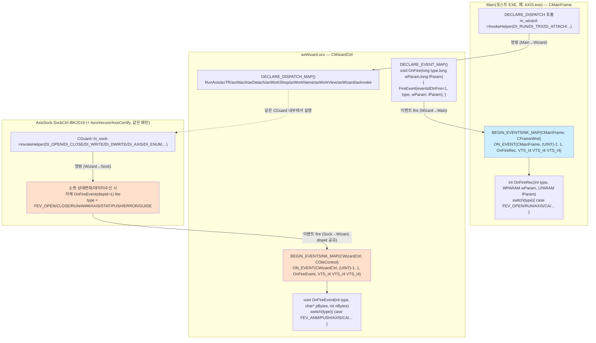
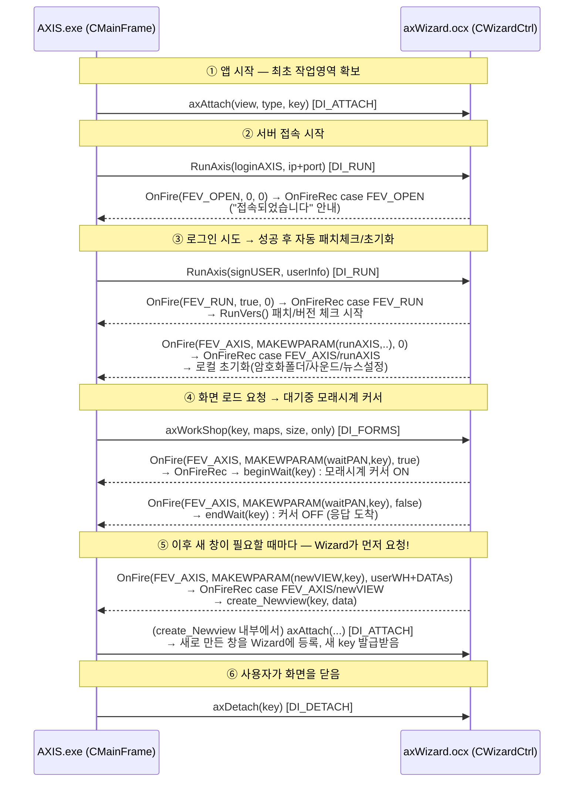

# AxisSock ↔ axWizard ↔ Main(호스트 EXE) 메시지/이벤트 프로토콜

## 목차

- [문서 목적](#문서-목적)
- [1. 핵심 컨벤션 — "ID_FIRE = 1" 하나가 계층마다 재사용된다](#1-핵심-컨벤션--id_fire--1-하나가-계층마다-재사용된다)
- [2. 3계층 구조도](#2-3계층-구조도)
- [3. Wizard ↔ AXIS(Main) 호출관계 상세 — 실제 흐름 예시](#3-wizard--axismain-호출관계-상세--실제-흐름-예시)
- [4. 히든 화면(IBXXXX01 등)도 특별한 경로가 아니다 — CDll 기반 작업영역](#4-히든-화면ibxxxx01-등도-특별한-경로가-아니다--cdll-기반-작업영역)
  - [4.1. `FEV_ANM` — Main 자신도 받는, `CDll`과는 또 다른 세 번째 RTM 경로](#41-fev_anm--main-자신도-받는-cdll과는-또-다른-세-번째-rtm-경로)
- [5. Layer A — Sock/Xecure/Certify → Wizard (`OnFireEvent`)](#5-layer-a--sockxecurecertify--wizard-onfireevent)
- [6. Layer B — Wizard → Main (`OnFire` → `OnFireRec`)](#6-layer-b--wizard--main-onfire--onfirerec)
- [7. 역방향 — Main/Wizard가 하위 계층에 "명령"을 내리는 경로](#7-역방향--mainwizard가-하위-계층에-명령을-내리는-경로)
- [8. FEV_AXIS의 이중 의미 — 같은 상수, 계층마다 다른 뜻](#8-fev_axis의-이중-의미--같은-상수-계층마다-다른-뜻)
- [9. 미해결 — `CMainFrame::OnUSER`도 같은 FEV_* switch를 갖고 있음](#9-미해결--cmainframeonuser도-같은-fev_-switch를-갖고-있음)
- [10. 관련 파일](#10-관련-파일)

---

## 문서 목적

`AxisSock`(소켓 OCX) ↔ `axWizard`(Wizard.dll) ↔ `Main`(Wizard를 호스팅하는 EXE, 예: `AXIS.exe`) 세 프로세스 경계 사이에서 실제로 어떤 메커니즘으로 메시지/이벤트를 주고받는지, `h/axisfire.h` 정의와 각 레이어의 실제 배선 코드(`BEGIN_EVENTSINK_MAP`/`DECLARE_EVENT_MAP`)를 직접 대조해서 정리합니다. `MigrationSpec_SocketToDrawing.md` §0이 "`CWizardCtrl::OnFireEvent`가 소켓 OCX 이벤트 최상위 분배점"이라고만 짧게 언급했던 부분을, 왜 그런 구조인지(같은 이벤트 이름·dispid가 여러 계층에서 재사용되는 컨벤션)까지 포함해서 확장한 문서입니다.

## 1. 핵심 컨벤션 — "ID_FIRE = 1" 하나가 계층마다 재사용된다

`h/axisfire.h` 맨 위 주석(1~32행)에 이미 답이 있습니다:

```cpp
//	Sock Control ID_FIRE = 1
//	void OnFireEvent(int type, char* pBytes, int nBytes)
//
//	Wizard Control ID_FIRE = 1
//	void OnFireEvent(int type, long wParam, long lParam)
```

Winix의 이 OCX 패밀리(Sock/Wizard/Xecure/Certify)는 전부 **"자신을 호스팅하는 쪽에 뭔가 알릴 때는 dispid=1(`ID_FIRE`)짜리 이벤트 하나만 쓴다"는 공통 규약**을 따릅니다. 실제 파라미터 개수/타입은 컨트롤마다 다를 수 있지만(Sock은 `char* pBytes`, Wizard는 `long wParam`), **"이벤트 자체의 정체성은 `type`(FEV_* 상수)이 결정한다"**는 설계 원칙은 동일합니다. 이걸 모르고 코드를 보면 "왜 `OnFireEvent` 하나에 전혀 상관없어 보이는 `FEV_ANM`(RTM)과 `FEV_CA`(인증서)가 같은 switch 안에 있지?"가 의아할 수 있는데, 답은 "그 둘이 서로 다른 컨트롤(Sock vs Certify)에서 왔지만 같은 dispid=1 이벤트로 들어오기 때문"입니다.

## 2. 3계층 구조도



## 3. Wizard ↔ AXIS(Main) 호출관계 상세 — 실제 흐름 예시

위 3계층 구조도에서 **Sock/Xecure/Certify를 빼고 Wizard↔AXIS(Main) 축만** 떼어내, 실제 앱 시작~로그인 시점에 어떤 순서로 "명령"(→)과 "이벤트"(⇢)가 오가는지 시간순으로 그려보면 이렇습니다. 각 단계는 이미 다른 문서에서 실측 확인된 내용을 그대로 가져온 것입니다([[LoginSequence.md]], [[KnowledgeBase.md]] §17).



**읽는 법:** `->>`(실선, Main→Wizard)는 §7 표의 "명령"(`InvokeHelper`), `-->>`(점선, Wizard→Main)는 §6의 "이벤트"(`OnFire`→`OnFireRec`)입니다. ③④에서 보듯, **AXIS가 명령을 한 번 내렸다고 응답이 한 번만 오는 게 아니라, Wizard가 처리 과정에서 필요할 때마다 여러 번(`FEV_RUN`, 이어서 `FEV_AXIS/runAXIS`) 독립적으로 이벤트를 쏩니다** — 요청-응답 1:1 대응이 아니라 비동기 이벤트 스트림에 가깝다는 걸 이 그림이 잘 보여줍니다. `waitPAN`(④)은 [[KnowledgeBase.md]] §17에서 이미 확인된 "모래시계 커서" 메커니즘의 실제 진입점이 바로 이 `OnFireRec`이라는 것도 이 그림으로 연결됩니다.

**`axAttach`는 앱 시작 전용이 아니다(실측 확인):** `axAttach`(`DI_ATTACH`)는 `MainFrm.cpp`에만 17곳, `MapHelper.cpp`에도 17곳, 총 34곳에서 호출되는 **범용 "새 작업영역 key 발급" 메커니즘**입니다 — ①(앱 시작 시 최초 화면)이나 ⑤(그 이후 아무 때나 새 창이 열릴 때)나 **완전히 동일한 `DI_ATTACH` 호출**을 재사용합니다. 다만 ①과 ⑤는 **누가 먼저 시작하느냐가 다릅니다**:
- ①(앱 시작): Main이 스스로 판단해서 `axAttach`를 먼저 호출(Wizard에게 요청받은 게 아님)
- ⑤(이후 신규 창): 스크립트의 `Screen.CreateWindow(...)`(`CxScreen::_CreateWindow`, [[DebugLogGuide.md]] §3)가 트리거 → **Wizard가 먼저 `FEV_AXIS/newVIEW` 이벤트로 Main에게 "새 창 열어달라"고 요청** → Main의 `create_Newview()`가 실제 윈도우(자식프레임)를 만들고 → **그 안에서 다시 `axAttach`를 호출해 Wizard에 등록**하는 왕복 구조(`MainFrm.cpp:5655`, `OnFireRec`의 `case newVIEW: return create_Newview(...)`)

즉 "명령은 항상 Main→Wizard 방향"이라는 §7의 설명은 **개별 호출 하나하나는 맞지만, 그 호출을 누가 먼저 트리거하는지는 이벤트(Wizard→Main)가 앞서는 경우가 실제로 있다**는 걸 이 사례가 보여줍니다.

**`axAttach` vs `axWorkShop` — 그릇과 내용물 (`WizardCtrl.cpp:354-384`):**
```cpp
long CWizardCtrl::axAttach(long view, long type, long key)
{
	return m_guard->Attach((CWnd*)view, type, key);   // 빈 작업영역(CClient) 생성, key 발급
}

BOOL CWizardCtrl::axWorkShop(long key, LPCTSTR maps, long size, BOOL only)
{
	CWorks* works;
	if (!m_guard->GetClient(key, works))   // ★ 그 key가 먼저 axAttach로 등록돼 있어야 함 — 없으면 실패
		return FALSE;
	...
	return works->Attach(maps, only ? true : false);   // 여기서 비로소 .map 화면 내용 로드(CScreen::Parse)
}
```
`axAttach`는 **빈 액자(작업영역 컨테이너)를 만들고 key를 발급**하는 것이고, `axWorkShop`은 **그 key 안에 실제 `.map` 화면(들)을 채워넣는 것**입니다 — `axWorkShop`은 대상 `key`가 이미 `axAttach`로 등록돼 있지 않으면 그 자리에서 `FALSE`를 반환하고 실패합니다. 같은 `key`로 `axWorkShop`을 다시 호출해서 그 창의 화면(맵)만 바꿔치기하는 것도 가능하지만, `axAttach`는 매번 새 창(=새 `key`)을 만드는 것이라 재사용 개념이 없습니다.

## 4. 히든 화면(IBXXXX01 등)도 특별한 경로가 아니다 — CDll 기반 작업영역

`Main`(AXIS.exe)이 `IBXXXX01`(실시간잔고, `MAPN_REALTIMEJANGO`)처럼 화면에 안 보이는 창을 만들어두는 게 있는데, **이것도 완전히 같은 `axAttach`/`axWorkShop` 파이프라인**을 그대로 씁니다. `CMainFrame::load_hidescreen()`(`MainFrm.cpp:20714`)을 직접 확인한 결과:

```cpp
CChildFrame* CMainFrame::load_hidescreen(CString mapname)
{
	int vtype = 0, size = 0, key = 128;   // key=128=0x80=WK_POPUP 범위로 요청

	// ① 이 맵의 타입을 먼저 조회 — 신규 발견: DI_FORMI = axWorkView(mapN, &size)
	m_wizard->InvokeHelper(DI_FORMI, DISPATCH_METHOD, VT_I4, (void*)&vtype,
	                        (BYTE*)(VTS_BSTR VTS_I4), mapname, &size);

	CView *view = GetNewView(vwKIND);           // 평범한 CView/CChildFrame 생성 (§3의 ①과 동일 부류)

	// ② axAttach — §3에서 다룬 것과 완전히 동일한 호출
	m_wizard->InvokeHelper(DI_ATTACH, DISPATCH_METHOD, VT_I4, (void*)&key,
	                        (BYTE*)(VTS_I4 VTS_I4 VTS_I4), (long)view, vtype, key);

	// ③ axWorkShop — 이것도 §3과 동일
	m_wizard->InvokeHelper(DI_FORMS, DISPATCH_METHOD, VT_BOOL, (void*)&rc,
	                        (BYTE*)(VTS_I4 VTS_BSTR VTS_I4 VTS_BOOL), key, mapname, size, false);

	// ④ 로드가 다 끝난 뒤에야, 평범한 Win32 API로 숨김 — Wizard는 전혀 모름
	child->SetWindowPos(NULL, 0, 0, nCx, nCy, SWP_HIDEWINDOW);
	return child;
}
```

**"숨긴다"는 개념 자체가 Wizard 쪽엔 없습니다.** Wizard 입장에서는 여느 화면과 똑같은 attach/load 요청 하나일 뿐이고, 실제로 `CChildFrame`(진짜 창)까지 만들어집니다. 유일한 차이는 로드가 끝난 직후 Main이 **평범한 Win32 API** `SetWindowPos(..., SWP_HIDEWINDOW)`로 그 창을 화면에서만 숨긴다는 것 — 창은 실존하고 메시지도 정상 수신하므로(`WM_REMAIN`류 IPC가 잘 도는 이유), "숨김"은 순전히 호스트 쪽의 표시 여부 결정일 뿐입니다.

**`key=128`은 실시간 우선순위와 무관 — 진짜 이유는 `CDll`이 필터링 자체를 안 거친다는 것 (`Guard.cpp:6117-6129`):**
```cpp
for (pos = m_clients.GetStartPosition(); pos; )   // CMap 해시버킷 순회 — key 크기와 순서 무관
{
	m_clients.GetNextAssoc(pos, key, works);
	if (works->m_status & S_LOAD)
	{
		if (works->isWorks())                              // CClient(일반 .map 화면)
			((CClient*)works)->OnAlert(code, updates, fms, obs, stat, &m_alertR);
			// → CScreen::OnAlert → FA_FLASH 필드 비교 → 일치할 때만 반영 ([[RealtimeCodeIndex_Investigation.md]])
		else                                                // CDll(IBXXXX01 등)
		{
			works->OnAlert(code, updates, stat);            // DLL_ALERT  — 매칭 없이 무조건 전달
			((CDll*)works)->OnAlert((void*)&m_alertR);       // DLL_ALERTx — 원본(_alertR) 통째로, 무조건 전달
		}
	}
}
```
`IBXXXX01`(실시간잔고)이 "가장 먼저 받는다"는 인상은 **key값이 특별해서가 아니라(순회 자체가 key 순서와 무관), `CDll`은 `CClient`가 거쳐야 하는 `FA_FLASH` 종목코드 매칭을 통째로 건너뛰고 매 틱을 무조건·전부 받기 때문**입니다. 대신 필터링 책임이 Wizard에서 `IBXXXX01.dll` 자신(`CMapWnd::parsingRTSx`)으로 넘어갈 뿐 — "우선순위"가 아니라 "무필터 전달"이 정체입니다.

**부가 발견 — 이번에 새로 나온 dispatch: `DI_FORMI`(`axWorkView`)**. §7 표의 Main→Wizard 목록에 있던 9개 메서드 중 지금까지 실제 호출 예시가 없었던 `axWorkView(mapN, *size)`가 여기서 실사용 확인됨 — attach하기 전에 "이 맵이 무슨 타입이냐"(`vtypeNRM`/`vtypeDLL`/... )를 먼저 물어봐서, 그 결과로 `vwKIND`(스크롤뷰 vs 일반뷰)와 `axAttach`에 넘길 `vtype`을 결정하는 데 씀.

**연결되는 기존 미해결 항목 — `CDll` 용도 확정:** [[WizardArchitecture.md]] §7.2가 "용도 미조사"로 남겨뒀던 `CDll : CWorks`("DLL 기반 작업영역", `vtypeDLL`이면 `CClient` 대신 이걸 생성)의 실사용 사례가 바로 이것입니다 — `mapname="IBXXXX01"`은 `.map` 바이너리가 아니라 **`IBXXXX01.dll`**을 가리키고, `axWorkShop`이 내부적으로 이 이름을 `CDll::Attach`(`axCreate` export 호출)로 라우팅하는 것으로 보입니다(정확한 `vtype` 판정 분기까지는 이번에 안 봤음 — `CGuard::Attach`/`CWorks::Attach` 내부 확인은 다음 조사로 남김).

### 4.1. `FEV_ANM` — Main 자신도 받는, `CDll`과는 또 다른 세 번째 RTM 경로

`Main`(`CMainFrame::OnFireRec`)도 `case FEV_ANM:`으로 실시간 시세를 직접 받습니다. §4에서 다룬 `CDll`(무필터 전달)과 비슷해 보이지만, **`m_clients`/작업영역(`key`) 개념 자체를 완전히 우회하는 별도 경로**입니다:

```cpp
// CGuard::DoRTM (Guard.cpp:6116) — m_clients 순회(§4의 그 루프)보다 앞서, 매 틱마다 무조건 실행
m_parent->SendMessage(WM_ANM, 0, (LPARAM)&m_alertR);

// Wizard/WizardCtrl.cpp:41,272 — WM_ANM은 CWizardCtrl 자신의 메시지 핸들러
ON_MESSAGE(WM_ANM, OnFireAlert)
LONG CWizardCtrl::OnFireAlert(WPARAM wParam, LPARAM lParam)
{
	OnFire(FEV_ANM, wParam, lParam);   // 곧바로 Layer B 이벤트로 재발행
	return 0;
}

// AXIS/MainFrm.cpp:5497 — Main 쪽 수신
case FEV_ANM:
	update_ticker((int)wParam, (struct _alertR*)lParam);   // Main 자신의 시세티커 UI, 화면/key와 무관
	break;
```

정리하면 RTM 틱 하나가 실제로는 **세 갈래로** 퍼집니다:

| 경로 | 트리거 지점 | 필터링 | 목적지 |
|---|---|---|---|
| `CClient`(§2 구조도의 일반 화면) | `m_clients` 순회 안, `isWorks()==true` | `FA_FLASH` 종목코드 매칭 (필터 O) | 그 종목을 보고 있는 화면의 그리드/필드 |
| `CDll`(§4, `IBXXXX01` 등) | `m_clients` 순회 안, `isWorks()==false` | 없음(무조건 전달) | `IBXXXX01.dll` 등 — 자체적으로 재필터링 |
| **`Main` 자신** (`FEV_ANM`) | **`m_clients` 순회와 무관, `DoRTM` 진입 직후 무조건 1회** | 없음(무조건 전달) | `CMainFrame::update_ticker()` — 특정 화면이 열려있는지와 무관한 Main 자체 UI(상단 시세바 등) |

`CDll`과 `FEV_ANM`이 "필터 없이 전부 받는다"는 점은 같지만, **`CDll`은 어쨌든 `axAttach`로 등록된 작업영역(key) 하나로서 순회에 낀 것이고, `FEV_ANM`은 애초에 작업영역이라는 개념 자체가 없는, Main 프로세스 레벨의 별도 브로드캐스트**라는 게 구조적 차이입니다 — `IBXXXX01`을 한 번도 attach 안 해도 `FEV_ANM`은 로그인 이후 항상 옵니다.

## 5. Layer A — Sock/Xecure/Certify → Wizard (`OnFireEvent`)

**실측 코드 (`Wizard/WizardCtrl.h:66-67`, `WizardCtrl.cpp:66-68`):**
```cpp
// WizardCtrl.h
afx_msg void OnFireEvent(int type, char* pBytes, int nBytes);
DECLARE_EVENTSINK_MAP()

// WizardCtrl.cpp
BEGIN_EVENTSINK_MAP(CWizardCtrl, COleControl)
	ON_EVENT(CWizardCtrl, (UINT)-1, (UINT)1, OnFireEvent, VTS_I4 VTS_I4 VTS_I4)
END_EVENTSINK_MAP()
```

`ON_EVENT`의 두 번째 인자 `(UINT)-1`은 "특정 자식 컨트롤 ID 하나가 아니라, 이 dispid(=1)로 이벤트를 fire하는 **모든** 자식 컨트롤을 받는다"는 뜻입니다. 실제로 `CGuard::Initial()`(Guard.cpp)이 `m_sock`/`m_xecure`/`m_certify`를 `CreateControl(ProgID, ..., control, -1)`로 생성할 때 `control` 인자가 `CWizardCtrl` 자기 자신(부모 OCX)이고 컨트롤 ID도 똑같이 `-1`입니다 — 그래서 **Sock/Xecure/Certify 셋 다 이 하나의 `OnFireEvent` 핸들러로 몰려 들어옵니다.** `VTS_I4 VTS_I4 VTS_I4`(4바이트 정수 3개)로 마샬링되지만, 실제 C++ 함수 시그니처가 `char* pBytes`를 받으므로 두 번째 인자는 포인터값이 정수로 실려오는 것뿐(32비트 COM 이벤트에서 흔한 패턴).

`switch(type)`의 케이스들이 서로 다른 컨트롤 출신인 것도 이 때문입니다(`MigrationSpec_SocketToDrawing.md` §0 참고):
- `FEV_ANM`/`FEV_PUSH`/`FEV_AXIS`/`FEV_OPEN`/`FEV_RUN`/`FEV_STAT`/`FEV_ERROR`/`FEV_GUIDE` → **Sock** 발신
- `FEV_CA` → **Certify** 발신 (`OnCertify(pBytes, nBytes)`로 위임)

## 6. Layer B — Wizard → Main (`OnFire` → `OnFireRec`)

**Wizard 쪽 (`WizardCtrl.h:82-86,100`):**
```cpp
void OnFire(long type, long wParam, long lParam)
{
	FireEvent(eventidOnFire, EVENT_PARAM(VTS_I4  VTS_I4  VTS_I4), type, wParam, lParam);
}
DECLARE_EVENT_MAP()
// ...
enum { ..., eventidOnFire = 1L };
```

**Main 쪽 (`AXIS/MainFrm.h:1493-1494`, `MainFrm.cpp:465-469`):**
```cpp
// MainFrm.h
DECLARE_EVENTSINK_MAP()
afx_msg int OnFireRec(int type, WPARAM wParam, LPARAM lParam);

// MainFrm.cpp
BEGIN_EVENTSINK_MAP(CMainFrame, CFrameWnd)
	ON_EVENT(CMainFrame, (UINT)-1, 1, OnFireRec, VTS_I4 VTS_I4 VTS_I4)
END_EVENTSINK_MAP()
```

정확히 대칭입니다 — Wizard가 `eventidOnFire`(=1)로 fire하면, 이걸 호스팅하는 EXE(`CMainFrame`)가 `(UINT)-1, 1` 조합으로 받아서 로컬 함수명 `OnFireRec`에 연결해둔 것입니다. **`OnFireRec`이라는 이름 자체는 임의로 붙인 것**(MFC ClassWizard가 이벤트 핸들러를 만들 때 개발자가 원하는 이름을 지정할 수 있음) — dispid=1이라는 숫자와 파라미터 타입(`VTS_I4 x3`)만 프로토콜상 의미가 있습니다.

`switch(type)`(`MainFrm.cpp:5359~`)은 Layer A와 완전히 다른 의미 공간입니다 — 여기 오는 `type`은 Sock/Certify가 아니라 **Wizard 자신이 내부 처리를 마친 뒤 "호스트 UI가 해야 할 일"을 알리는 것**입니다(`FEV_OPEN`=접속알림, `FEV_RUN`=시작/업데이트, `FEV_AXIS`=아래 8절, `FEV_VERS`=화면버전, `FEV_CA`=인증서 관련 UI 등). §3의 시퀀스, 그리고 [[LoginSequence.md]]에서 다뤘던 `CMainFrame::OnFireRec case FEV_RUN`(→`RunVers()` 패치체크)/`case FEV_AXIS: case runAXIS`(로컬 초기화)가 바로 이 스위치의 케이스들입니다.

## 7. 역방향 — Main/Wizard가 하위 계층에 "명령"을 내리는 경로

이벤트(fire, 위로 알림)와 별개로, **명령(호출, 아래로 지시)**은 완전히 다른 메커니즘 — 평범한 COM 디스패치 메서드 호출입니다.

| 방향 | 메커니즘 | 노출측 선언 | 호출측 |
|---|---|---|---|
| Main → Wizard | `DECLARE_DISPATCH_MAP()` | `WizardCtrl.h:70-79` — `RunAxis`/`axTR`/`axAttach`/`axDetach`/`axWorkShop`/`axWorkName`/`axWorkView`/`axWizard`/`axInvoke` (dispid 1~9 = `DI_RUN`~`DI_INVOKE`, `axisfire.h:189-199`) | `m_wizard->InvokeHelper(DI_XXX, ...)` |
| Wizard → Sock | COM `InvokeHelper` | Sock 자체 dispatch(`axisfire.h:330-337`) — `DI_OPEN`/`DI_CLOSE`/`DI_WRITE`/`DI_DOPEN`/`DI_DCLOSE`/`DI_DWRITE`/`DI_AXIS`/`DI_ENUM` | `CGuard::m_sock->InvokeHelper(DI_XXX, ...)` (`Guard.cpp` 다수) |

즉 **"명령"은 Main→Wizard→Sock으로 아래 방향, "이벤트(fire)"는 Sock→Wizard→Main으로 위 방향** — 완전히 대칭적인 양방향 파이프라인입니다.

## 8. FEV_AXIS의 이중 의미 — 같은 상수, 계층마다 다른 뜻

가장 헷갈리기 쉬운 지점이라 따로 뗍니다. `FEV_AXIS`(=6)는 axisfire.h에 **딱 한 번** 정의돼 있지만, 실제로는 계층에 따라 전혀 다른 걸 가리킵니다:

| 계층 | 의미 | 실제 처리 |
|---|---|---|
| **Layer A**(Sock→Wizard) | "TR 응답 등 원시 `_axisH` 데이터가 도착했다" | `CWizardCtrl::OnFireEvent`의 `case FEV_AXIS: OnRead(pBytes, nBytes)` — `MigrationSpec_SocketToDrawing.md` §0의 그 경로 |
| **Layer B**(Wizard→Main) | "호스트 UI가 처리해야 할 화면관리 명령이다" (`LOWORD(wParam)`에 서브키) | `CMainFrame::OnFireRec`의 `case FEV_AXIS:` 안에서 다시 `switch(LOWORD(wParam))`로 `runAXIS`/`newVIEW`/`renVIEW`/`delVIEW`/`waitPAN`/`alarmPAN`/`closeAXIS`/`userPASS`/... (axisfire.h:75-109) 분기 |

Layer A의 `FEV_AXIS`는 Wizard가 **소켓에서 원시 데이터를 받았다는 사실**을 알리는 것이고, Layer B의 `FEV_AXIS`는 Wizard가 그 데이터를 **자체적으로 다 처리한 뒤** 호스트에게 "새 창을 열어라/닫아라/모래시계 커서 켜라" 같은 **파생된 UI 명령**을 내리는 것 — 원인과 결과가 같은 이름의 상수를 공유하는 것뿐, 완전히 다른 이벤트입니다. §3의 시퀀스 다이어그램에서 `runAXIS`/`waitPAN`이 전부 이 Layer B `FEV_AXIS`의 서브키 예시입니다.

## 9. 미해결 — `CMainFrame::OnUSER`도 같은 FEV_* switch를 갖고 있음

`AXIS/MainFrm.cpp:4413`의 `LONG CMainFrame::OnUSER(WPARAM wParam, LPARAM lParam)`(`ON_MESSAGE(WM_USER, OnUSER)`로 등록된 평범한 Windows 메시지 핸들러)가 `OnFireRec`과 **거의 동일한 `case FEV_OPEN/CLOSE/RUN/SIZE/ANM/AXIS/STAT/ERROR/GUIDE/FMX/VERS` 스위치**를 따로 갖고 있습니다(4972~5339행, `OnFireRec` 정의 바로 앞).

`OnFireRec`(COM 이벤트싱크, dispid=1)과 `OnUSER`(`WM_USER` 메시지)는 서로 다른 전달 메커니즘인데 왜 같은 상수 공간으로 분기하는 로직이 두 벌 존재하는지는 이번 조사에서 확정하지 못했습니다. 가능성:
- `OnFireRec`이 내부적으로 `SendMessage(WM_USER, ...)`로 `OnUSER`에 재위임하는 경우(단순 라우팅) — 이 문서 작성 시점엔 `OnFireRec` 본문에서 그런 호출을 직접 확인하지 못함(추가 확인 필요)
- 완전히 별개의 두 번째 발신 경로(예: 다른 컨트롤이 `PostMessage(hwnd, WM_USER, ...)`로 직접 쏘는 경우)가 실제로 존재하고, 그게 우연히 같은 FEV_* 이름공간을 재사용하는 경우
- `WizardArchitecture.md`/`KnowledgeBase.md`에서 이미 여러 번 나온 "레거시 중복 구현"(예: `COnTimer` 죽은코드, 두 개의 `ParseRCC`) 패턴처럼, 리팩토링 과정에서 한쪽이 죽은 코드로 남았을 가능성

**다음 조사 대상으로 남겨둠** — `OnUSER`가 실제로 호출되는지(호출자 추적), `OnFireRec`과의 관계를 확정 지어야 이 문서가 완결됩니다.

## 10. 관련 파일

| 파일 | 역할 |
|---|---|
| `h/axisfire.h` | 전체 FEV_*/DI_*/dispid 상수 마스터 정의(880줄) — 이 문서가 다루는 프로토콜의 유일한 정본(source of truth) |
| `Wizard/WizardCtrl.h/cpp` | `CWizardCtrl` — Layer A 수신(`OnFireEvent`) + Layer B 발신(`OnFire`) + Main→Wizard 디스패치 노출(`DECLARE_DISPATCH_MAP`) |
| `Wizard/Guard.cpp` | `CGuard` — `m_sock`/`m_xecure`/`m_certify` 생성(`CreateControl(..., control, -1)`) 및 Wizard→Sock 명령(`InvokeHelper`) |
| `AXIS/MainFrm.h/cpp` | `CMainFrame` — Layer B 수신(`OnFireRec`) + Main→Wizard 명령(`m_wizard->InvokeHelper`) + 미해결 이슈의 `OnUSER` + `create_Newview`/`loadMap`/`load_hidescreen`(§3·§4의 실사용 예시) |
| `AXIS/MapHelper.cpp` | `axAttach`(`DI_ATTACH`) 호출부 17곳 — `MainFrm.cpp`와 함께 이 메커니즘이 앱 전체에서 반복 재사용됨을 보여주는 또 다른 큰 축 |
| `APPL/IBXXXX01-운영` | §4의 히든 화면 실사례 — `MAPN_REALTIMEJANGO`로 로드되는 실시간잔고 DLL, `CDll` 기반 작업영역의 실제 정체 |
| [[MigrationSpec_SocketToDrawing.md]] | §0 "전체 파이프라인 개요" — Layer A(`OnFireEvent`→`OnRead`→`OnAxis`) 이후 TR 파싱 파이프라인 상세 |
| [[WizardDependency.md]] | §2 — `m_sock`/`m_xecure`/`m_certify`가 런타임 COM 컨트롤로 로드되는 지점 |
| [[WizardArchitecture.md]] | §7.2 — `CDll : CWorks`(DLL 기반 작업영역) 정의, 이번 §4로 실사용처 확정 |
| [[LoginSequence.md]] | `CMainFrame::OnFireRec`의 `FEV_RUN`/`FEV_AXIS`/`FEV_CA` 케이스가 실제 로그인 흐름에서 어떻게 쓰이는지 |
| [[KnowledgeBase.md]] | §17 — `waitPAN`(모래시계 커서) 메커니즘, §3의 예시와 연결됨 |
