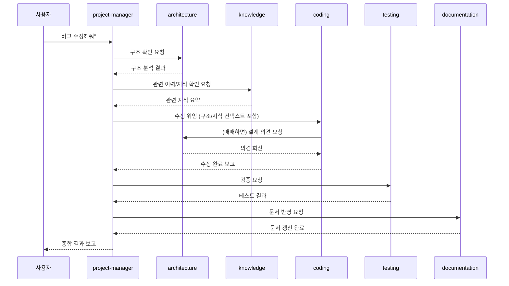

# C++/MFC/DLL/Windows 프로젝트 Agent Team

이 문서는 `~/.claude/agents/` 아래 정의된 9개 서브에이전트로 구성된 개발 조직의
구조, 각 Agent의 책임, 협업 방식, 자동 실행 흐름을 설명한다.
이 파일 자체는 서브에이전트 정의가 아니라(Frontmatter 없음) 팀 전체를 이해하기 위한
참고 문서다.

## 팀 구성

| Agent (`name`) | 파일 | 역할 요약 | 코드 수정 | 산출물 |
|---|---|---|---|---|
| `project-manager` | project-manager.md | 요청 분석, Agent 선정/순서 결정, 위임, 결과 종합 | ❌ | (문서 없음, 종합 보고) |
| `architecture` | architecture.md | DLL/Layer/Module/Thread/Message Flow/Dependency/리팩터링 후보 분석 | ❌ | Architecture.md, ArchitectureReview.md, Dependency.md |
| `knowledge` | knowledge.md | 코드 변경의 역할/목적/관계/API/설계 의도 축적 | ❌ | KnowledgeBase.md |
| `coding` | coding.md | 신규 기능/버그 수정/리팩터링/DLL·MFC·Win32 개발 | ✅ | 소스 코드 |
| `performance` | performance.md | CPU/Memory/Thread/Lock/Cache/Socket/I·O 병목 분석 및 제안 | ❌(제안만) | PerformanceReport.md |
| `documentation` | documentation.md | 모든 Markdown 문서 최신화, Mermaid 다이어그램 | ❌ | SourceIndex/Dependency/Architecture/CallGraph/ProjectReport/Todo/Build/KnowledgeBase.md |
| `testing` | testing.md | Unit/Boundary/Stress/Thread/Leak/Race 테스트 전략 및 시나리오 | 테스트 코드만 | test/, Todo.md |
| `release` | release.md | DLL Export/Version/PDB/VC Runtime/의존성 배포 검증 | ❌ | ReleaseChecklist.md, Build.md |
| `mentor` | mentor.md | SRP/디자인 패턴/유지보수성/확장성/기술 부채 검토, 장기 방향 제시 | ❌ | Todo.md, KnowledgeBase.md |

## 공통 작업 절차 (모든 Agent 공통)

모든 Agent는 자신의 역할을 수행하기 전, 항상 다음을 따른다.

```mermaid
flowchart TD
    A[CLAUDE.md 읽기] --> B[docs 폴더 확인]
    B --> C["기존 문서 읽기\n(Architecture/Dependency/KnowledgeBase/\nSourceIndex/CallGraph/Build/Todo/ProjectReport)"]
    C --> D[코드와 문서 비교]
    D --> E{괴리 있음?}
    E -- Yes --> F[update-docs Skill 호출]
    E -- No --> G[자신의 역할 수행]
    F --> G
    G --> H[KnowledgeBase.md 갱신]
    H --> I[관련 문서 갱신\n(기존 문서 삭제 금지)]
```

## 협업 규칙

- **Project Manager**는 직접 구현하지 않는다 (Edit/Write 도구 없음으로 강제).
- **Architecture Agent**는 코드를 수정하지 않는다. 구조 판단의 최종 근거를 제공한다.
- **Knowledge Agent**는 항상 최신 지식을 유지하며, 절대 삭제하지 않고 병합만 한다.
- **Coding Agent**는 Architecture를 우회하지 않는다. 애매하면 `architecture` Agent를
  Agent 도구로 직접 호출해 의견을 구한다 (중첩 서브에이전트 호출).
- **Performance Agent**는 병목을 분석하고 개선안을 제안만 한다 — 구현은 Coding Agent.
- **Documentation Agent**는 모든 문서를 최신 상태로 유지하고 다른 Agent의 산출물을
  사람이 읽기 좋게 정리한다.
- **Testing Agent**는 품질을 검증하고, 실패는 재현 조건과 함께 보고한다.
- **Release Agent**는 배포 가능 여부를 검증하고, 확인 불가 항목을 임의로 통과시키지 않는다.
- **Mentor Agent**는 코드를 작성하지 않고 설계/품질을 지속적으로 평가하며 장기 방향만 제시한다.

## 자동 실행 흐름 (예시: 버그 수정)



다른 작업 유형(신규 기능, 리팩터링, 성능 개선, 배포 준비, 코드 리뷰)의 흐름은
`project-manager.md`의 "자신의 역할" 섹션에 정의되어 있다.

## Agent 팀 확장/교체 가이드

이 팀은 새로운 프로젝트에서도 그대로 재사용할 수 있도록 일반화되어 있다
(특정 프로젝트 정보는 Agent 정의 파일이 아니라 `docs/*.md`와 `CLAUDE.md`에서 읽는다).

**새 Agent 추가**

1. `~/.claude/agents/<name>.md`를 생성하고 frontmatter(`name`, `description`, `tools`)를 정의한다.
2. 본문에 "공통 작업 절차"(이 문서 상단과 동일한 8단계)와 "자신의 역할", "산출물",
   "협업 규칙", "주의사항" 섹션을 포함한다.
3. 이 `TEAM.md`의 팀 구성 표에 행을 추가한다.
4. `project-manager.md`의 "자신의 역할" 섹션에 새 Agent가 관여하는 작업 흐름을 추가한다.

**기존 Agent 교체/폐기**

1. 대체할 Agent 파일을 수정하거나 삭제한다.
2. `TEAM.md` 표와 `project-manager.md`의 실행 흐름에서 해당 Agent 참조를 갱신한다.
3. 다른 Agent의 협업 규칙에서 폐기된 Agent를 참조하는 부분이 있는지 확인하고 갱신한다.

**원칙**

- 각 Agent는 독립적으로 호출 가능해야 한다 (다른 Agent의 존재를 전제로 동작이 깨지면 안 됨).
- 코드 수정 권한(Edit/Write/Bash)은 실제로 코드를 작성해야 하는 Agent(`coding`,
  일부 `testing`/`release`의 문서·스크립트 작성)에만 부여한다.
- 문서는 어떤 Agent도 삭제하지 않는다 — 항상 갱신/병합만 한다.
